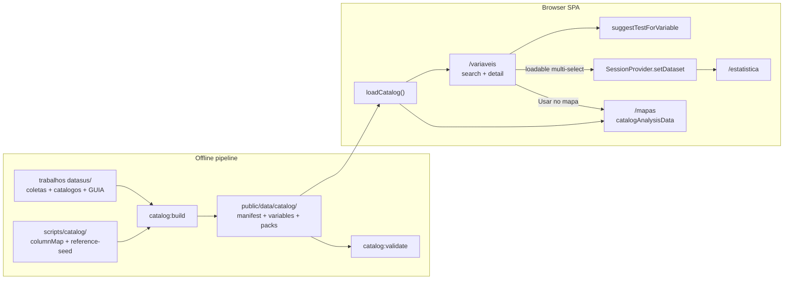

# Phase 5: Variáveis no site (scrape + referências) - Research

**Researched:** 2026-07-25  
**Domain:** Offline public-health variable catalog pipeline + React catalog UX + Mapas/Estatística data handoff  
**Confidence:** HIGH

## Summary

Phase 5 turns the already-tracked `trabalhos datasus/` corpus into a **versioned static catalog** under `public/data/catalog/`, then replaces the Variáveis placeholder and Phase 4 didactic mocks with **real UF×ano packs** plus a curated provenance-complete reference slice. Runtime must never call TABNET/IBGE; regenerate stays offline via `npm run catalog:build` / `catalog:validate`.

Existing coletas already ship tidy UF×ano CSVs (351 rows = 27 UF × 13 years) with `metadata.json` provenance sidecars. Both bases write UTF-8 **with BOM** (`utf-8-sig`) and document intentional **2023 population gaps** (rates/densities empty; counts remain). Absolute hardcoded paths in `coleta_*.py` must be ported to repo-relative resolution before regenerate is trustworthy. [VERIFIED: codebase]

**Primary recommendation:** Package validated coleta CSVs first (Node normalize → `variables.json` + `packs/*.json` + `manifest.json`); curate reference entries from catalogos/GUIA only when every D-05 field is fillable; swap Mapas via a `catalogAnalysisData` facade that preserves the Phase 4 variable-ID API and retires `provenance: 'mock'`.

<user_constraints>
## User Constraints (from CONTEXT.md)

### Locked Decisions
- **D-01:** Treat `trabalhos datasus/` as the **source of truth already tracked** — do not rediscover variables from scratch. Pipeline **ingests and normalizes**:
  1. `build/catalogos/*_catalog.json` + `GUIA_MAPEAMENTO_DADOS_DISPONIVEIS.md` → **reference catalog** (browseable, provenance-complete; may be `loadable: false` until a pack exists)
  2. Existing serious coletas → **loadable analysis packs** (UF × ano):
     - `outputs/coleta_embolia_trombose_uf/` (SIH nibr + CNES RH + SIDRA pop)
     - `outputs/coleta_vascular_amputacao/` (SIH qibr + CNES + SIDRA)
  3. Optional third pack if cleanly extractable from `outputs/lacir_projetos/` without inventing cells — otherwise leave as reference-only.
- **D-02:** **No mock numeric values** in Mapas for variables that exist in loadable packs. Phase 4 `mock.*` IDs are replaced/aliased by catalog variable IDs whose values come from the packaged CSVs (real scraped series 2013–2025). Variables without a pack stay reference-only (or paste path from Phase 4).
- **D-03:** v1 does **not** require re-downloading every TABNET form at execute time if outputs already exist and validate. Pipeline **must** still include a **regenerate path** (port `coleta_*.py` to repo-relative paths + document `npm run catalog:build`) so scrapes are reproducible. Prefer packaging validated outputs first; re-scrape only if validation fails or user later asks refresh.
- **D-04:** Catalog entry count target: **all variables derived from loadable packs** (each metric column = one loadable variable) **plus** a curated reference slice from guia/catalogos (sources: TABNET, OpenDataSUS, IBGE/SIDRA, e-Gestor, ANS, Atlas, IPEA, COVID) — prioritize entries that already have official URLs in the tracked catalogs. Quality > dumping 276 raw TABNET report titles without provenance fields filled.
- **D-05:** Every catalog entry **MUST** include (JSON + UI):
  - `id` (stable slug, e.g. `sih.embolia_trombose.internacoes`)
  - `label` (PT-BR)
  - `variableType` — `categorica` | `numerica` | `ordinal` | `taxa` | `contagem` | `texto`
  - `domain` — short theme tag (ex.: `vascular`, `morbidade`, `rh_sus`, `populacao`)
  - `sourceSystem` (ex.: SIH/SUS, CNES, SIDRA/IBGE)
  - `sourceName` (human source label)
  - `tableOrIndicator` (TABNET `.def` / SIDRA table / endpoint)
  - `period` (e.g. `2013–2025`)
  - `officialUrl` (absolute URL)
  - `methodologyNotes` (aggregation rules, filters, known gaps — copy/adapt from coleta `metadata.json` notes)
  - `loadable` boolean + optional `packId` / `columnKey`
- **D-06:** UI never shows a variable without the provenance block. Missing any of D-05 fields = pipeline **fails validation** (do not ship orphans).
- **D-07:** `provenance: 'mock'` is retired for catalog-backed Mapas variables. Remaining paste path stays `provenance: 'paste'`.
- **D-08:** Pipeline lives under `scripts/catalog/` (Node and/or Python). Outputs committed (or generated into) `public/data/catalog/`:
  - `manifest.json` — `{ version, generatedAt, packs[], catalogEntryCount }`
  - `variables.json` — full catalog array
  - `packs/<packId>.json` — tidy long or wide tables ready for session/Mapas (UF code, sigla, year, metrics…)
- **D-09:** App loads catalog via static fetch/import of these assets — **zero network calls to DATASUS/IBGE at runtime**.
- **D-10:** Add npm scripts: `catalog:build` (normalize from `trabalhos datasus`), `catalog:validate` (schema + no orphan + pack columns exist). Wire `catalog:validate` into CI or at least `pretest`/`typecheck` gate if cheap.
- **D-11:** Replace `PlaceholderShell` with a real page: **search** + filters (`sourceSystem`, `variableType`, `domain`, `loadable`) + **scrollable list/table** + **detail panel** (provenance + test hint + actions).
- **D-12:** Visual language: existing LACIR dark/teal shell — **no new card-heavy dashboard**. One composition: list + detail. Match Mapas/Estatística density and typography tokens.
- **D-13:** Suggested test hint (CAT-03): pure function `suggestTestForVariable(entry)` (+ optional pair mode later) mapping `variableType` + domain heuristics → registry `testId` + short PT reason. Show in detail panel; link “Abrir em Estatística” when loadable.
- **D-14:** **Carregar na Estatística:** build `SessionDataset` (`headers`/`rows`/`sourceLabel` including provenance short cite) via `setDataset` and navigate to `/estatistica`. Prefer tidy table: territory × time × selected metrics.
- **D-15:** **Usar no mapa:** navigate to `/mapas` with catalog variable IDs selected; Mapas data provider reads pack values by UF×year (replaces `mockAnalysisData` for those IDs). Keep Phase 4 group/time/paste UX.
- **D-16:** Multi-select load: user can pick 1–N loadable variables from the same pack (or compatible grain UF×ano) before loading; cross-pack join only when keys match (`uf_codigo`,`ano`) — otherwise block with clear PT message.
- **D-17:** Default grain for v1 packs: **UF × ano** (matches Mapas UF layer and existing coletas). Município-level raw HTML leftovers in outputs are **not** primary v1 loadables.
- **D-18:** Introduce `catalogAnalysisData` (or evolve mock module) that resolves values from packs; keep stable API used by `GroupConfigPanel` / choropleth. Alias old `mock.amputacoes` / internações-like IDs to real pack columns where semantics match.
- **D-19:** Time series years for catalog vars = intersection of pack years present (not hard-coded 2018–2022 didactic list), clamped to available non-null denominators when showing rates.

### Claude's Discretion
- Exact React component split (table vs virtualized list); whether packs are wide JSON or columnar.
- How much of the 276 TABNET reports become reference entries in v1 (curate with complete provenance; omit incomplete).
- Whether to use Papa Parse vs hand CSV parse in the build script.
- Minor copy for empty states and validation error messages (PT-BR, didactic).

### Deferred Ideas (OUT OF SCOPE)
- Continuous/automated CI scrape refresh of all TABNET forms (REQUIREMENTS v2 out-of-scope note)
- Full município-level packs in-app (raw HTML leftovers stay offline tools)
- Live OpenDataSUS API queries from the browser
- Auto-join arbitrary cross-source indicators beyond UF×ano key match
</user_constraints>

<phase_requirements>
## Phase Requirements

| ID | Description | Research Support |
|----|-------------|------------------|
| CAT-01 | Search/browse panel of public-health variables classified by type | Catalog schema `variableType` + Variáveis list/detail UX (D-11/D-12); filters on type/domain/source/loadable |
| CAT-02 | Mandatory provenance on every variable | D-05/D-06 validation gate; provenance block always rendered; orphans fail `catalog:validate` |
| CAT-03 | Suggested statistical test hint from classified type | `suggestTestForVariable` → `TEST_REGISTRY` ids; reuse `SuggestedTestCard` pattern |
| CAT-04 | Load curated/scraped datasets into analysis in-app | `buildSessionDataset` + `setDataset` → `/estatistica`; Mapas via `catalogAnalysisData` + pack lookup |
| CAT-05 | Versioned offline pipeline, not live runtime scrape | `scripts/catalog/*` → `public/data/catalog/*`; npm `catalog:build` / `catalog:validate`; regenerate path ports `coleta_*.py` |
</phase_requirements>

## Project Constraints (from CLAUDE.md)

`./CLAUDE.md` was **not present** in the project root at research time. Constraints below are taken from locked planning docs and established codebase conventions:

- Client-only analyses; scrape is build-time assets, never live TABNET in class. [CITED: `.planning/PROJECT.md`]
- PT-BR didactic copy; use `n/d` for missing values in UI (never em dash). [VERIFIED: codebase / CONTEXT.md]
- `TEST_REGISTRY` is the single source of test identity. [VERIFIED: `src/features/tests/registry.ts`]
- Preserve LACIR dark/teal shell; no card-heavy Variáveis dashboard (D-12).
- No new backend/auth/database for this phase.

## Architectural Responsibility Map

| Capability | Primary Tier | Secondary Tier | Rationale |
|------------|-------------|----------------|-----------|
| Scrape / regenerate TABNET+SIDRA | Offline toolchain (Node/Python CLI) | — | Runtime browser must not scrape (D-09, PROJECT) |
| Normalize CSV → catalog JSON packs | Offline toolchain (`scripts/catalog/`) | CDN/Static (`public/data/catalog/`) | Build-time assets committed or generated before `vite build` |
| Schema validation / orphan gate | Offline toolchain | CI (`catalog:validate`) | Fail closed before ship (D-06/D-10) |
| Browse/search/filter variables | Browser / Client | CDN/Static (fetch JSON) | SPA route `/variaveis` |
| Provenance UI | Browser / Client | — | Mandatory block from catalog entry fields |
| Suggest test hint | Browser / Client | — | Pure function over entry + registry |
| Load into Estatística | Browser / Client | Session memory | `SessionProvider.setDataset` |
| Mapas choropleth values | Browser / Client | Static packs | Replace mock metrics; paste path remains |
| Geo topology | Browser / Client | Bundled `src/geo` | Already Phase 4; unchanged |

## Standard Stack

### Core

| Library | Version | Purpose | Why Standard |
|---------|---------|---------|--------------|
| Node.js | v25.9.0 (local) / project Vite 8 toolchain | `catalog:build` / `catalog:validate` scripts | Matches existing `scripts/fetch-geo-assets.mjs` pattern [VERIFIED: environment] |
| Python 3 | 3.9.6 (local) | Regenerate path only (`coleta_*.py` port) | Existing coleta scripts are Python [VERIFIED: codebase] |
| React + React Router | 19.2.x / 7.18.x | Variáveis page + navigation to Estatística/Mapas | Existing app shell [VERIFIED: `package.json`] |
| Vitest + Testing Library | 4.1.x / 16.3.x | Unit tests for schema validators, suggest heuristics, Mapas swap | Existing harness [VERIFIED: `package.json`] |
| TypeScript | ~5.9 | Shared `CatalogEntry` types used by app + mirrored by validate script | Project standard |

### Supporting

| Library | Version | Purpose | When to Use |
|---------|---------|---------|-------------|
| *(none new)* | — | Hand CSV parse + JSON schema checks in Node | Prefer zero new deps for v1 normalize/validate |
| stdlib `urllib` (Python) | stdlib | TABNET POST regenerate (already in coletas) | Only when re-scrape required |

### Alternatives Considered

| Instead of | Could Use | Tradeoff |
|------------|-----------|----------|
| Hand CSV + BOM strip | Papa Parse / `csv-parse` | Extra dependency for ~350-row files; not needed [ASSUMED: discretionary] |
| Hand D-05 validator | Zod | Zod exists only as transitive dep today; adding direct dep is optional polish, not required for CI gate |
| Node-only pipeline | Pure Python build | Would diverge from `scripts/*.mjs` + npm script conventions already used for geo |

**Installation:**

```bash
# No new runtime/build packages required for v1.
# After packing assets:
npm run catalog:build
npm run catalog:validate
```

**Version verification:** No new packages recommended; existing toolchain versions verified via local `node --version`, `python3 --version`, and `package.json` on 2026-07-25.

## Package Legitimacy Audit

> Phase recommendation: **install zero new packages**.

| Package | Registry | Age | Downloads | Source Repo | slopcheck | Disposition |
|---------|----------|-----|-----------|-------------|-----------|-------------|
| *(none)* | — | — | — | — | n/a | No install |

**Packages removed due to slopcheck [SLOP] verdict:** none  
**Packages flagged as suspicious [SUS]:** none  

*slopcheck was unavailable at research time (`pip install` failed / binary missing). Because no packages are recommended, this does not block planning. If a later plan adds Papa Parse / Zod / etc., re-run the legitimacy gate and add `checkpoint:human-verify`.*

## Recommended Catalog JSON Schema (D-05)

### `CatalogEntry` (each element of `variables.json`)

```typescript
// Recommended shape — fields marked ★ are D-05 mandatory
export type VariableType =
  | 'categorica'
  | 'numerica'
  | 'ordinal'
  | 'taxa'
  | 'contagem'
  | 'texto';

export interface CatalogEntry {
  id: string;                    // ★ stable slug
  label: string;                 // ★ PT-BR
  variableType: VariableType;    // ★
  domain: string;                // ★ e.g. vascular | morbidade | rh_sus | populacao
  sourceSystem: string;          // ★ e.g. SIH/SUS | CNES | SIDRA/IBGE
  sourceName: string;            // ★ human label
  tableOrIndicator: string;      // ★ .def / SIDRA table / endpoint
  period: string;                // ★ e.g. "2013–2025"
  officialUrl: string;           // ★ absolute http(s) URL
  methodologyNotes: string;      // ★ non-empty; from metadata.notes
  loadable: boolean;             // ★
  packId?: string;               // required when loadable === true
  columnKey?: string;            // required when loadable === true
  // Discretionary but strongly recommended for Mapas/rates:
  unit?: string;                 // "n" | "%" | "por 100 mil" | …
  grain?: 'uf_ano';
  aliases?: string[];            // e.g. ["mock.amputacoes"]
  yearsAvailable?: number[];     // intersection years with non-null values for this column
  nullYears?: number[];          // e.g. [2023] for pop-denominator rates
}
```

### `manifest.json`

```json
{
  "version": "1.0.0",
  "generatedAt": "2026-07-25T00:00:00.000Z",
  "catalogEntryCount": 42,
  "packs": [
    {
      "packId": "sih.embolia_trombose_uf",
      "grain": "uf_ano",
      "sourceDir": "trabalhos datasus/outputs/coleta_embolia_trombose_uf",
      "rowCount": 351,
      "years": [2013, 2014, 2015, 2016, 2017, 2018, 2019, 2020, 2021, 2022, 2023, 2024, 2025],
      "keys": ["uf_codigo", "uf", "ano"]
    }
  ]
}
```

### Pack file shape (discretion: **wide rows**)

Prefer one JSON object per UF×ano row (mirrors CSV; simplest Mapas lookup):

```json
{
  "packId": "sih.embolia_trombose_uf",
  "grain": "uf_ano",
  "keys": ["uf_codigo", "uf", "ano"],
  "metricKeys": ["internacoes_embolia_trombose_arteriais", "…"],
  "rows": [
    {
      "uf_codigo": "11",
      "uf": "RO",
      "uf_nome": "Rondônia",
      "ano": 2013,
      "internacoes_embolia_trombose_arteriais": 21,
      "taxa_internacao_por_100k": 1.215127,
      "populacao": 1728214
    }
  ]
}
```

Empty CSV cells → JSON `null` (UI shows `n/d`). Do not coerce to `0`. [VERIFIED: 2023 pop gaps in both bases]

### Loadable column → entry map (v1 packs)

**Pack `sih.embolia_trombose_uf`** ← `base_embolia_trombose_arteriais_uf_2013_2025.csv`  
Sources from `metadata.json`: CNES `prid02br.def`, SIH `nibr.def`, SIDRA 6579/9514. [VERIFIED: metadata.json]

| columnKey | id (recommended) | variableType | domain |
|-----------|------------------|--------------|--------|
| medicos_vasculares_sus | `cnes.medicos_vasculares_sus` | contagem | rh_sus |
| populacao | `sidra.populacao_residente` | contagem | populacao |
| medicos_vasculares_por_100k | `cnes.medicos_vasculares_por_100k` | taxa | rh_sus |
| internacoes_embolia_trombose_arteriais | `sih.embolia_trombose.internacoes` | contagem | vascular |
| obitos_embolia_trombose_arteriais | `sih.embolia_trombose.obitos` | contagem | vascular |
| dias_permanencia_embolia_trombose_arteriais | `sih.embolia_trombose.dias_permanencia` | contagem | vascular |
| taxa_mortalidade_pct | `sih.embolia_trombose.taxa_mortalidade` | taxa | vascular |
| media_permanencia_calculada | `sih.embolia_trombose.media_permanencia` | numerica | vascular |
| taxa_internacao_por_100k | `sih.embolia_trombose.taxa_internacao_100k` | taxa | vascular |

Skip metadata-only text columns as loadables: `lista_morb_cid10`, `metodo_sih`, `populacao_fonte`, `cnes_competencia` (fold into `methodologyNotes` / provenance).

**Pack `sih.amputacao_mmii_uf`** ← `base_analise_vascular_amputacao_2013_2025.csv`

| columnKey | id (recommended) | variableType | domain |
|-----------|------------------|--------------|--------|
| internacoes_amputacao_mmii | `sih.amputacao_mmii.internacoes` | contagem | vascular |
| obitos_amputacao_mmii | `sih.amputacao_mmii.obitos` | contagem | vascular |
| taxa_mortalidade_sih_pct | `sih.amputacao_mmii.taxa_mortalidade` | taxa | vascular |
| letalidade_calculada_pct | `sih.amputacao_mmii.letalidade` | taxa | vascular |
| taxa_internacao_amputacao_mmii_por_100k | `sih.amputacao_mmii.taxa_internacao_100k` | taxa | vascular |

**Shared CNES/pop columns:** emit **once** in `variables.json` (canonical ids above) with `packId` pointing to the embolia pack as primary; amputação pack may still carry the columns for join convenience, but catalog must not duplicate conflicting entries. Cross-pack multi-select allowed because both share keys `uf_codigo`,`ano` (D-16). [VERIFIED: both CSVs share those columns]

**`outputs/lacir_projetos/`:** only `PLANILHA_PROJETOS_LACIR_DATASUS.xlsx` + previews — **not** a tidy UF×ano series. Leave **reference-only** (no pack) per D-01.3. [VERIFIED: directory listing]

## Architecture Patterns

### System Architecture Diagram



### Recommended Project Structure

```
scripts/catalog/
├── paths.mjs                 # resolve accented "trabalhos datasus" from repo root
├── parseCsv.mjs              # utf-8-sig BOM strip + typed rows
├── columnMap.json            # packId → columnKey → CatalogEntry fields
├── reference-seed.json       # curated reference-only entries (complete D-05)
├── build.mjs                 # normalize → public/data/catalog/*
├── validate.mjs              # schema + orphan + pack column existence
└── README.md                 # regenerate notes + npm scripts

# optional regenerate (port absolute paths):
trabalhos datasus/scripts/
├── coleta_embolia_trombose_municipio_uf.py   # BASE_DIR → repo-relative
└── coleta_vascular_amputacao.py

public/data/catalog/
├── manifest.json
├── variables.json
└── packs/
    ├── sih.embolia_trombose_uf.json
    └── sih.amputacao_mmii_uf.json

src/features/catalog/
├── types.ts                  # CatalogEntry, Manifest, PackFile
├── loadCatalog.ts            # fetch/import static JSON (cached)
├── suggestTestForVariable.ts # CAT-03 pure function
├── buildSessionDataset.ts    # CatalogEntry[] → SessionDataset
├── catalogAnalysisData.ts    # Mapas provider (aliases + UF×year)
└── *.test.ts

src/routes/variaveis/
├── VariaveisPage.tsx         # list + detail composition (no PlaceholderShell)
├── VariableFilters.tsx
├── VariableList.tsx
├── VariableDetailPanel.tsx   # provenance + hint + actions
└── VariaveisPage.test.tsx
```

### Pattern 1: Fail-closed catalog validation
**What:** `catalog:validate` rejects missing D-05 fields, non-http(s) URLs, `loadable:true` without pack/column, pack column absent, or duplicate ids.  
**When to use:** Every build and pretest/CI.  
**Example:** Exit non-zero; do not write partial `public/data/catalog` on failure (build atomically to temp then rename).

### Pattern 2: Facade swap for Mapas
**What:** Keep call sites (`getMockMetricByUf`, `VariableCheckboxList`, `assembleHandoffTable`) but re-home implementation to `catalogAnalysisData` with alias resolution.  
**When to use:** All Phase 4 consumers of `mockAnalysisData.ts`.  
**Anti-pattern:** Forking a second parallel variable list in Mapas that drifts from `variables.json`.

### Pattern 3: SessionDataset tidy load
**What:** Headers `uf_codigo;uf;ano;{labels…}` with string cells; `sourceLabel` like `Catálogo LACIR · SIH nibr.def · Embolia e trombose arteriais · 2013–2025`.  
**When to use:** “Carregar na Estatística” and multi-select same grain.

### Anti-Patterns to Avoid
- **Dumping 276 TABNET reports as catalog rows** — many lack filled `variableType` / methodology; violates D-04/D-06.
- **Inventing 2023 population** to fill rates — metadata forbids; UI must show `n/d`.
- **Aliasing `mock.taxa_mortalidade` (“infantil”) to hospital mortality** — semantic lie; change Mapas labels to catalog truth or drop that mock without alias.
- **Runtime fetch to tabnet.datasus.gov.br** — blocked by D-09 / PROJECT.
- **Hardcoded absolute `BASE_DIR` outside repo** — regenerate will fail on other machines (current scripts). [VERIFIED: `coleta_*.py`]

## Don't Hand-Roll

| Problem | Don't Build | Use Instead | Why |
|---------|-------------|-------------|-----|
| TABNET HTML scrape engine | New browser scraper | Existing `coleta_*.py` regenerate path | Timeouts, latin-1 POST, form quirks already handled |
| Geo / UF path matching | New UF dictionary | Existing `UF_LIST` / `ufCodes` in Mapas | Phase 4 already keyed by sigla + IBGE |
| Test identity / titles | Local string maps | `TEST_REGISTRY` + `getTestById` | Single source (Phase 1 pattern) |
| Choropleth assembly UX | New Mapas flow | `GroupConfigPanel` + `assembleHandoffTable` | Keep group/time/paste; only swap data provider |
| CSV BOM surprises | Ignoring first header char | Explicit `utf-8-sig` / strip `\uFEFF` | Both bases start with BOM [VERIFIED: file bytes] |

**Key insight:** The hard work (scrape + tidy + notes) is already done offline; Phase 5 is packaging, provenance enforcement, and UX wiring — not rediscovery.

## Common Pitfalls

### Pitfall 1: TABNET timeouts on regenerate
**What goes wrong:** Direct “Taxa mortalidade” queries hang; scripts already compute rates client-side after aggregation.  
**Why it happens:** TABNET CGI latency; documented in amputação `metadata.json` notes. [VERIFIED: metadata.json]  
**How to avoid:** Prefer packaging existing CSVs; on regenerate keep computed-rate strategy (`timeout=120–180` already in scripts).  
**Warning signs:** Empty outputs, urllib timeout exceptions.

### Pitfall 2: UTF-8 BOM breaks header keys
**What goes wrong:** First column becomes `\ufeffuf_codigo`; pack maps miss columns; validation fails or Mapas returns empty.  
**Why it happens:** Python wrote `encoding="utf-8-sig"`. [VERIFIED: script + BOM bytes]  
**How to avoid:** Always open with BOM-aware decode; assert header `uf_codigo` exactly in validate.

### Pitfall 3: 2023 population / rate gaps
**What goes wrong:** Choropleth shows 0 or fake continuity for rates in 2023.  
**Why it happens:** SIDRA rule leaves 2023 without official denominator; `populacao` empty; density rates empty; hospital mortality % still filled (uses óbitos/internações). [VERIFIED: CSV analysis]  
**How to avoid:** JSON `null` + UI `n/d`; D-19 clamp year pickers for rate vars to years with non-null denominators; document in `methodologyNotes` / `nullYears`.

### Pitfall 4: Accented path `trabalhos datasus`
**What goes wrong:** Scripts fail when cwd or shell encoding mishandles the space + accent.  
**Why it happens:** Folder name is not ASCII. [VERIFIED: workspace path]  
**How to avoid:** Resolve via `path.join(repoRoot, 'trabalhos datasus', …)` from `import.meta.url`; never hardcode `/Users/…/Desktop/trabalhos datasus`.

### Pitfall 5: Semantic mock alias mismatch
**What goes wrong:** Users think they load “mortalidade infantil” but see SIH hospital rates.  
**Why it happens:** Phase 4 mock labels ≠ pack semantics. [VERIFIED: `mockAnalysisData.ts`]  
**How to avoid:** Alias only where meaning matches; rewrite Mapas variable list from catalog loadables; drop or re-label non-matching mocks.

### Pitfall 6: Orphan reference scrape from raw catalogs
**What goes wrong:** OpenDataSUS endpoints lack `variableType`/`period`; shipping them fails D-06.  
**Why it happens:** Catalogos are crawl metadata, not D-05 entries. [VERIFIED: catalog JSON shapes]  
**How to avoid:** Curate `reference-seed.json` with human-filled fields; omit incomplete.

## Code Examples

### CSV normalize (Node, BOM-safe)

```javascript
// scripts/catalog/parseCsv.mjs — pattern recommended for this repo
import fs from 'node:fs';

export function readCsvUtf8Sig(filePath) {
  let text = fs.readFileSync(filePath, 'utf8');
  if (text.charCodeAt(0) === 0xfeff) text = text.slice(1);
  const lines = text.trimEnd().split(/\r?\n/);
  const headers = lines[0].split(',');
  const rows = lines.slice(1).map((line) => {
    const cells = line.split(','); // sufficient for these delimiter-simple bases
    const obj = {};
    headers.forEach((h, i) => {
      const raw = cells[i] ?? '';
      obj[h] = raw === '' ? null : raw;
    });
    return obj;
  });
  return { headers, rows };
}
```

*Note: If a future CSV gains quoted commas, switch to a real parser then — current bases are simple. [VERIFIED: sample rows]*

### `suggestTestForVariable` heuristics vs `TEST_REGISTRY`

```typescript
// src/features/catalog/suggestTestForVariable.ts
import { getTestById, isTestAvailable, type TestRegistryEntry } from '@/features/tests/registry';
import type { CatalogEntry } from './types';

export interface TestHint {
  testId: string;
  rationale: string;
}

/** CAT-03 — single-variable hint (pair mode deferred). */
export function suggestTestForVariable(entry: CatalogEntry): TestHint {
  const label = entry.label;
  switch (entry.variableType) {
    case 'contagem':
      return {
        testId: 'poisson',
        rationale: `"${label}" é uma contagem. A regressão de Poisson modela fatores que influenciam sua frequência.`,
      };
    case 'taxa':
      return {
        testId: 'prais-winsten',
        rationale: `"${label}" é uma taxa ao longo do tempo. O Prais-Winsten estima tendência temporal com correção de autocorrelação.`,
      };
    case 'numerica':
      return {
        testId: 't-student',
        rationale: `"${label}" é numérica contínua. O t de Student compara médias entre dois grupos de território.`,
      };
    case 'ordinal':
      return {
        testId: 'kruskal-dunn',
        rationale: `"${label}" é ordinal. Kruskal-Wallis/Dunn compara grupos sem exigir normalidade.`,
      };
    case 'categorica':
      return {
        testId: 'qui-quadrado',
        rationale: `"${label}" é categórica. O qui-quadrado testa associação entre categorias.`,
      };
    case 'texto':
    default:
      return {
        testId: 'demo',
        rationale: `"${label}" é descritiva/textual — use o fluxo de dados para preparar colunas antes de um teste formal.`,
      };
  }
}

export function resolveHint(entry: CatalogEntry): TestHint & { registry?: TestRegistryEntry } {
  const hint = suggestTestForVariable(entry);
  const registry = getTestById(hint.testId);
  if (!registry || (hint.testId !== 'demo' && !isTestAvailable(hint.testId))) {
    return {
      testId: 'demo',
      rationale: 'Nenhum teste disponível para este tipo ainda — explore o fluxo demonstração.',
      registry: getTestById('demo'),
    };
  }
  return { ...hint, registry };
}
```

Align Mapas `suggestResearchForSelection` later to prefer `variableType` from catalog over keyword sniffing on labels (`interna`/`óbito`/`taxa`) once IDs are catalog-backed. [VERIFIED: current keyword heuristics in `suggestResearchForSelection.ts`]

### SessionDataset load path

```typescript
// src/features/catalog/buildSessionDataset.ts
import type { SessionDataset } from '@/shared/session/SessionProvider';
import type { CatalogEntry, PackFile } from './types';

export function buildSessionDataset(
  selected: CatalogEntry[],
  packsById: Record<string, PackFile>,
): SessionDataset {
  if (selected.some((e) => !e.loadable || !e.packId || !e.columnKey)) {
    throw new Error('Só variáveis carregáveis podem ir para a Estatística.');
  }
  const packIds = [...new Set(selected.map((e) => e.packId!))];
  // D-16: allow multi-pack only if keys compatible (uf_codigo, ano)
  const pack = packsById[selected[0]!.packId!]!;
  const headers = ['uf_codigo', 'uf', 'ano', ...selected.map((e) => e.label)];
  const rows = pack.rows.map((row) => [
    String(row.uf_codigo),
    String(row.uf),
    String(row.ano),
    ...selected.map((e) => {
      const v = row[e.columnKey!];
      return v === null || v === undefined ? 'n/d' : String(v);
    }),
  ]);
  const cite = selected
    .map((e) => `${e.sourceSystem} · ${e.tableOrIndicator}`)
    .filter((v, i, a) => a.indexOf(v) === i)
    .join(' · ');
  return {
    headers,
    rows,
    sourceLabel: `Catálogo LACIR · ${cite} · ${selected[0]!.period}`,
  };
}
```

Wire in Variáveis detail actions:

```typescript
setDataset(buildSessionDataset(selected, packs));
navigate('/estatistica');
// Usar no mapa:
navigate('/mapas', { state: { catalogVariableIds: selected.map((e) => e.id) } });
```

### Mapas swap strategy

| Phase 4 mock id | Action | Catalog target |
|-----------------|--------|----------------|
| `mock.amputacoes` | Alias + replace values | `sih.amputacao_mmii.internacoes` |
| `mock.internacoes` | Alias to embolia internações **or** replace list entry label to embolia series | `sih.embolia_trombose.internacoes` |
| `mock.obitos` | Alias to embolia óbitos (update label) | `sih.embolia_trombose.obitos` |
| `mock.taxa_mortalidade` | **Do not alias** (label is infantil) | Drop mock; expose `sih.*.taxa_mortalidade` with honest label |
| `mock.cobertura_aps` | Reference-only until e-Gestor pack | Seed reference entry from e-Gestor/GUIA; paste path remains |
| `mock.procedimentos` | Reference-only (qibr is amputação filter, not generic ambulatory) | Optional TABNET `qibr.def` reference entry |

API to preserve (signatures):

- `getMetricByUf(variableId)` / `getMetricByUfAndYear(variableId, year)`
- Variable list for checkbox intersection — for v1 packs, **all UFs have all loadable vars** (full 27× years), so intersection = full catalog loadables (paste still overlays).

Years: derive from pack `years` / per-column `yearsAvailable`; stop using `MOCK_TIME_SERIES_YEARS = [2018…2022]` for catalog vars (D-19). Capacitação picker already allows 2000–2025 (`CAPACITATION_*`); filter options when active variable is a rate with `nullYears`. [VERIFIED: `mapAnalysisState.ts`]

Provenance union type becomes `'catalog' | 'paste' | 'hybrid'` (retire `'mock'` per D-07). Update tests that assert `'mock'`.

## Reference curation (no orphan provenance)

Raw catalogs are **not** D-05-ready:

| Source file | Shape | v1 curation rule |
|-------------|-------|------------------|
| `tabnet_catalog.json` | 276 `reports` with `title`,`def_url`,`source_url` | Seed ≤ ~15–25 didactic forms that have `def_url` + clear system (SIH nibr/qibr, CNES prid02, plus a few GUIA table highlights). Fill `variableType`/`domain`/`period`/`methodologyNotes` manually in `reference-seed.json`. |
| `opendatasus_catalog.json` | endpoints + fields | Only entries with `sample_ok` and a concrete indicator narrative; else skip |
| `egestor_catalog.json` | `variable_groups.cobertura` etc. | One reference cluster for APS coverage (supports eventual `mock.cobertura_aps` replacement) |
| `ibge_catalog.json` | large | Prefer SIDRA 6579/9514 URLs already in coleta metadata |
| `ans` / `atlas` / `ipea` / `covid` | heterogeneous | 1–3 flagship reference rows each **only if** officialUrl + methodologyNotes can be completed |

Pipeline merge order:

1. Generate loadable entries from `columnMap.json` + coleta `metadata.json` notes (auto).  
2. Concat `reference-seed.json`.  
3. Validate all D-05 fields non-empty; absolute URL regex; unique ids.  
4. Write `variables.json`.

## State of the Art

| Old Approach | Current Approach | When Changed | Impact |
|--------------|------------------|--------------|--------|
| Phase 4 didactic `mock.*` UF weights | Versioned scraped UF×ano packs | Phase 5 (this) | Real SIH/CNES/SIDRA series in Mapas |
| Research-only `trabalhos datasus/` | In-app catalog assets | Phase 5 | Classroom flow without TABNET |
| Keyword suggest-test on labels | `variableType`-driven hints (+ Mapas group heuristics) | Phase 5 | Stable CAT-03 |

**Deprecated/outdated:**
- `provenance: 'mock'` for catalog-backed variables (D-07).
- Hardcoded absolute `BASE_DIR` in coleta scripts (port before regenerate).
- Treating 276 TABNET report titles as shippable catalog rows without enrichment.

## Assumptions Log

| # | Claim | Section | Risk if Wrong |
|---|-------|---------|---------------|
| A1 | Hand CSV split on `,` is enough for current coleta bases (no quoted commas) | Code Examples | Build mis-parses if CSV format changes — add real parser then |
| A2 | Shared CNES/pop values match across embolia and amputação packs (same scrape rules) | Schema / packs | Cross-pack join could disagree — validate equality in `catalog:validate` |
| A3 | ~15–25 reference seed rows is the right v1 depth | Reference curation | User may want denser catalog — discretionary, not locked |
| A4 | `lacir_projetos` xlsx is not worth a loadable pack without inventing cells | Standard recommendation | If sheet has hidden tidy tables, optional pack was skipped |

## Open Questions (RESOLVED)

1. **Should Mapas default year become latest non-null year per variable (e.g. 2025) instead of Phase 4’s 2020-ish defaults?**
   - **RESOLVED:** Default to latest year with non-null value for the active variable; exclude years where the metric is null (e.g. 2023 rates/densities). Locked for 05-05.

2. **Commit generated `public/data/catalog/*` in git vs generate in `prebuild` only?**
   - **RESOLVED:** **Commit** packs + `variables.json` + `manifest.json` for offline CI/tests (D-03 package-first). `catalog:build` regenerates when coletas change.

3. **Wire `catalog:validate` into `pretest` vs separate CI step?**
   - **RESOLVED:** `pretest` runs `catalog:validate` then vitest (05-02).

## Environment Availability

| Dependency | Required By | Available | Version | Fallback |
|------------|------------|-----------|---------|----------|
| Node.js | catalog:build/validate, Vite | ✓ | v25.9.0 | — |
| npm | scripts | ✓ | 11.12.1 | — |
| Python 3 | regenerate coletas only | ✓ | 3.9.6 | Skip regenerate; package existing CSVs |
| TABNET / SIDRA network | regenerate scrape | not required for v1 package path | — | Use committed outputs (D-03) |
| `public/data/` directory | asset output | ✗ (only `public/logo-lacir.png`) | — | Create `public/data/catalog/` in build |
| graphify knowledge graph | research enrichment | disabled | — | Skipped |

**Missing dependencies with no fallback:** none for package-first path.

**Missing dependencies with fallback:** live TABNET — fallback is existing CSV packaging.

Step 2.6 note: Accented corpus path exists and is readable from the repo root.

## Validation Architecture

> `workflow.nyquist_validation` is enabled in `.planning/config.json`.

### Test Framework

| Property | Value |
|----------|-------|
| Framework | Vitest ^4.1.10 + Testing Library |
| Config file | Vite/Vitest defaults via `package.json` (`vitest`) |
| Quick run command | `npm run test:run -- src/features/catalog` |
| Full suite command | `npm run test:run` |

### Phase Requirements → Test Map

| Req ID | Behavior | Test Type | Automated Command | File Exists? |
|--------|----------|-----------|-------------------|-------------|
| CAT-01 | Filters/search return typed entries | component | `vitest run src/routes/variaveis/VariaveisPage.test.tsx` | ❌ Wave 0 |
| CAT-02 | Entry missing officialUrl fails validate; UI shows provenance fields | unit + component | `node scripts/catalog/validate.mjs` + detail panel test | ❌ Wave 0 |
| CAT-03 | `suggestTestForVariable` maps types → registry ids | unit | `vitest run src/features/catalog/suggestTestForVariable.test.ts` | ❌ Wave 0 |
| CAT-04 | `buildSessionDataset` tidy shape + Mapas metric non-zero for SP internações | unit | `vitest run src/features/catalog/buildSessionDataset.test.ts` + catalogAnalysisData tests | ❌ Wave 0 |
| CAT-05 | `manifest.json` present; packs rowCount 351; no network in loadCatalog | unit + script | `catalog:validate` + `loadCatalog.test.ts` | ❌ Wave 0 |
| D-19 | Rate var year list excludes nullYears (2023 densidades) | unit | `catalogAnalysisData` year helper test | ❌ Wave 0 |
| D-07 | Mapas provenance no longer `'mock'` for catalog vars | unit | update `assembleHandoffTable` / `mapAnalysisState` tests | ⚠️ exists, needs rewrite |

### Sampling Rate
- **Per task commit:** `npm run test:run -- src/features/catalog src/routes/variaveis` (+ touched Mapas tests)
- **Per wave merge:** `npm run catalog:validate && npm run test:run`
- **Phase gate:** Full suite green + manual UAT of Variáveis → Estatística/Mapas load

### Wave 0 Gaps
- [ ] `scripts/catalog/{build,validate,parseCsv,paths}.mjs` + `columnMap.json` + `reference-seed.json`
- [ ] `public/data/catalog/**` generated fixtures for CI
- [ ] `src/features/catalog/*.ts` + tests
- [ ] `src/routes/variaveis/*` real page tests
- [ ] Mapas consumer updates (`mock` → `catalog`) and test rewrites
- [ ] `package.json` scripts: `catalog:build`, `catalog:validate`; wire validate into pretest

## Security Domain

### Applicable ASVS Categories

| ASVS Category | Applies | Standard Control |
|---------------|---------|-----------------|
| V2 Authentication | no | N/A — no auth |
| V3 Session Management | no | In-memory session only |
| V4 Access Control | no | Public didactic app |
| V5 Input Validation | yes | Catalog validate gate; URL must be http(s); multi-select join key checks; CSV/JSON parse bounds |
| V6 Cryptography | no | No secrets in pipeline |

### Known Threat Patterns for this stack

| Pattern | STRIDE | Standard Mitigation |
|---------|--------|---------------------|
| Orphan / spoofed provenance | Spoofing | Fail closed if D-05 incomplete; commit reviewed assets |
| XSS via methodologyNotes HTML | Tampering | Render as text nodes only (React children strings); never `dangerouslySetInnerHTML` |
| Path traversal in build scripts | Tampering | Resolve files only under repo `trabalhos datasus/outputs` allowlist |
| Supply-chain new deps | Tampering | No new packages in v1; legitimacy gate if added later |
| Accidental live scrape in client | Information disclosure / ToS | Static fetch of `/data/catalog/*` only; code review for datasus hostnames in `src/` |

## Sources

### Primary (HIGH confidence)
- `.planning/phases/05-variaveis-no-site-scrape-referencias/05-CONTEXT.md` — D-01…D-19
- `.planning/REQUIREMENTS.md` — CAT-01…CAT-05
- `.planning/ROADMAP.md` — Phase 5 success criteria
- `.planning/PROJECT.md` + `.planning/notes/2026-07-25-pivot-scrape-mapa-analise.md` — scrape=pipeline, provenance mandatory
- `trabalhos datasus/outputs/*/metadata.json` + base CSVs — pack columns, sources, 2023 gap notes
- `trabalhos datasus/build/catalogos/*` — reference corpus shapes
- `src/routes/mapas/mockAnalysisData.ts`, `assembleHandoffTable.ts`, `SessionProvider.tsx`, `registry.ts` — integration surfaces
- Local environment probes — Node/Python versions, BOM bytes, pop-gap counts

### Secondary (MEDIUM confidence)
- Phase 4 CONTEXT D-13…D-15 — hybrid mocks designed for Phase 5 swap
- GUIA_MAPEAMENTO sections on TABNET/SIDRA join keys — didactic curation guidance

### Tertiary (LOW confidence)
- Exact count of reference-seed rows for v1 (discretionary curation depth)

## Metadata

**Confidence breakdown:**
- Standard stack: HIGH — reuse existing Node/Vite/Vitest; no new packages
- Architecture: HIGH — corpus + Mapas/session integration points verified in repo
- Pitfalls: HIGH — BOM, 2023 gaps, TABNET timeout, absolute paths verified in sources

**Research date:** 2026-07-25  
**Valid until:** 2026-08-24 (30 days; corpus stable unless coletas refreshed)
