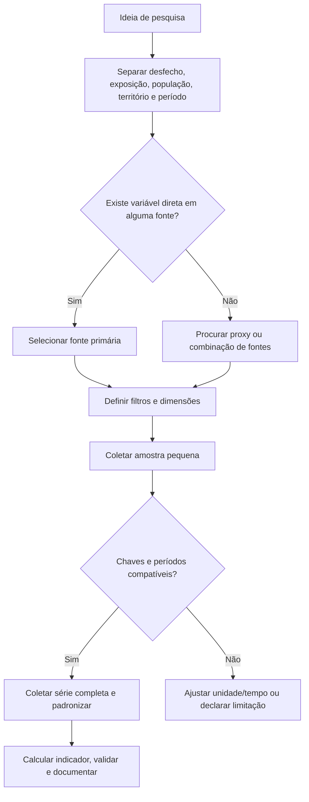
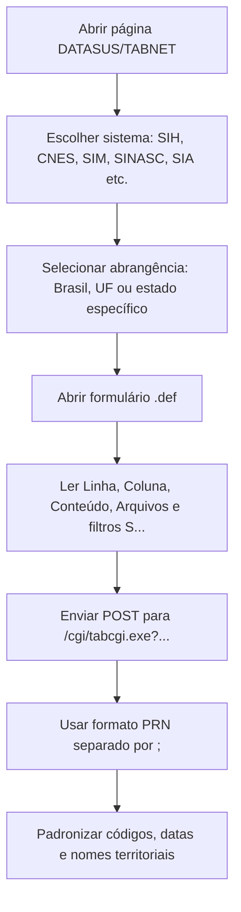
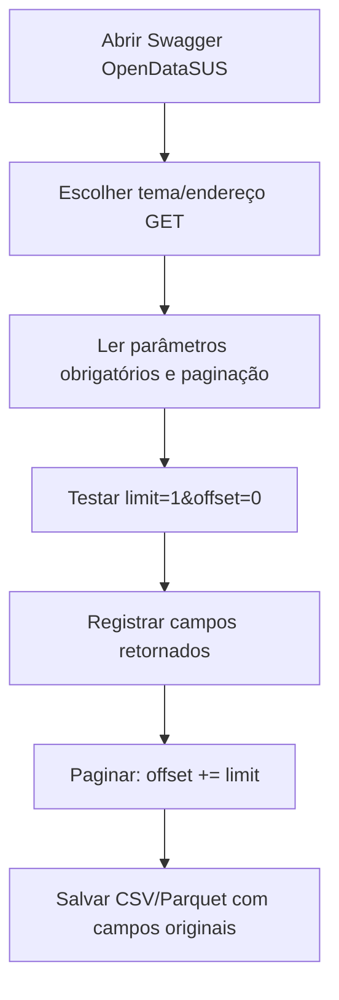
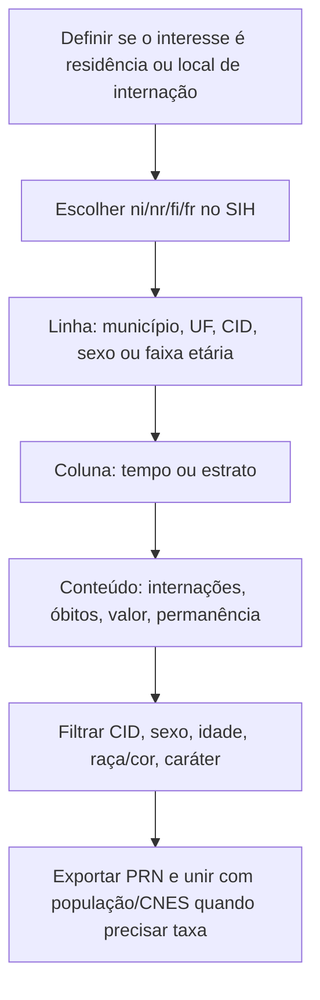
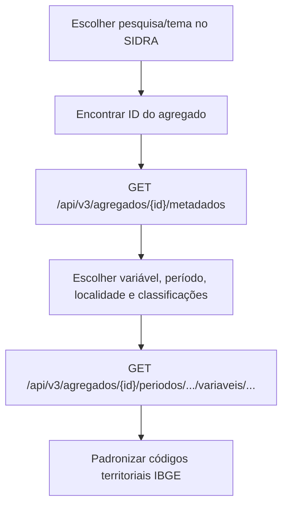
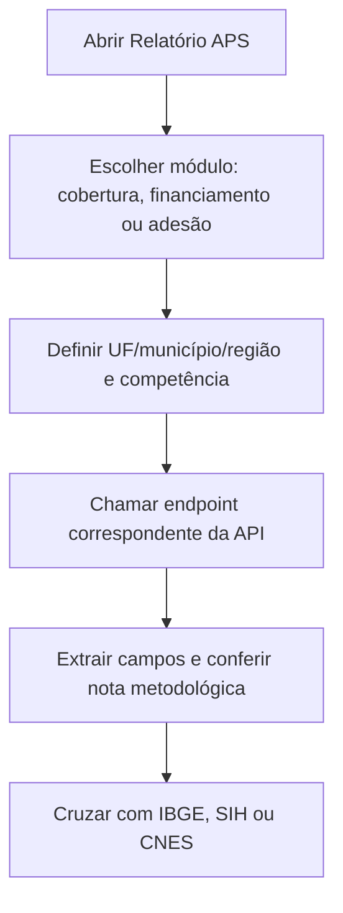
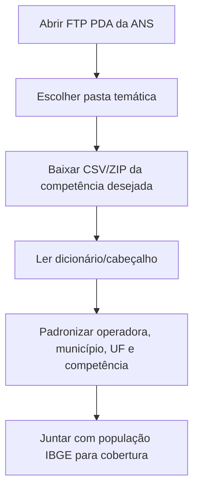
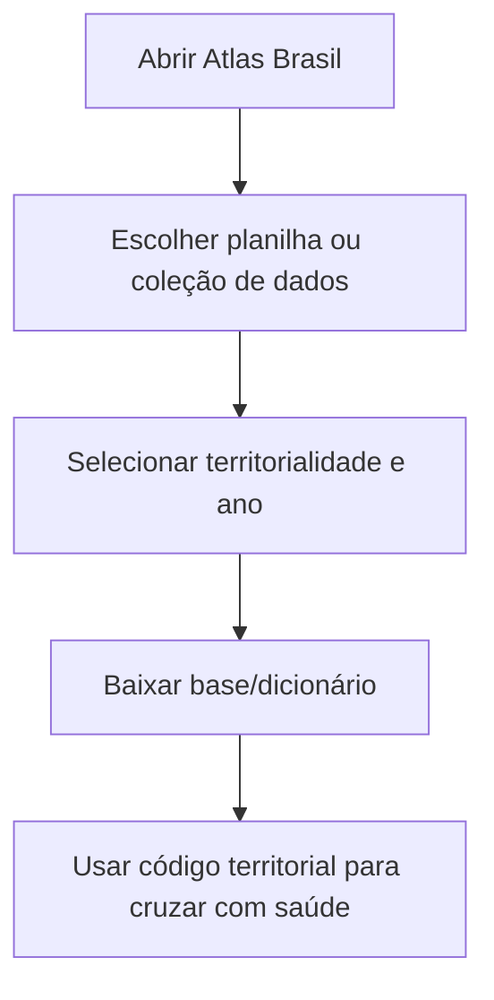
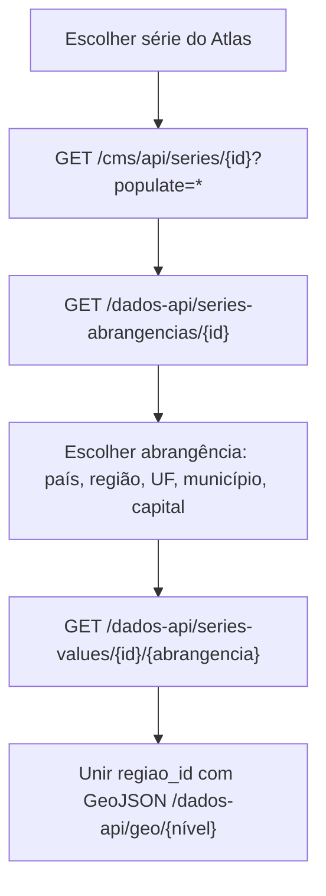
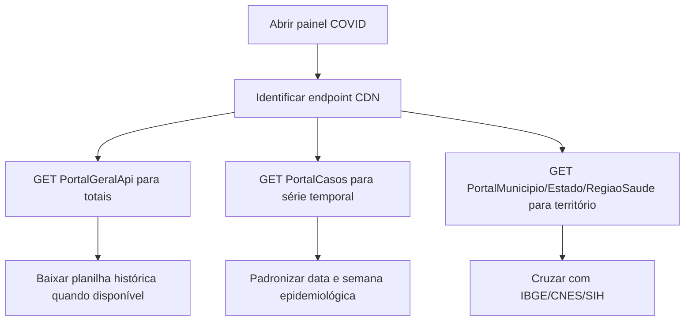

# Guia de mapeamento de variáveis públicas para pesquisas em saúde

Gerado em 2026-06-04 12:11 a partir do PDF `MAPEAMENTO DE VARIÁVEIS DE PESQUISA.pdf` e dos 13 links oficiais nele apontados.

Este documento serve como um roteiro didático para transformar uma ideia de pesquisa em um plano de coleta. Ele não baixa bases massivas automaticamente; ele mapeia onde estão os dados, quais variáveis/filtros aparecem, quais APIs ou formulários usar e como juntar as fontes com segurança.

## Como usar quando alguém trouxer uma ideia

1. Traduza a ideia em `desfecho`, `exposição`, `população`, `território`, `período` e `unidade de análise`.
2. Procure no catálogo a fonte que mede o desfecho e a fonte que fornece denominador ou covariáveis.
3. Confira se as chaves batem: município/UF, ano/mês/semana, sexo, idade, CID, CNES, CBO, plano/operadora.
4. Se a pergunta exige taxa, busque o denominador no IBGE, SIDRA, DATASUS população ou Atlas.
5. Monte uma coleta pequena de teste antes da extração ampla.

## Matriz rápida das fontes

| Fonte | Melhor para | Unidade típica | Extração principal |
|---|---|---|---|
| DATASUS/TABNET | Internações, produção SUS, mortalidade, nascidos vivos, imunização, CNES, população e indicadores legados | Brasil, UF, município, região de saúde, ano/mês | Formulário `.def` + POST em `tabcgi.exe`, saída `formato=prn` |
| CNES físico | Leitos, UTI, equipamentos, consultórios, instalações | Estabelecimento, município, UF, mês | TABNET CNES |
| CNES RH | Profissionais, ocupações CBO, vínculos, carga horária | Município, UF, CBO, mês | TABNET CNES RH |
| SIH/SUS | Internações, AIH, custos, dias de permanência, óbitos hospitalares | Local de internação/residência, município/UF, mês, CID | TABNET SIH |
| OpenDataSUS | APIs abertas de CNES, vacinação, arboviroses, SIM, SINASC, SRAG, SISAGUA, SISVAN, APS, BPS | Varia por endpoint; geralmente registro individual ou agregado | API REST com `limit`/`offset` |
| SIDRA/IBGE | População, Censo, PNAD, PNS, PeNSE, AMS e indicadores socioeconômicos | Brasil, UF, município, setor/agregado conforme pesquisa | API SIDRA v3 por agregado/metadados |
| IBGE Cidades | Perfil municipal pronto: população, trabalho, educação, economia, território | Município | API de pesquisas/indicadores do IBGE |
| e-Gestor APS | Cobertura APS/AB/ACS/SB, programas e financiamento da atenção primária | UF, município, competência | API do relatório APS |
| ANS | Saúde suplementar: beneficiários, operadoras, cobertura, ressarcimento, TISS | Operadora, UF, município, competência | FTP de dados abertos e ANS TabNet |
| Atlas Brasil/PNUD | IDHM, vulnerabilidade, educação, renda, trabalho, território | Município, UF, RM, UDH, anos censitários/PNAD | Planilha/site e Cockpit API pública |
| Atlas da Violência/Ipea | Homicídios, violência por sexo/raça/idade, séries e taxas | Brasil, região, UF, município, capital | CMS API + `dados-api` |
| Painel COVID-19 | Casos, óbitos, incidência, mortalidade, SRAG, insumos e planilhas históricas | Brasil, UF, município, região de saúde, semana/data | CDN/API do painel |

## Chaves de integração mais importantes

- Território: `codmun`/código IBGE de 6 ou 7 dígitos, `UF`, região, região de saúde, capital, CNES.
- Tempo: ano, mês, ano/mês, semana epidemiológica, competência, data de notificação, data de atendimento, data de óbito.
- Pessoa/grupo: sexo, faixa etária, idade, raça/cor, escolaridade, ocupação/CBO.
- Saúde: CID-10, capítulo CID, lista de morbidade, procedimento, AIH, caráter de atendimento, regime, estabelecimento CNES, equipe/INE.
- Suplementar: registro da operadora, CNPJ, modalidade, tipo de contratação, segmentação assistencial.

## Indicadores derivados úteis

- Taxa por 100 mil habitantes: `(evento / população) * 100000`.
- Proporção: `(subgrupo / total) * 100`.
- Letalidade hospitalar SIH: `(óbitos hospitalares / internações) * 100`.
- Média de permanência SIH: `dias de permanência / internações`.
- Leitos por 100 mil: `(leitos CNES / população) * 100000`.
- Profissionais por 100 mil: `(profissionais CNES RH / população) * 100000`.
- Cobertura APS/eSF/eSB/ACS: usar numerador do e-Gestor ou CNES/equipes e denominador populacional indicado na nota metodológica.
- Cobertura suplementar ANS: `(beneficiários / população IBGE) * 100`.

## 1. DATASUS/TABNET

Fonte: [DATASUS/TABNET](https://datasus.saude.gov.br/informacoes-de-saude-tabnet/).

O TABNET é uma família de formulários. A página do relatório escolhe `Linha`, `Coluna`, `Conteúdo`, `Período` e filtros. A coleta limpa usa o próprio formulário como metadado e envia uma requisição POST para `tabcgi.exe`.

### Lógica de abrangência

- `abrangencia=1`: usa `br.def`.
- `abrangencia=2`: usa `uf.def`.
- `abrangencia=3`: permite `br.def`, `uf.def` ou uma UF específica, como `ba.def`.
- `abrangencia=4`: permite `br.def` ou UF específica.
- O formulário envia `Linha`, `Coluna`, `Incremento`, `Arquivos`, filtros `S...`, `formato=prn` e opções como `zeradas=exibirlz`.

### Variáveis TABNET encontradas nos formulários rastreados

Foram identificados 250 formulários TABNET com metadados parseáveis, 276 relatórios/referências e 0 erros de acesso ou páginas incompatíveis. Os catálogos completos ficam em `build/catalogos/tabnet_catalog.json`.

**Dimensões possíveis em linha/coluna**

`1ªBac Escarro`, `2ªBac. Escarro`, `AZT+3TC`, `AZT+3TC+Indinavir`, `AZT+3TC+Nelfinavir`, `Abastecimento de água`, `Ac.trâns.c/derram.carga perig.`, `Acid rel trabalho`, `Acid. Trabalho`, `Acid.trânsito c/carga perigosa`, `Acid.trânsito trabalho/trajeto`, `Acomet neurológico na gestação`, `Acompanham. familiar no parto`, `Acond Amost Adequad`, `Aconselham. p/aliment.saudável`, `Aconselham. p/não beber`, `Aconselham. p/não faltar`, `Aconselham. p/não fumar`, `Aconselham. p/não usar tintura`, `Adeq quant pré-natal*`, `Adequab Zona de Transformação`, `Adequabilidade`, `Adm Vacina VOP`, `Afastamento`, `Agente`, `Agressor violênc.p/conhecido`, `Agressor violênc.p/desconhec`, `Aids`, `Ainda menstrua`, `Alcatrão`, `Alcoolismo`, `Aleit Materno`, `Aleitamento`, `Algum medic.cobert.plano saúde`, `Algum medic.obtido farm.popul.`, `Algum medic.obtido serv.públic`, `Alter. sensibilidade`, `Alterações congênitas detec`, `Altura medida na 1ª consulta`, `Alívio na dor do peito`, `Amb. Infec.`, `Ambiente Infecção`, `Ambiente da Infecção`, `Ambiente estressante`, `Ambulância`, `Ameaça`, `Ameaça em violênc.p/conhecido`, `Ameaça em violênc.p/desconhec`, `Amigos/Conhec`, `Aminas`, `Anat.pat./citolog`, `Anda a pé no trabalho`, `Animal vacinado`, `Ano`, `Ano 1ª Dose Rotavirus`, `Ano 1º Sintoma(s)`, `Ano 2ª Dose Rotavirus`, `Ano Atendimento`, `Ano Coleta Fezes`, `Ano Diag/sintomas`, `Ano Diagnóstico`, `Ano Encerramento`, `Ano Env Amost LACEN`, `Ano Evolucao`, `Ano In. Tratamento`, `Ano Inic Trat Mãe`, `Ano Inic. deficiência motora`, `Ano Inic.Sintomas`, `Ano Nasc`, `Ano Nascimento`, `Ano Notif Atual`, `Ano Notificação`, `Ano Resultado`, `Ano acidente`, `Ano atendimento`, `Ano competencia`, `Ano competência`, `Ano da Notific`, `Ano da Notificação`, `Ano da notificação`, `Ano de Diagnóstico`, `Ano do Atend`, `Ano do Diagnóstico`, `Ano do nascimento`, `Ano do Óbito`, `Ano do óbito`, `Ano do último parto`, `Ano epidem. 1º Sintomas(s)`, `Ano epidem. diagnóstico`, `Ano epidem. notificação`, `Ano exposição`, `Ano internação`, `Ano início ativid`, `Ano início situaç`, `Ano notificação`, `Ano processamento`, `Ano resultado`, `Ano Óbito`, `Ano Últ Dose VOP`, `Ano(s) de início do exantema`, `Ano/Mês`, `Ano/mês atendimento`, `Ano/mês compet`, `Ano/mês compet.`, `Ano/mês do nascimento`, `Ano/mês do Óbito`, `Ano/mês internação`, `Ano/mês processamento`, `Anomal detectada`, `Anomalia congênita`, `Antec trat Pré-exp`, `Antec trat Pós-exp`, `Antec trat quando?`, `Anti-HCV`, `Anti-HIV`, `Anti-Hbs`, `AntiHBcIgM Sorol/virol`, `AntiHCV Sorol/virol`, `Antineoplásicos`, `Antirretroviral`, `Análise Qualitativa`, `Análise Quantitativa`, `Apgar 1º Min`, `Apgar 1º minuto`, `Apgar 5º Min`, `Apgar 5º minuto`, `Aprovação produção`, `Arma de fogo`, `Artrite reumatóide`, `Asbesto`, `Asbesto/Amianto`, `Asma`, `Assist.saúde p/viol.p/conhecid`, `Assist.saúde p/viol.p/desconh`, `Assédio Sexual`, `At.psicossoc/terap`, `Atend SUS`, `Atend particular`, `Atend.ambulatorial`, `Atend.emerg.cobert.plano saúde`, `Atend.emerg.domic.foi p/SUS`, `Atend.emerg.domíc.últ.12 meses`, `Atende no SUS`, `Atendimento`, `Atendimento local acid.trâns.`, `Atent. viol pudor`, `Atip.cel.escamosas`, `Atip.cel.glandulares`, `Aumento de peso na gravidez`, `Autoavaliação de saúde`, `Autoctone Mun Res`, `Autóc Munic Resid?`, `Autóctone da UF?`, `Aval Incap Cura`, `Aval Incap Notif`, `Avaliação - clareza explicaç.`, `Avaliação - disponib.p/perg.`, `Avaliação - equipamentos`, `Avaliação - espaço disponível`, `Avaliação - forma recebimento`, `Avaliação - habilitades médico`, `Avaliação - liberdade escolha`, `Avaliação - limpeza instalaç.`, `Avaliação - privacidade`, `Avaliação - respeito do médico`, `Avaliação - tempo c/deslocam.`, `Avaliação - tempo de espera`, `Avaliação atend.emerg.domic.`, `Avaliação da saúde bucal`, `Avaliação do atendimento`, `Avaliação do plano de saúde`, `Avaliação funcional`, `Avaliação última internação`, `Avental EPI`, `Ação ao sentir dor no peito`, `BI-RADS`, `Bacilosc 2º mês`, `Bacilosc 6º mês`, `Bacilosc Notif`, `Baciloscopia`, `Bact Ident Amost`, `Bacteriologia`, `Banco de leite`, `Banco de sangue`, `Banco órgãos/tecid`, `Benefic. governo`, `Benzeno`, `Berílio`, `Bioquímica`, `Biópsia pulmonar`, `Bota EPI`, `C básic ou M diagn`, `C. múltipla(Cap)`, `C. múltipla(Cat3c)`, `C. múltipla(Grup)`, `C/Berços aloj.conj`, `C/Berços normais`, `C/Camas complement`, `C/Cir.cardíaca`, `C/Cons.enfermagem`, `C/Cons.médicos`, `C/Cons.odontológ`, `C/Enferm c/+6 leit`, `C/Enferm c/2 leit`, `C/Enferm c/3-6leit`, `C/Leitos UTI adult`, `C/Leitos UTI coron`, `C/Leitos UTI infan`, `C/Leitos UTI neon`, `C/Leitos UTI queim`, `C/Leitos unid.int`, `C/Outr salas/cons`, `C/Quartos/apartam`, `C/Sal cirurg amb`, `C/Sal curativo`, `C/Sal enfermagem`, `C/Sal imunização`, `C/Sal nebul/reidr`, `C/Sal repous/obser`, `C/Salas UTI/CTI` ... (+1734)

**Medidas/conteúdos possíveis**

`% Positividade`, `% crianças renda dom < 1/2 SM`, `% crianças renda dom < 1/4 SM`, `% população com renda < 1/2 SM`, `% população com renda < 1/4 SM`, `%Ac.trâns.c/assist.saúde local`, `%Ac.trâns.c/assistência saúde`, `%Ac.trâns.c/internação`, `%Ac.trâns.c/perda ativ.habit.`, `%Ac.trâns.c/sequelas/incapac.`, `%Acid.trab.c/internação`, `%Acid.trab.c/perda ativ.habit.`, `%Acid.trab.c/sequelas/incapac.`, `%Acid.trabalho`, `%Acid.trâns.no trabalho/trajet`, `%Acid.trâns.no trajeto trab.`, `%Acid.trânsito c/lesões`, `%Ass.méd.últ.12 meses p/depres`, `%Assist. TV mais 3h/dia`, `%Assist.médica últ.12 meses`, `%At.física domést > 150min`, `%At.física trab > 150min`, `%Autoavaliação boa/muito boa`, `%Avaliação boa/muito boa SB`, `%Com problema crônico coluna`, `%Cons.abusiv.álcool 4+vezes`, `%Cons.c/especialista p/depres`, `%Cons.carne/frango exc.gordura`, `%Cons.recom.hortaliças/frutas`, `%Cons.regular refrig.açúcar`, `%Consulta c/médico especialist`, `%Consumo abusivo de álcool`, `%Consumo elevado de sal`, `%Consumo leite integral`, `%Consumo regular de doces`, `%Consumo regular de feijão`, `%Consumo regular refrigerante`, `%Consumo semanal de peixe`, `%Consumo álcool 1+vezes p/mês`, `%Consumo álcool 1+vezes p/sem`, `%Crianças 6-23m sulf.ferroso`, `%Crianças 9-11m c/aleit.matern`, `%Crianças <1a c/3+doses tetrav`, `%Crianças <2a c/1ª cons. <=7d`, `%Crianças <2a c/tst olho 1ºmês`, `%Crianças <2a c/tst orel 1ºmês`, `%Crianças <2a c/tst pé 1ª sem.`, `%Crianças <2a comem bisc/bolo`, `%Crianças <2a tomam refr/artif`, `%Diagn.méd.insufic.renal crôn`, `%Diagn.médico AVC`, `%Diagn.médico DORT`, `%Diagn.médico artrite/reumat.`, `%Diagn.médico asma`, `%Diagn.médico colesterol`, `%Diagn.médico depressão`, `%Diagn.médico diabetes`, `%Diagn.médico doença cardíaca`, `%Diagn.médico hipert.arterial`, `%Diagnóstico médico de câncer`, `%Dific.aliment.p/probl.dental`, `%Dirigiu após beber`, `%Dom.cad.1a+ s/visita ACS/ESF`, `%Dom.cad.1a+c/vis.ACS/ESF mens`, `%Dom.cadast.Unid.Saúde Família`, `%Dom.com animais vacinad.raiva`, `%Dom.com cachorros`, `%Dom.com coleta serv. limpeza`, `%Dom.com energia elétrica`, `%Dom.com gatos`, `%Dom.com visita agent endemias`, `%Dom.esgoto rede geral/pluvial`, `%Dom.água canaliz em um cômodo`, `%Escova dentes 2x ou + p/dia`, `%Ex-fumantes`, `%Expostos mídia anti-tabaco`, `%Expostos mídia pró-tabaco`, `%Faz psicoterapia p/depressão`, `%Fez exame de pé últ.12 meses`, `%Fez exame vista últ.12 meses`, `%Fez ponte safena/stent/angiop`, `%Fez todos exames solicitados`, `%Fisicamente ativos deslocam`, `%Fisicamente ativos trab.dom.`, `%Fisicamente ativos trabalho`, `%Fumant tentaram parar 12meses`, `%Fumant.pensou parar advert.`, `%Fumantes atuais de cigarros`, `%Fumantes atuais de tabaco`, `%Fumantes diários de tabaco`, `%Fumantes expost.advert.maços`, `%Gest.c/PA elev.e c/orientaç.`, `%Gest.c/acompanhante no parto`, `%Gest.c/atend.médico no parto`, `%Gest.c/auscult.coração bebê`, `%Gest.c/diabetes e c/orientaç.`, `%Gest.c/ex.sangue c/diabetes`, `%Gest.c/ex.sífilis c/resultado`, `%Gest.c/exame de sangue`, `%Gest.c/exame de sífilis`, `%Gest.c/exame de urina`, `%Gest.c/inform.serv.saúde`, `%Gest.c/medição de peso`, `%Gest.c/medição fundo do útero`, `%Gest.c/medição press.arterial`, `%Gest.c/orient.aleitamento`, `%Gest.c/orient.sinais parto`, `%Gest.c/orient.sinais risco`, `%Gest.c/parto cesáreo marcado`, `%Gest.c/parto em casa de parto`, `%Gest.c/parto hospitalar`, `%Gest.c/parto no estab.indicad`, `%Gest.c/parto vaginal`, `%Gest.c/pressão elevada gravid`, `%Gest.c/solicit.exame de HIV`, `%Gest.c/todos aconselhamentos`, `%Gest.c/ultrassonografia`, `%Gest.inic.pré-natal <13sem`, `%Gest.procuraram +1 estabelec.`, `%Gest.s/acomp.ñ sabia/ñ deix.`, `%Gestantes c/cartão pré-natal`, `%Gestantes com pré-natal`, `%Idosos c/cirurgia de catarata`, `%Idosos c/lim. AVD ajuda famil`, `%Idosos c/lim. AVD ajuda remun`, `%Idosos c/lim. AVD neces.ajuda`, `%Idosos c/lim. AVD ñ têm ajuda`, `%Idosos c/limitação AIVD`, `%Idosos c/limitação AVD`, `%Idosos diagn.com catarata`, `%Idosos part.ativ.soc.organiz.`, `%Idosos vacinados c/gripe`, `%Insuficientemente ativos`, `%Internação p/DM ou complic`, `%Internação p/HA ou complic`, `%Limit.intensa AVC`, `%Limit.intensa asma`, `%Limit.intensa depressão`, `%Limit.intensa doença cardíaca`, `%Limit.intensa problema coluna`, `%Limitação intens/muito intens`, `%Medicament.p/DM 2 últ.semanas`, `%Medicament.p/DM Farm.Popular`, `%Medicament.p/HA 2 últ.semanas`, `%Medicament.p/HA Farm.Popular`, `%Mesmo médico consult.anterior`, `%Mor.cad.1a+ s/visita ACS/ESF`, `%Mor.cad.1a+c/vis.ACS/ESF mens`, `%Mor.cadast.Unid.Saúde Família`, `%Mor.com animais vacinad.raiva`, `%Mor.com cachorros`, `%Mor.com coleta serv. limpeza`, `%Mor.com energia elétrica`, `%Mor.com gatos`, `%Mor.com visita agent endemias`, `%Mor.esgoto rede geral/pluvial`, `%Mor.água canaliz em um cômodo`, `%Mulh.18-49a c/aborto espont.`, `%Mulh.18-49a c/aborto provoc.`, `%Mulh.18-49a c/tratam.gravidez`, `%Mulh.18-49a evitam gravidez`, `%Mulh.18-49a já ficaram grávid`, `%Mulh.25-64a c/prev e res.<3mes`, `%Mulh.45a+ c/trat.menop.p/méd.`, `%Mulh.45a+ c/trat.p/sint.menop.`, `%Mulheres 25-64a c/prev <3 anos`, `%Mulheres 45a e + na menopausa`, `%Mulheres 50-69a mamog <2anos`, `%Mulheres 50-69a s/mamografia`, `%Mulheres fizeram histerectomia`, `%Nenhuma dificuldade locomoção`, `%Nunca mediram colesterol`, `%Nunca mediram glicemia`, `%Nunca mediram press. arterial`, `%Não fumantes expostos em casa`, `%Não fumantes expostos no trab`, `%Não se locomove/grande dific.`, `%Nível recom at.física lazer`, `%Perd 13+ dent c/dif.aliment.`, `%Perderam 13 ou + dentes`, `%Perderam todos os dentes`, `%Pes.c/aten.urg.SUS c/boa aval`, `%Pes.c/atend.urgênc.domicílio`, `%Pes.c/atendimento 1ª procura`, `%Pes.c/cons.médic.últ.12 meses`, `%Pes.c/cons.odont.últ.12 meses`, `%Pes.c/int.SUS e boa avaliação`, `%Pes.c/internação SUS`, `%Pes.c/internação últ.12 meses`, `%Pes.c/medicament.Farm.Popular`, `%Pes.c/medicament.serv.público`, `%Pes.c/medicamento receitado`, `%Pes.c/prát.integr.complement`, `%Pes.c/refer.dengue c/diag.méd`, `%Pes.c/referiram dengue`, `%Pes.conseguiu alguns medicam.`, `%Pes.conseguiu todos medicam.`, `%Pes.procura atend.últ.2 seman`, `%Pes.procura mesmo local atend.`, `%Pess.c/defic.audit.adquirida`, `%Pess.c/defic.física adquirida`, `%Pess.c/defic.intelec.adquirid`, `%Pess.c/defic.visual adquirida`, `%Pess.c/defic.visual c/aux.loc`, `%Pess.c/limit.intens.def.audit`, `%Pess.c/limit.intens.def.físic`, `%Pess.c/limit.intens.def.intel`, `%Pess.c/limit.intens.def.visu.`, `%Pess.c/pouca/nenh.lim.def.aud`, `%Pess.c/pouca/nenh.lim.def.fís`, `%Pess.c/pouca/nenh.lim.def.int`, `%Pess.c/pouca/nenh.lim.def.vis`, `%Pess.q nasceram c/defic.audit`, `%Pess.q nasceram c/defic.físic`, `%Pess.q nasceram c/defic.intel`, `%Pess.q nasceram c/defic.visu.`, `%Pess.serv.reab.p/defic.audit.`, `%Pess.serv.reab.p/defic.física`, `%Pess.serv.reab.p/defic.intel.`, `%Pess.serv.reab.p/defic.visual` ... (+1195)

**Filtros possíveis**

`1ªBac Escarro`, `2ªBac. Escarro`, `AZT+3TC`, `AZT+3TC+Indinavir`, `AZT+3TC+Nelfinavir`, `Abastecimento de água`, `Ac.trâns.c/derram.carga perig.`, `Acid rel trabalho`, `Acid. Trabalho`, `Acid.trânsito c/carga perigosa`, `Acid.trânsito trabalho/trajeto`, `Acomet neurológico na gestação`, `Acompanham. familiar no parto`, `Aconselham. p/aliment.saudável`, `Aconselham. p/não beber`, `Aconselham. p/não faltar`, `Aconselham. p/não fumar`, `Aconselham. p/não usar tintura`, `Adeq quant pré-natal*`, `Afastamento`, `Agente`, `Agressor violênc.p/conhecido`, `Agressor violênc.p/desconhec`, `Aids`, `Ainda menstrua`, `Alcatrão`, `Alcoolismo`, `Aleit Materno`, `Aleitamento`, `Algum medic.cobert.plano saúde`, `Algum medic.obtido farm.popul.`, `Algum medic.obtido serv.públic`, `Alter. sensibilidade`, `Alterações congênitas detec`, `Altura medida na 1ª consulta`, `Alívio na dor do peito`, `Amazônia Legal`, `Amazônia Legal (Acid)`, `Amazônia Legal (Atend.)`, `Amazônia Legal (notificação)`, `Amazônia Legal (residência)`, `Amazônia Legal Empresa`, `Amb. Infec.`, `Ambiente Infecção`, `Ambiente da Infecção`, `Ambiente estressante`, `Ambulância`, `Ameaça`, `Ameaça em violênc.p/conhecido`, `Ameaça em violênc.p/desconhec`, `Amigos/Conhec`, `Aminas`, `Anat.pat./citolog`, `Anda a pé no trabalho`, `Animal vacinado`, `Ano 1ª Dose Rotavirus`, `Ano 1º Sintoma(s)`, `Ano 2ª Dose Rotavirus`, `Ano Atendimento`, `Ano Coleta Fezes`, `Ano Diag/sintomas`, `Ano Diagnóstico`, `Ano Encerramento`, `Ano Env Amost LACEN`, `Ano Evolucao`, `Ano In. Tratamento`, `Ano Inic Trat Mãe`, `Ano Inic. deficiência motora`, `Ano Inic.Sintomas`, `Ano Notif Atual`, `Ano Notificação`, `Ano Resultado`, `Ano acidente`, `Ano da Notific`, `Ano da Notificação`, `Ano de Diagnóstico`, `Ano do Atend`, `Ano do Diagnóstico`, `Ano do nascimento`, `Ano do Óbito`, `Ano do óbito`, `Ano do último parto`, `Ano epidem. 1º Sintomas(s)`, `Ano epidem. diagnóstico`, `Ano epidem. notificação`, `Ano exposição`, `Ano início ativid`, `Ano início situaç`, `Ano notificação`, `Ano resultado`, `Ano Últ Dose VOP`, `Ano(s) de início do exantema`, `Ano/mês internação`, `Anomalia congênita`, `Antec trat Pré-exp`, `Antec trat Pós-exp`, `Antec trat quando?`, `Anti-HCV`, `Anti-HIV`, `Anti-Hbs`, `AntiHBcIgM Sorol/virol`, `AntiHCV Sorol/virol`, `Antineoplásicos`, `Antirretroviral`, `Análise Qualitativa`, `Análise Quantitativa`, `Apgar 1º Minuto`, `Apgar 1º minuto`, `Apgar 5º Minuto`, `Apgar 5º minuto`, `Aprovação produção`, `Arma de fogo`, `Asbesto/Amianto`, `Asma`, `Assist.saúde p/viol.p/conhecid`, `Assist.saúde p/viol.p/desconh`, `Assédio Sexual`, `At.psicossoc/terap`, `Atend SUS`, `Atend particular`, `Atend.ambulatorial`, `Atend.emerg.cobert.plano saúde`, `Atend.emerg.domic.foi p/SUS`, `Atend.emerg.domíc.últ.12 meses`, `Atende no SUS`, `Atendimento`, `Atendimento local acid.trâns.`, `Atent. viol pudor`, `Aumento de peso na gravidez`, `Autoavaliação de saúde`, `Autoctone Mun Res`, `Autóc Munic Resid?`, `Autóctone da UF?`, `Aval Incap Cura`, `Aval Incap Notif`, `Avaliação - clareza explicaç.`, `Avaliação - disponib.p/perg.`, `Avaliação - equipamentos`, `Avaliação - espaço disponível`, `Avaliação - forma recebimento`, `Avaliação - habilitades médico`, `Avaliação - liberdade escolha`, `Avaliação - limpeza instalaç.`, `Avaliação - privacidade`, `Avaliação - respeito do médico`, `Avaliação - tempo c/deslocam.`, `Avaliação - tempo de espera`, `Avaliação atend.emerg.domic.`, `Avaliação da saúde bucal`, `Avaliação do atendimento`, `Avaliação do plano de saúde`, `Avaliação última internação`, `Avental EPI`, `Ação ao sentir dor no peito`, `Bacilosc 2º mês`, `Bacilosc 6º mês`, `Bacilosc Notif`, `Baciloscopia`, `Bact Ident Amost`, `Bacteriologia`, `Banco de leite`, `Banco de sangue`, `Banco órgãos/tecid`, `Benefic. governo`, `Benzeno`, `Berílio`, `Bioquímica`, `Bota EPI`, `C Básica (Cap)`, `C Básica (Cat 3c)`, `C Básica (Grup)`, `C básic ou M diagn`, `C. múltipla(Cap)`, `C. múltipla(Cat3c)`, `C. múltipla(Grup)`, `C/Berços aloj.conj`, `C/Berços normais`, `C/Camas complement`, `C/Cir.cardíaca`, `C/Cons.enfermagem`, `C/Cons.médicos`, `C/Cons.odontológ`, `C/Enferm c/+6 leit`, `C/Enferm c/2 leit`, `C/Enferm c/3-6leit`, `C/Leitos UTI adult`, `C/Leitos UTI coron`, `C/Leitos UTI infan`, `C/Leitos UTI neon`, `C/Leitos UTI queim`, `C/Leitos unid.int`, `C/Outr salas/cons`, `C/Quartos/apartam`, `C/Sal cirurg amb`, `C/Sal curativo`, `C/Sal enfermagem`, `C/Sal imunização`, `C/Sal nebul/reidr`, `C/Sal repous/obser`, `C/Salas UTI/CTI`, `C/Salas cir/parto`, `C/Salas cirurgia`, `C/Salas curetagem`, `C/Salas parto`, `C/Salas pré-parto`, `C/Salas rec.póscir`, `C/Serv.AIDS`, `C/Transp.cardíaco`, `C/Transp.fígado`, `C/Transp.medula`, `C/Transp.pulmão`, `C/Transp.renal`, `C/Turn DST/AIDS`, `C/Turn cardiologia`, `C/Turn cirurgia`, `C/Turn clín.médica`, `C/Turn dermatolog`, `C/Turn ginecologia`, `C/Turn inf-parasit`, `C/Turn nefrologia`, `C/Turn neurocirurg`, `C/Turn obstetrícia`, `C/Turn odontologia`, `C/Turn oftalmolog`, `C/Turn ortopedia`, `C/Turn otorrinolar`, `C/Turn outras esp`, `C/Turn pediatria`, `C/Turn psiquiatria`, `C/Turn tisio-pneum`, `C/Turn total`, `C/Urg-Cons.médicos`, `C/Urg-Cons.odontol`, `C/Urg-Sal at adult`, `C/Urg-Sal at ped`, `C/Urg-Sal curativo`, `C/Urg-Sal de gesso`, `C/Urg-Sal obs adul`, `C/Urg-Sal obs ped`, `C/Urg-Sal pq cirur`, `C/Urg-salas/consul`, `C/salas/consultór`, `CAPES`, `CAT`, `CBO do Profissional`, `CID Anomalia`, `CID Dermatose`, `CID LER/DORT`, `CID PAIR`, `CID Pneumoconiose`, `CNAE-Ativ. Econ.`, `CTI`, `Capital`, `Capital Acid`, `Capital Atend.`, `Capital Empresa`, `Capital de notificação`, `Capital de residência`, `Capítulo CID-10`, `Capítulo CID-9` ... (+1565)

### Relatórios SIH/SUS rastreados

| Relatório | Dimensões | Medidas | Filtros | Períodos mais recentes | Formulário |
| --- | --- | --- | --- | --- | --- |
| TabNet Win32 3.3: Morbidade Hospitalar do SUS - por local de internação - Brasil | 20 | 15 | 21 | Mar/2026, Fev/2026, Jan/2026 | http://tabnet.datasus.gov.br/cgi/deftohtm.exe?sih/cnv/nibr.def |
| TabNet Win32 3.3: Morbidade Hospitalar do SUS - por local de residência - Brasil | 20 | 15 | 21 | Mar/2026, Fev/2026, Jan/2026 | http://tabnet.datasus.gov.br/cgi/deftohtm.exe?sih/cnv/nrbr.def |
| TabNet Win32 3.3: Morbidade Hospitalar do SUS por Causas Externas - por local de internação - Brasil | 21 | 15 | 22 | Mar/2026, Fev/2026, Jan/2026 | http://tabnet.datasus.gov.br/cgi/deftohtm.exe?sih/cnv/fibr.def |
| TabNet Win32 3.3: Morbidade Hospitalar do SUS por Causas Externas - por local de residência - Brasil | 21 | 15 | 22 | Mar/2026, Fev/2026, Jan/2026 | http://tabnet.datasus.gov.br/cgi/deftohtm.exe?sih/cnv/frbr.def |
| TabNet Win32 3.3: Morbidade Hospitalar do SUS - por local de internação - Brasil | 20 | 9 | 22 | Dez/2007, Nov/2007, Out/2007 | http://tabnet.datasus.gov.br/cgi/deftohtm.exe?sih/cnv/mibr.def |
| TabNet Win32 3.3: Morbidade Hospitalar do SUS - por local de residência - Brasil | 19 | 9 | 21 | Dez/2007, Nov/2007, Out/2007 | http://tabnet.datasus.gov.br/cgi/deftohtm.exe?sih/cnv/mrbr.def |
| TabNet Win32 3.3: Morbidade Hospitalar do SUS por Causas Externas - por local de internação - Brasil | 17 | 9 | 20 | Dez/2007, Nov/2007, Out/2007 | http://tabnet.datasus.gov.br/cgi/deftohtm.exe?sih/cnv/eibr.def |
| TabNet Win32 3.3: Morbidade Hospitalar do SUS por Causas Externas - por local de residência - Brasil | 16 | 9 | 19 | Dez/2007, Nov/2007, Out/2007 | http://tabnet.datasus.gov.br/cgi/deftohtm.exe?sih/cnv/erbr.def |
| TabNet Win32 3.3: Procedimentos hospitalares do SUS - por local de internação - Brasil | 29 | 15 | 29 | Mar/2026, Fev/2026, Jan/2026 | http://tabnet.datasus.gov.br/cgi/deftohtm.exe?sih/cnv/qibr.def |
| TabNet Win32 3.3: Procedimentos hospitalares do SUS - por local de internação - Brasil | 18 | 20 | 21 | Dez/2007, Nov/2007, Out/2007 | http://tabnet.datasus.gov.br/cgi/deftohtm.exe?sih/cnv/pibr.def |
| TabNet Win32 3.3: Procedimentos hospitalares do SUS - por local de residência - Brasil | 29 | 15 | 29 | Mar/2026, Fev/2026, Jan/2026 | http://tabnet.datasus.gov.br/cgi/deftohtm.exe?sih/cnv/qrbr.def |
| TabNet Win32 3.3: Procedimentos hospitalares do SUS - por local de residência - Brasil | 17 | 20 | 20 | Dez/2007, Nov/2007, Out/2007 | http://tabnet.datasus.gov.br/cgi/deftohtm.exe?sih/cnv/prbr.def |
| TabNet Win32 3.3: Procedimentos hospitalares do SUS - por gestor - Brasil | 23 | 15 | 30 | Mar/2026, Fev/2026, Jan/2026 | http://tabnet.datasus.gov.br/cgi/deftohtm.exe?sih/cnv/qgbr.def |
| TabNet Win32 3.3: Dados detalhados das AIH - por local internação - Brasil | 17 | 2 | 26 | Mar/2026, Fev/2026, Jan/2026 | http://tabnet.datasus.gov.br/cgi/deftohtm.exe?sih/cnv/spabr.def |
| TabNet Win32 3.3: Dados detalhados das AIH - por residência - Brasil | 17 | 2 | 26 | Mar/2026, Fev/2026, Jan/2026 | http://tabnet.datasus.gov.br/cgi/deftohtm.exe?sih/cnv/sprbr.def |
| TabNet Win32 3.3: Dados detalhados das AIH - por gestor - Brasil | 17 | 2 | 26 | Mar/2026, Fev/2026, Jan/2026 | http://tabnet.datasus.gov.br/cgi/deftohtm.exe?sih/cnv/spgbr.def |

### Relatórios CNES rastreados

| Relatório | Dimensões | Medidas | Filtros | Períodos mais recentes | Formulário |
| --- | --- | --- | --- | --- | --- |
| TabNet Win32 3.3: CNES - Recursos Físicos - Ambulatório - Consultórios - Brasil | 21 | 5 | 24 | Abr/2026, Mar/2026, Fev/2026 | http://tabnet.datasus.gov.br/cgi/deftohtm.exe?cnes/cnv/consulbr.def |
| TabNet Win32 3.3: CNES - Recursos Físicos - Ambulatório - Leitos de Repouso e Observação - Brasil | 21 | 4 | 24 | Abr/2026, Mar/2026, Fev/2026 | http://tabnet.datasus.gov.br/cgi/deftohtm.exe?cnes/cnv/ambleibr.def |
| TabNet Win32 3.3: CNES - Recursos Físicos - Hospitalar - Leitos de internação - Brasil | 29 | 3 | 32 | Abr/2026, Mar/2026, Fev/2026 | http://tabnet.datasus.gov.br/cgi/deftohtm.exe?cnes/cnv/leiintbr.def |
| TabNet Win32 3.3: CNES - Recursos Físicos - Hospitalar - Leitos Complementares - Brasil | 22 | 3 | 25 | Abr/2026, Mar/2026, Fev/2026 | http://tabnet.datasus.gov.br/cgi/deftohtm.exe?cnes/cnv/leiutibr.def |
| TabNet Win32 3.3: CNES - Recursos Físicos - Hospitalar - Instalações Físicas de Obstetrícia e Neonatologia - Brasil | 21 | 4 | 24 | Abr/2026, Mar/2026, Fev/2026 | http://tabnet.datasus.gov.br/cgi/deftohtm.exe?cnes/cnv/leiobsbr.def |
| TabNet Win32 3.3: CNES - Recursos Físicos - Urgência - Consultórios - Brasil | 21 | 2 | 24 | Abr/2026, Mar/2026, Fev/2026 | http://tabnet.datasus.gov.br/cgi/deftohtm.exe?cnes/cnv/rurgcbr.def |
| TabNet Win32 3.3: CNES - Recursos Físicos - Urgência - Leitos de Repouso / Observação - Brasil | 21 | 4 | 24 | Abr/2026, Mar/2026, Fev/2026 | http://tabnet.datasus.gov.br/cgi/deftohtm.exe?cnes/cnv/recurgbr.def |
| TabNet Win32 3.3: CNES - Recursos Físicos - Equipamentos - Brasil | 24 | 3 | 27 | Abr/2026, Mar/2026, Fev/2026 | http://tabnet.datasus.gov.br/cgi/deftohtm.exe?cnes/cnv/equipobr.def |
| TabNet Win32 3.3: CNES - Recursos Humanos - Ocupações - segundo CBO 2002 - Brasil | 28 | 3 | 31 | Abr/2026, Mar/2026, Fev/2026 | http://tabnet.datasus.gov.br/cgi/deftohtm.exe?cnes/cnv/proc02br.def |
| TabNet Win32 3.3: CNES - Recursos Humanos - Profissionais - Indivíduos - segundo CBO 2002 - Brasil | 28 | 1 | 31 | Abr/2026, Mar/2026, Fev/2026 | http://tabnet.datasus.gov.br/cgi/deftohtm.exe?cnes/cnv/prid02br.def |
| TabNet Win32 3.3: CNES - Estabelecimentos por Tipo - Brasil | 21 | 1 | 24 | Abr/2026, Mar/2026, Fev/2026 | http://tabnet.datasus.gov.br/cgi/deftohtm.exe?cnes/cnv/estabbr.def |
| TabNet Win32 3.3: CNES - Estabelecimentos por nível de atenção - Brasil | 21 | 11 | 24 | Abr/2026, Mar/2026, Fev/2026 | http://tabnet.datasus.gov.br/cgi/deftohtm.exe?cnes/cnv/atencbr.def |
| TabNet Win32 3.3: CNES - Estabelecimentos - Serviços / classificação até Fevereiro de 2008 - Brasil | 20 | 1 | 23 | Fev/2008, Jan/2008, Dez/2007 | http://tabnet.datasus.gov.br/cgi/deftohtm.exe?cnes/cnv/servclbr.def |
| TabNet Win32 3.3: CNES - Estabelecimentos - Classificação do Serviço - Brasil | 22 | 1 | 25 | Abr/2026, Mar/2026, Fev/2026 | http://tabnet.datasus.gov.br/cgi/deftohtm.exe?cnes/cnv/servc2br.def |
| TabNet Win32 3.3: CNES - Estabelecimentos por Habilitação - Brasil | 22 | 2 | 26 | Abr/2026, Mar/2026, Fev/2026 | http://tabnet.datasus.gov.br/cgi/deftohtm.exe?cnes/cnv/habbr.def |
| TabNet Win32 3.3: CNES - Estabelecimentos com Tipo de Atendimento Prestado - Ambulatório - Brasil | 21 | 4 | 24 | Abr/2026, Mar/2026, Fev/2026 | http://tabnet.datasus.gov.br/cgi/deftohtm.exe?cnes/cnv/atambbr.def |
| TabNet Win32 3.3: CNES - Estabelecimentos com Tipo de Atendimento Prestado - Internação - Brasil | 21 | 4 | 24 | Abr/2026, Mar/2026, Fev/2026 | http://tabnet.datasus.gov.br/cgi/deftohtm.exe?cnes/cnv/atintbr.def |
| TabNet Win32 3.3: CNES - Estabelecimentos com Tipo de Atendimento Prestado - SADT - Brasil | 21 | 4 | 24 | Abr/2026, Mar/2026, Fev/2026 | http://tabnet.datasus.gov.br/cgi/deftohtm.exe?cnes/cnv/atsadtbr.def |
| TabNet Win32 3.3: CNES - Estabelecimentos com Tipo de Atendimento Prestado - Urgência - Brasil | 21 | 4 | 24 | Abr/2026, Mar/2026, Fev/2026 | http://tabnet.datasus.gov.br/cgi/deftohtm.exe?cnes/cnv/aturgbr.def |
| TabNet Win32 3.3: CNES - Estabelecimentos com Tipo de Atendimento Prestado - Vigilância Epidemiológica e/ou Sanitária - Brasil | 21 | 1 | 24 | Abr/2026, Mar/2026, Fev/2026 | http://tabnet.datasus.gov.br/cgi/deftohtm.exe?cnes/cnv/atvigbr.def |
| TabNet Win32 3.3: CNES - Estabelecimentos com Tipo de Atendimento Prestado - Outros (Farmácia ou Cooperativa) - Brasil | 21 | 4 | 24 | Abr/2026, Mar/2026, Fev/2026 | http://tabnet.datasus.gov.br/cgi/deftohtm.exe?cnes/cnv/atoutbr.def |
| TabNet Win32 3.3: CNES - Recursos Humanos - Ocupações - segundo CBO 1994 - Brasil | 23 | 3 | 26 | Jul/2007, Jun/2007, Mai/2007 | http://tabnet.datasus.gov.br/cgi/deftohtm.exe?cnes/cnv/profocbr.def |
| TabNet Win32 3.3: CNES - Recursos Humanos - Profissionais - Indivíduos - segundo CBO 1994 - Brasil | 24 | 1 | 26 | Jul/2007, Jun/2007, Mai/2007 | http://tabnet.datasus.gov.br/cgi/deftohtm.exe?cnes/cnv/profidbr.def |
| TabNet Win32 3.3: CNES - Equipes de Saúde - Brasil | 22 | 1 | 25 | Abr/2026, Mar/2026, Fev/2026 | http://tabnet.datasus.gov.br/cgi/deftohtm.exe?cnes/cnv/equipebr.def |

### Links de bases TABNET/DATASUS encontrados na página principal

| Texto | URL |
| --- | --- |
| DATASUS | https://datasus.saude.gov.br/ |
| Sistemas | https://datasus.saude.gov.br/sistemas/ |
| Acesso à informação | https://datasus.saude.gov.br/acesso-a-informacao/ |
| DATASUS | https://datasus.saude.gov.br/ |
| O DATASUS | https://datasus.saude.gov.br/sobre-o-datasus/ |
| Sistemas | https://datasus.saude.gov.br/sistemas/ |
| Interoperabilidade | https://datasus.saude.gov.br/catalogo-de-servicos/ |
| Indicadores e Dados Básicos – IDB | https://datasus.saude.gov.br/acesso-a-informacao/indicadores-e-dados-basicos/ |
| Rol de Diretrizes, Objetivos, Metas e Indicadores 2013-2015 – Edição 2015 | https://datasus.saude.gov.br/acesso-a-informacao/rol-de-diretrizes-objetivos-metas-e-indicadores-2013-2015-edicao-2015/ |
| Rol de Diretrizes, Objetivos, Metas e Indicadores 2013-2015 – Resultados passíveis de apuração quadrimestral – 3º quadrimestre 2015 | https://datasus.saude.gov.br/acesso-a-informacao/rol-de-diretrizes-objetivos-metas-e-indicadores-2013-2015-resultados-passiveis-de-apuracao-quadrimestral-3o-quadrimestre-2015/ |
| Rol de Diretrizes, Objetivos, Metas e Indicadores 2013-2015 – Edição 2014 | https://datasus.saude.gov.br/acesso-a-informacao/rol-de-diretrizes-objetivos-metas-e-indicadores-2013-2015-edicao-2014/ |
| Rol de Diretrizes, Objetivos, Metas e Indicadores 2013-2015 – Edição 2013 | https://datasus.saude.gov.br/acesso-a-informacao/rol-de-diretrizes-objetivos-metas-e-indicadores-2013-2015-edicao-2013/ |
| Transição Pacto pela Saúde e COAP – 2012 | https://datasus.saude.gov.br/acesso-a-informacao/transicao-pacto-pela-saude-e-coap-2012/ |
| Pacto pela Saúde – 2010/2011 | https://datasus.saude.gov.br/acesso-a-informacao/pacto-pela-saude-2010-2011/ |
| Pactos de Atenção Básica | https://datasus.saude.gov.br/acesso-a-informacao/pactos-de-atencao-basica/ |
| Indicadores Municipais | https://datasus.saude.gov.br/acesso-a-informacao/indicadores-municipais/ |
| Produção Hospitalar (SIH/SUS) | https://datasus.saude.gov.br/acesso-a-informacao/producao-hospitalar-sih-sus/ |
| Produção Ambulatorial (SIA/SUS) | https://datasus.saude.gov.br/acesso-a-informacao/producao-ambulatorial-sia-sus/ |
| Imunizações – desde 1994 | https://datasus.saude.gov.br/acesso-a-informacao/imunizacoes-desde-1994/ |
| Atenção Básica – Saúde da Família – de 1998 a 2015 | https://datasus.saude.gov.br/acesso-a-informacao/atencao-basica-saude-da-familia-de-1998-a-2015/ |
| Vigilância Alimentar e Nutricional | https://datasus.saude.gov.br/acesso-a-informacao/vigilancia-alimentar-e-nutricional/ |
| Morbidade Hospitalar do SUS (SIH/SUS) | https://datasus.saude.gov.br/acesso-a-informacao/morbidade-hospitalar-do-sus-sih-sus/ |
| Casos de Aids – Desde 1980 (SINAN) | http://www2.aids.gov.br/cgi/deftohtm.exe?tabnet/br.def |
| Casos de Hanseníase – Desde 2001 (SINAN) | https://datasus.saude.gov.br/acesso-a-informacao/casos-de-hanseniase-desde-2001-sinan/ |
| Casos de Tuberculose – Desde 2001 (SINAN) | https://datasus.saude.gov.br/acesso-a-informacao/casos-de-tuberculose-desde-2001-sinan/ |
| Doenças e Agravos de Notificação – 2007 em diante (SINAN) | https://datasus.saude.gov.br/acesso-a-informacao/doencas-e-agravos-de-notificacao-de-2007-em-diante-sinan/ |
| Doenças e Agravos de Notificação – 2001 a 2006 (SINAN) | https://datasus.saude.gov.br/acesso-a-informacao/doencas-e-agravos-de-notificacao-2001-a-2006-sinan/ |
| Notificações de casos suspeitos de SCZ – desde 2015 | https://datasus.saude.gov.br/acesso-a-informacao/registro-de-eventos-em-saude-publica-resp-microcefalia/ |
| Programa de Controle da Esquistossomose (PCE) | https://datasus.saude.gov.br/acesso-a-informacao/programa-de-controle-da-esquistossomose-pce/ |
| Estado Nutricional (SISVAN) | https://datasus.saude.gov.br/acesso-a-informacao/estado-nutricional-sisvan/ |
| Hipertensão e Diabetes (HIPERDIA) | https://datasus.saude.gov.br/acesso-a-informacao/hipertensao-e-diabetes-hiperdia/ |
| Câncer de colo de útero e de mama (SISCOLO/SISMAMA) | https://datasus.saude.gov.br/acesso-a-informacao/cancer-de-colo-de-utero-e-de-mama-siscolo-sismama/ |
| Sistema de Informação do Câncer – SISCAN (colo do útero e mama) | https://datasus.saude.gov.br/acesso-a-informacao/sistema-de-informacao-do-cancer-siscan-colo-do-utero-e-mama/ |
| Tempo até o início do tratamento oncológico – PAINEL – oncologia | http://tabnet.datasus.gov.br/cgi/dhdat.exe?PAINEL_ONCO/PAINEL_ONCOLOGIABR.def |
| CNES – Estabelecimentos | https://datasus.saude.gov.br/cnes-estabelecimentos |
| CNES – Recursos Físicos | https://datasus.saude.gov.br/cnes-recursos-fisicos |
| CNES – Recursos Humanos a partir de agosto de 2007 – Ocupações classificadas pela CBO 2002 | https://datasus.saude.gov.br/cnes-recursos-humanos-a-partir-de-agosto-de-2007-ocupacoes-classificadas-pela-cbo-2002 |
| CNES – Recursos Humanos até julho de 2007 – Ocupações classificadas pela CBO 1994 | https://datasus.saude.gov.br/cnes-recursos-humanos-ate-julho-de-2007-ocupacoes-classificadas-pela-cbo-1994 |
| CNES – Equipes de Saúde | https://datasus.saude.gov.br/cnes-equipes-de-saude |
| Pesquisa Assistência Médico Sanitária AMS 2002 | https://datasus.saude.gov.br/pesquisa-assistencia-medico-sanitaria-ams-2002 |
| Pesquisa Assistência Médico Sanitária AMS 1999 | https://datasus.saude.gov.br/pesquisa-assistencia-medico-sanitaria-ams-1999 |
| Pesquisa Assistência Médico Sanitária AMS 1992 | https://datasus.saude.gov.br/pesquisa-assistencia-medico-sanitaria-ams-1992 |
| Pesquisa Assistência Médico Sanitária AMS 1981 a 1990 | https://datasus.saude.gov.br/pesquisa-assistencia-medico-sanitaria-ams-1981-a-1990 |
| Nascidos Vivos – desde 1994 | https://datasus.saude.gov.br/nascidos-vivos-desde-1994 |
| Mortalidade – desde 1996 pela CID-10 | https://datasus.saude.gov.br/mortalidade-desde-1996-pela-cid-10 |
| Painéis de monitoramento (SVS) | https://datasus.saude.gov.br/paineis-de-monitoramento-svs |
| Correção e redistribuição de óbitos segundo a Pesquisa de Busca Ativa | https://datasus.saude.gov.br/correcao-e-redistribuicao-de-obitos-segundo-a-pesquisa-de-busca-ativa |
| Mortalidade – 1979 a 1995, pela CID-9 | https://datasus.saude.gov.br/mortalidade-1979-a-1995-pela-cid-9 |
| Câncer (sítio do Inca) | https://datasus.saude.gov.br/cancer-sitio-do-inca |
| População residente | https://datasus.saude.gov.br/populacao-residente |
| Educação – Censos 1991, 2000 e 2010 | https://datasus.saude.gov.br/educacao-censos-1991-2000-e-2010 |
| Trabalho e renda – Censos 1991, 2000 e 2010 | https://datasus.saude.gov.br/trabalho-e-renda-censos-1991-2000-e-2010 |
| Produto Interno Bruto | https://datasus.saude.gov.br/produto-interno-bruto |
| Saneamento – Censos 1991, 2000 e 2010 | https://datasus.saude.gov.br/saneamento-censos-1991-2000-e-2010 |
| PNS – Pesquisa Nacional de Saúde – 2013 | https://datasus.saude.gov.br/pns-pesquisa-nacional-de-saude-2013 |
| PNAD – Pesquisa Nacional por Amostra de Domicílios: Questionário básico | https://datasus.saude.gov.br/pnad-pesquisa-nacional-por-amostra-de-domicilios-questionario-basico |
| PNAD – Pesquisa Nacional por Amostra de Domicílios: Suplemento Saúde | https://datasus.saude.gov.br/pnad-pesquisa-nacional-por-amostra-de-domicilios-suplemento-saude |
| VIGITEL – Vigilância de fatores de risco e proteção para doenças crônicas por inquérito telefônico | https://datasus.saude.gov.br/vigitel-vigilancia-de-fatores-de-risco-e-protecao-para-doencas-cronicas-por-inquerito-telefonico |
| VIVA – Vigilância de violências e acidentes | https://datasus.saude.gov.br/viva-vigilancia-de-violencias-e-acidentes |
| Inquérito Domiciliar de Fatores de Risco para Doenças e Agravos não Transmissíveis – 2002/2003 | https://datasus.saude.gov.br/inquerito-domiciliar-de-fatores-de-risco-para-doencas-e-agravos-nao-transmissiveis-2002-2003 |
| Inquéritos de Saúde Bucal – 1996 | https://datasus.saude.gov.br/inqueritos-de-saude-bucal-1996 |
| Inquérito Nacional de Prevalência da Esquistossomose e Geo-helmintoses 2011/2015 | https://datasus.saude.gov.br/nquerito-nacional-de-prevalencia-da-esquistossomose-e-geo-helmintoses-2011-2015 |
| Recursos Federais do SUS (por Município) | http://tabnet.datasus.gov.br/cgi/deftohtm.exe?recsus/cnv/rsbr.def |
| Valores aprovador da produção SUS (por Prestador) | http://tabnet.datasus.gov.br/cgi/deftohtm.exe?recsus/cnv/rpbr.def |
| Guia de autorização de pagamento | http://tabnet.datasus.gov.br/cgi/deftohtm.exe?gap/cnv/gpbr.def |
| Freqüência segundo Grupo Informações | http://tabnet.datasus.gov.br/cgi/tabcgi.exe?logtabnet/log.def |
| O DATASUS | https://datasus.saude.gov.br/sobre-o-datasus/ |

## 2. OpenDataSUS

Fonte: [OpenDataSUS](https://dadosabertos.saude.gov.br/) e Swagger público [apidadosabertos.saude.gov.br/v1](https://apidadosabertos.saude.gov.br/v1/).

O OpenDataSUS expõe endpoints REST. O padrão de coleta é descobrir endpoint no Swagger, passar filtros/paginação, baixar em páginas e salvar os campos exatamente como vierem.

Título da API: `DEMAS - API de Dados Abertos`. Versão mapeada: `1.8.21`. Endpoints GET identificados: 79.

### Endpoints e campos amostrados

| Endpoint | Tema | Amostrou? | Campos identificados |
| --- | --- | --- | --- |
| /arboviroses/chikungunya | Agravo Arboviroses | sim | `acido_pept`, `alrm_abdom`, `alrm_hemat`, `alrm_hepat`, `alrm_hipot`, `alrm_letar`, `alrm_liq`, `alrm_plaq`, `alrm_sang`, `alrm_vom`, `ano_nasc`, `arquivo`, `artralgia`, `artrite`, `auto_imune`, `cefaleia`, `classi_fin`, `clinc_chik` ... (+108) |
| /arboviroses/dengue | Agravo Arboviroses | sim | `abdominal`, `acido_pept`, `acido_pept_c121`, `alrm_abdom`, `alrm_hemat`, `alrm_hepat`, `alrm_hipot`, `alrm_letar`, `alrm_liq`, `alrm_plaq`, `alrm_sang`, `alrm_vom`, `amos_out`, `amos_pcr`, `ano`, `ano_nasc`, `ant_dt_inv`, `arquivo` ... (+179) |
| /arboviroses/febre-amarela-humanos-primatas-nao-humanos | Agravo Arboviroses | sim | `ano_is`, `cod_mun_lpi`, `cod_uf_lpi`, `dt_is`, `dt_obito`, `idade`, `macrorreg_lpi`, `mes_is`, `monitoramento_is`, `mun_lpi`, `obito`, `se_is`, `sexo`, `uf_lpi` |
| /arboviroses/zikavirus | Agravo Arboviroses | sim | `ano_nasc`, `arquivo`, `classi_fin`, `comuninf`, `copaisinf`, `coufinf`, `criterio`, `cs_escol_n`, `cs_flxret`, `cs_gestant`, `cs_raca`, `cs_sexo`, `cs_suspeit`, `doenca_tra`, `dt_digita`, `dt_encerra`, `dt_invest`, `dt_notific` ... (+24) |
| /assistencia-a-saude/hospitais-e-leitos | Assistência à Saúde | sim | `codigo_do_tipo_da_unidade`, `codigo_ibge_do_municipio`, `complemento_do_endereco_do_hospital`, `descricao_da_natureza_juridica_do_hosptial`, `descricao_do_tipo_da_unidade`, `enderco_do_hospital`, `motivo_da_desabilitacao_do_hospital,_caso_esteja_desabilitado`, `natureza_juridica_do_hospital`, `nome_da_razao_social_do_hospital`, `nome_da_regiao_do_brasil_onde_fica_o_hospital`, `nome_do_bairro_do_endereco_do_hosptial`, `nome_do_hospital`, `nome_do_municipio_onde_fica_o_hospital`, `numero_do_cep_do_hospital`, `numero_do_endereco_do_hospital`, `quantidade_de_leitos_de_uti_adulto_do_hosptial`, `quantidade_de_leitos_de_uti_coronariana_do_hosptial`, `quantidade_de_leitos_de_uti_do_hosptial` ... (+13) |
| /assistencia-a-saude/registro-de-ocupacao-hospitalar-covid-19 | Assistência à Saúde | sim | `cnes`, `datanotificacao`, `estado`, `estadonotificacao`, `excluido`, `municipio`, `municipionotificacao`, `ocupacaoconfirmadocli`, `ocupacaoconfirmadouti`, `ocupacaocovidcli`, `ocupacaocoviduti`, `ocupacaohospitalarcli`, `ocupacaohospitalaruti`, `ocupacaosuspeitocli`, `ocupacaosuspeitouti`, `origem`, `saidaconfirmadaaltas`, `saidaconfirmadaobitos` ... (+3) |
| /assistencia-a-saude/unidade-basicas-de-saude | Assistência à Saúde | sim | `bairro`, `cnes`, `ibge`, `latitude`, `logradouro`, `longitude`, `nome`, `uf` |
| /atencao-primaria/cadastro-vinculado-programa-previne-brasil | Atenção Primária | sim | `codigo_municipio_ibge`, `competencia_referencia`, `estimativa_populacional_ibge`, `nome_municipio`, `pessoas_vinculadas_criterios_ponderacao`, `pessoas_vinculadas_equipe_municipio`, `sigla_equipe`, `sigla_unidade_federacao`, `situacao_equipe`, `tipo_equipe` |
| /atencao-primaria/enani-2019 | Atenção Primária | sim | `a00_regiao`, `a06_domicilio`, `a11_situacao`, `b00_numero`, `b02_sexo`, `b03_relacao`, `b04_idade`, `b05_data`, `b05a_idade_em_meses`, `b06_numero_mae`, `b06a_porque`, `b06b_mae_responsavel`, `bb04_idade_da_mae`, `bbb08_numero_mais_novo1`, `bbb08a_numero_mais_velho1`, `d01_cor`, `d02_matriculado`, `d03_duracao` ... (+723) |
| /atencao-primaria/indicador-desempenho-programa-previne-brasil | Atenção Primária | sim | `base_externa`, `cadastro`, `codigo_municipio`, `codigo_tipo_indicador`, `competencia`, `denominador_estimado`, `denominador_identificado`, `denominador_utilizador`, `municipio`, `numerador`, `percentual`, `percentual_quadrimestre`, `populacao`, `quadrimestre`, `uf`, `visao_equipe` |
| /atencao-primaria/pmmb | Atenção Primária | sim | `amazonia_legal`, `ampliacao_eapp`, `ampliacao_ecr`, `ativas_coparticipacao`, `ativas_ff`, `ativos_amarela`, `ativos_branca`, `ativos_celetista_mfc`, `ativos_crm_pmm`, `ativos_eapp`, `ativos_ecr`, `ativos_emsi`, `ativos_esf`, `ativos_fem`, `ativos_indigena`, `ativos_intercambista_pmm`, `ativos_masc`, `ativos_ppf` ... (+40) |
| /atencao-primaria/pmmb-profissionais-ativos | Atenção Primária | sim | `ciclo`, `co_ibge`, `crm`, `dt_atualizacao`, `eixo_integracao`, `faixa_etaria`, `inicio_atividade`, `municipio_dsei`, `nacionalidade`, `nivel`, `no_profissional`, `perfil`, `programa_vaga`, `raca_cor`, `sexo`, `tipo_equipe`, `uf` |
| /atencao-primaria/pmmb-serie-historica | Atenção Primária | sim | `dt_referencia`, `ibge`, `municipio_dsei`, `prof_bolsista_vinculados`, `prof_celetista_vinculados`, `prof_cooperados_pmmb`, `prof_crm_brasil_pmmb`, `prof_inter_pmmb`, `prof_provab`, `prof_tutor_vinculados`, `regiao`, `total_prof_ativos`, `uf` |
| /ciencia-tecnologia/dgits-contribuicoes-consultas-publicas | Ciência & Tecnologia | sim | `ano`, `data_da_consulta`, `nome_da_tecnologia`, `numero_da_semana_epidemiologica_e_ano`, `total` |
| /ciencia-tecnologia/dgits-controle-demandas-conitec | Ciência & Tecnologia | sim | `data_do_protocolo`, `nome_do_demandante`, `origem`, `tema_da_saude`, `tipo_de_tecnologia` |
| /ciencia-tecnologia/dgits-controle-pcdt | Ciência & Tecnologia | sim | `descricao_do_nome`, `descricao_do_tipo`, `status` |
| /ciencia-tecnologia/dgits-tecnologias-diretrizes | Ciência & Tecnologia | sim | `analise_final_conitec`, `analise_inicial_conitec`, `consulta_publica`, `contribuicões_experiencia_opiniao`, `contribuicões_tecnico_cientificas`, `decisao_ministerio_da_saude`, `decisao_ministerio_da_saude_portarias`, `decisao_ministerio_da_saude_relatorio`, `demandante`, `despacho`, `notas_tecnicas`, `quantidade`, `relatorio_recomendacao_final`, `relatorio_recomendacao_inicial`, `relatorios_sociedade`, `tecnologias_diretrizes_covid19` |
| /cnes/estabelecimentos | CNES | sim | `bairro_estabelecimento`, `codigo_atividade_ensino_unidade`, `codigo_cep_estabelecimento`, `codigo_cnes`, `codigo_esfera_administrativa_unidade`, `codigo_estabelecimento_saude`, `codigo_identificador_turno_atendimento`, `codigo_motivo_desabilitacao_estabelecimento`, `codigo_municipio`, `codigo_natureza_organizacao_unidade`, `codigo_nivel_hierarquia_unidade`, `codigo_tipo_unidade`, `codigo_uf`, `data_atualizacao`, `descricao_esfera_administrativa`, `descricao_natureza_juridica_estabelecimento`, `descricao_nivel_hierarquia`, `descricao_turno_atendimento` ... (+19) |
| /cnes/estabelecimentos/{codigo_cnes} | CNES | não |  |
| /cnes/tipounidades | CNES | sim | `codigo_tipo_unidade`, `descricao_tipo_unidade` |
| /cnes/tipounidades/{codigo_tipo_unidade} | CNES | não |  |
| /daf/estoque-medicamentos-bnafar-horus | BNAFAR | sim | `bairro`, `cep`, `codigo_catmat`, `codigo_cnes`, `codigo_municipio`, `codigo_uf`, `data_posicao_estoque`, `data_validade`, `descricao_produto`, `descricao_programa_saude`, `email`, `latitude`, `logradouro`, `longitude`, `municipio`, `nome_fantasia`, `numero_endereco`, `numero_lote` ... (+7) |
| /economia-da-saude/bps | Economia da Saúde | sim | `ano_da_compra`, `anvisa`, `capacidade`, `cnpj_da_instituicao`, `cnpj_do_fabricante`, `cnpj_do_fornecedor`, `codigo_br`, `data_da_compra`, `data_da_insercao`, `descricao_catmat`, `fabricante`, `fornecedor`, `generico`, `modalidade_da_compra`, `nome_da_instituicao`, `nome_do_munica­pio_da_instituicao`, `preco_total`, `preco_unitario` ... (+6) |
| /economia-da-saude/sistema-de-apuracao-e-gestao-de-custos-do-sus-apurasus | Economia da Saúde | sim | `bairro`, `cnes`, `codigo_ibge`, `latitude`, `longitude`, `municipio`, `nome_fantasia_da_unidade`, `uf`, `unidade_da_federacao` |
| /educacao-em-saude/pvc | Educação em Saúde | sim | `co_uf`, `nu_ano`, `nu_beneficiario`, `nu_mes`, `vl_total` |
| /macrorregiao-e-regiao-de-saude/municipio | Macrorregião e Região de Saúde | sim | `codigo_macrorregiao_saude`, `codigo_municipio`, `codigo_regiao_pais`, `codigo_regiao_saude`, `codigo_uf`, `macrorregiao_saude`, `municipio`, `populacao_estimada_ibge_2022`, `regiao_pais`, `regiao_saude`, `uf` |
| /outros-temas/ced | Outros Temas | sim | `gestor`, `nome_sistema`, `sigla_sistema` |
| /plataformabr/projetos | Plataforma Brasil | sim | `data_emissao_parecer`, `data_submissao_projeto_pesquisa`, `data_submissao_ultima_versao_projeto_pesquisa`, `instituicao_proponente`, `municipio_comite_etica_pesquisa`, `municipio_instituicao_proponente`, `nome_comite_etica_pesquisa`, `numero_caae`, `numero_parecer `, `situacao_parecer`, `titulo_projeto_pesquisa`, `uf_comite_etica_pesquisa`, `uf_instituicao_proponente` |
| /plataformabr/projetos/{numero_caae} | Plataforma Brasil | não |  |
| /prevencao-e-promocao/distribuicao_epi_insumo | Prevenção e Promoção | sim | `data_de_saida`, `material`, `numero_do_pedido`, `quantidade`, `requisitante_destino`, `status`, `unidade` |
| /saude-indigena/acompanhamento-obra-infraestrutura-saude | Saúde Indígena | sim | `acompanhamento_obra_infraestruturas_saude` |
| /saude-indigena/indicadores-enfrentamento-monitoramento-covid19-indigenas | Saúde Indígena | sim | `atuacao`, `categoria_profissional`, `dsei`, `quantidade`, `tipo_de_vinculo` |
| /saude-indigena/planilha-de-fornecimento-e-monitoramento-da-qualidade-da-agua-acesso-a-agua | Saúde Indígena | sim | `_aldeia_abastecimento_caminhao_pipa`, `_aldeia_sem_fornecimento`, `_aldeias_com_infraestrutura`, `_de_aldeias_monitoradas_em_relacao_ao_pmqai_planejado`, `_de_aldeias_monitoradas_em_relacao_ao_total`, `dsei`, `media_do_numero_de_aldeias_monitoradas_no_mes_com_analise_dos_6`, `n_aldeias_pmqai`, `numero_de_aldeias`, `pop_sem_fornecimento`, `pop_total_abastecimento_por_caminhao_pipa`, `pop_total_com_infraestrutura_de_abastecimento`, `populacao_total`, `requer_manutencao__aldeia`, `requer_manutencao_pop`, `requer_substituicao__aldeia`, `requer_substituicao_pop`, `satisfatorio__aldeia` ... (+4) |
| /saude-indigena/planilha-registros-habilitacao-recebimento-incentivo | Saúde Indígena | sim | `cnes`, `dsei`, `estado`, `mesano_publicacao`, `municipio`, `nome_do_estabelecimento`, `portaria`, `regiao`, `situacao`, `tipo_estabelecimento` |
| /saude-indigena/sasi-sus-gerenciamento-de-residuos-solidos | Saúde Indígena | sim | `coleta_e_destinacao_de_residuos_solidos_percentual_de_aldeias_onde_a_prefeitura_e_a_principal_responsavel`, `coleta_e_destinacao_de_residuos_solidos_percentual_de_aldeias_onde_a_propria_aldeia_e_a_principal_responsavel`, `coleta_e_destinacao_de_residuos_solidos_percentual_de_aldeias_onde_nao_ha_informacao_sobre_os_responsaveis`, `coleta_e_destinacao_de_residuos_solidos_percentual_de_aldeias_onde_o_dsei_e_o_principal_responsavel`, `coleta_e_destinacao_de_residuos_solidos_percentual_de_aldeias_onde_os_catadores_sao_os_principais_responsaveis`, `destinacao_dos_residuos_organicos_percentual_de_aldeias_que_destinam_os_residuos_organicos_junto_com_os_residuos_comuns`, `destinacao_dos_residuos_organicos_percentual_de_aldeias_que_destinam_os_residuos_organicos_na_mata_longe_das_aldeias`, `destinacao_dos_residuos_organicos_percentual_de_aldeias_que_destinam_os_residuos_organicos_no_lixao_da_aldeia`, `destinacao_dos_residuos_organicos_percentual_de_aldeias_que_utilizam_os_residuos_organicos_para_alimentacao_de_animais`, `destinacao_dos_residuos_organicos_percentual_de_aldeias_que_utilizam_os_residuos_organicos_para_compostagem`, `destinacao_dos_residuos_organicos_percentual_de_aldeias_sem_informacao_sobre_a_destinacao_dos_residuos_organicos`, `distrito_sanitario_especial_indigena_dsei`, `logistica_reversa_percentual_de_aldeias_que_realizam_logistica_reserva`, `possui_coleta_seletiva_implantada_percentual_de_aldeias_que_nao_possuem_coleta_seletiva`, `possui_coleta_seletiva_implantada_percentual_de_aldeias_que_possuem_coleta_seletiva`, `possui_coleta_seletiva_implantada_percentual_de_aldeias_sem_informacao_sobre_coleta_seletiva`, `possui_vala_construida_pela_comunidade_percentual_de_aldeias_com_presenca_de_valas_construidas_pela_comunidade`, `possui_vala_construida_pela_comunidade_percentual_de_aldeias_que_nao_possuem_valas_construidas_pela_comunidade` ... (+4) |
| /saude-indigena/sasisus-esgotamento-sanitario | Saúde Indígena | sim | `distrito_sanitario_especial_indigena`, `est_conserv_estrut_perc_ald_estrut_exist_insatisfatoria`, `est_conserv_estrut_perc_ald_estrut_exist_regular`, `est_conserv_estrut_perc_ald_estrut_exist_requer_interd_subst`, `est_conserv_estrut_perc_ald_estrut_exist_requer_manutencao`, `est_conserv_estrut_perc_ald_estrut_exist_satisfatoria`, `est_conserv_estrut_perc_ald_onde_nao_existe_estrut_tratamento`, `est_conserv_estrut_perc_ald_sem_informacao_sobre_a_estrutura`, `exist_estrut_perc_ald_banheiro_particular`, `exist_estrut_perc_ald_casinha_latrina`, `exist_estrut_perc_ald_coleta_pela_rede_publica`, `exist_estrut_perc_ald_coleta_pela_rede_sesai`, `exist_estrut_perc_ald_melhorias_sanits_domic_mds_indiv_coletiv`, `exist_estrut_perc_ald_sem_estrutura`, `exist_estrut_perc_ald_sem_informacao`, `tipo_trat_esgoto_perc_ald_atendidas_por_concessionaria`, `tipo_trat_esgoto_perc_ald_destinacao_nos_corpos_hidricos`, `tipo_trat_esgoto_perc_ald_sem_informacao` ... (+5) |
| /saude-indigena/sesai-atendimentos | Saúde Indígena | sim | `categoria_siconv`, `ds_cbo_familia`, `ds_cbo_ocupacao`, `ds_dsei`, `ds_polo_base`, `ds_tipo_aldeia`, `no_aldeia`, `no_municipio`, `no_terra_indigena`, `nu_mes`, `qt_faixa_etaria_0_4`, `qt_faixa_etaria_10_19`, `qt_faixa_etaria_20_29`, `qt_faixa_etaria_30_59`, `qt_faixa_etaria_5_9`, `qt_faixa_etaria_60_mais`, `qt_faixa_etaria_ignorado`, `sg_uf` ... (+1) |
| /saude-indigena/sesai-recursos-humanos | Saúde Indígena | sim | `co_colaborador_desidentificado`, `ds_dsei`, `ds_escolaridade`, `faixa_etaria`, `indigena`, `no_categoria`, `no_tipo_vinculo`, `sg_sexo`, `tp_atuacao1` |
| /saude-indigena/siasi-acompanhamento-gestacional | Saúde Indígena | sim | `codigo_cbo_da_familia`, `codigo_cbo_da_ocupacao`, `codigo_da_gestao_do_dsei`, `codigo_da_localidade`, `codigo_da_terra_indigena`, `codigo_do_ibge`, `codigo_do_polo_base`, `codigo_do_profissional`, `data_da_finalizacao`, `data_da_ultima_menstruacao`, `data_de_nascimento`, `data_do_acompanhamento`, `descricao_do_cbo_da_familia`, `descricao_do_cbo_da_ocupacao`, `descricao_do_polo_base`, `gestao_do_dsei`, `nome_da_terra_indigena`, `nome_do_municipio` ... (+5) |
| /saude-indigena/siasi-modulo-morbidades | Saúde Indígena | sim | `ano_de_atendimento`, `codigo_cbo_da_ocupacao`, `codigo_da_categoria_pai`, `codigo_da_familia_cbo`, `codigo_da_gestao_do_dsei`, `codigo_da_localidade`, `codigo_da_terra_indigena`, `codigo_do_cid10`, `codigo_do_ibge`, `codigo_do_polo_base`, `data_de_atendimento`, `data_de_nascimento`, `descricao_do_cbo_da_familia`, `descricao_do_cbo_da_ocupacao`, `descricao_do_polo_base`, `faixa_etaria_no_atendimento`, `gestao_do_dsei`, `idade_no_atendimento_em_dias` ... (+6) |
| /saude-indigena/siasi-modulo-saude-bucal-ficha3 | Saúde Indígena | sim | `aldeia`, `aplicacao_topica_fluor`, `co_aldeia`, `co_dsei_gestao`, `co_polo_base`, `co_terra_indigena`, `creme_dental_distribuido`, `dsei_gestao`, `educ_escovacao_dental_superv`, `educ_prof_medio_comunidade`, `educ_prof_medio_estab`, `educ_prof_superior_comunidade`, `educ_prof_superior_estab`, `escova_dental_distribuida`, `fio_dental_distribuido`, `no_municipio`, `nu_ano`, `polo_base` ... (+1) |
| /saude-indigena/siasi-modulo-saude-bucal-ficha4 | Saúde Indígena | sim | `codigo_cbo_da_familia`, `codigo_cbo_da_ocupacao`, `codigo_da_gestao_do_dsei`, `codigo_da_localidade`, `codigo_da_terra_indigena`, `codigo_do_ibge`, `codigo_do_polo_base`, `codigo_do_profissional`, `codigo_do_tipo_protese_necess_inf`, `codigo_do_tipo_protese_necess_sup`, `codigo_do_tipo_protese_uso_inf`, `codigo_tipo_fluorose`, `codigo_tipo_protese_uso_sup`, `data_da_consulta`, `data_de_nascimento`, `descricao_do_cbo_da_familia`, `descricao_do_cbo_da_ocupacao`, `descricao_do_polo_base` ... (+12) |
| /saude-indigena/siasi-modulo-saude-bucal-ficha7 | Saúde Indígena | sim | `analgesico`, `anti-inflamatorio`, `antibiotico`, `aplicacao_cariostatico`, `aplicacao_selante`, `aplicacao_terapeutica_de_fluor`, `cirurgia_buco_maxilo_facial`, `codigo_da_aldeia`, `codigo_da_gestao_do_dsei`, `codigo_da_terra_indigena`, `codigo_do_ibge`, `codigo_do_polo_base`, `consulta_odontologica_programada`, `consultas_atendidas_por_agendamento`, `demanda_espontanea`, `descricao_da_aldeia`, `descricao_do_polo_base`, `endodontia` ... (+28) |
| /saude-indigena/sistema-de-atencao-a-saude-indigena-modulo-de-vigilancia-alimentar-e-nutricional | Saúde Indígena | sim | `ano_de_atendimento`, `codigo_cbo_da_familia`, `codigo_cbo_da_ocupacao`, `codigo_do_ibge`, `codigo_do_profissional`, `data_de_atendimento`, `data_de_nascimento`, `descricao_do_cbo_da_familia`, `descricao_do_cbo_da_ocupacao`, `descricao_do_polo_base`, `descricao_do_tipo_de_acompanhamento_nutricional`, `descricao_estatura_idade`, `descricao_imc_idade`, `descricao_peso_idade`, `gestao_do_dsei`, `idade_em_meses_no_atendimento`, `idade_no_atendimento`, `mes_de_atendimento` ... (+7) |
| /sisagua/cadastro-carro-pipa-populacao | SISAGUA | sim | `cnpj_da_instituicao`, `cnpj_do_escritorio_regionallocal`, `codigo_do_carro_pipa`, `codigo_ibge`, `data_de_criacao`, `data_de_preenchimento`, `data_fim_da_autorizacao`, `data_inicio_de_autorizacao`, `finalidade`, `municipio`, `n_de_pessoas_abastecidas_estimativa`, `nome_da_instituicao`, `nome_do_escritorio_regionallocal`, `nome_do_responsavel_pelo_carro_pipa`, `numero_da_autorizacao`, `placa`, `regiao_geografica`, `regional_de_saude` ... (+5) |
| /sisagua/cadastro-carro-pipa-procedencia | SISAGUA | sim | `c000`, `c001`, `c002`, `c003`, `c004`, `c005`, `c006`, `c007`, `c008`, `c009`, `c010`, `c011`, `c012` |
| /sisagua/controle-mensal-amostras-fora-do-padrao | SISAGUA | sim | `ano_de_referencia`, `area`, `categoria_area`, `cnpj_da_instituicao`, `cnpj_do_escritorio_regionallocal`, `codigo_forma_de_abastecimento`, `codigo_ibge`, `data_da_coleta`, `data_de_preenchimento_do_relatorio_mensal`, `data_de_registro`, `endereco`, `latitude`, `local`, `longitude`, `mes_de_referencia`, `municipio`, `nome_da_forma_de_abastecimento`, `nome_da_instituicao` ... (+13) |
| /sisagua/controle-mensal-demais-parametros | SISAGUA | sim | `ano_de_referencia`, `categoria_do_manancial_superficial`, `categoria_do_ponto_de_captacao_subterranea`, `cnpj_da_instituicao`, `cnpj_do_escritorio_regionallocal`, `codigo_forma_de_abastecimento`, `codigo_ibge`, `data_da_coleta`, `data_de_preenchimento_do_relatorio_mensal`, `data_de_registro`, `mes_de_referencia`, `municipio`, `nome_da_eta__uta`, `nome_da_forma_de_abastecimento`, `nome_da_instituicao`, `nome_do_escritorio_regionallocal`, `nome_do_manancial_superficial`, `nome_do_ponto_de_captacao_subterranea` ... (+10) |
| /sisagua/controle-mensal-infraestrutura-operacional | SISAGUA | sim | `ano_de_referencia`, `area`, `categoria_area`, `cnpj_da_instituicao`, `cnpj_do_escritorio_regionallocal`, `codigo_forma_de_abastecimento`, `codigo_ibge`, `data_de_preenchimento_do_relatorio_mensal`, `data_de_registro`, `local`, `mes_de_referencia`, `municipio`, `nome_da_forma_de_abastecimento`, `nome_da_instituicao`, `nome_do_escritorio_regionallocal`, `numero_de_eventos_de_falta_de_agua`, `numero_de_eventos_de_intermitencia_somente_para_saa`, `numero_de_reclamacao_de_gosto_e_ou_odor` ... (+10) |
| /sisagua/controle-mensal-parametros-basicos | SISAGUA | sim | `ano_de_referencia`, `campo`, `cnpj_da_instituicao`, `cnpj_do_escritorio_regional_local`, `codigo_forma_de_abastecimento`, `codigo_ibge`, `mes_de_referencia`, `municipio`, `nome_da_eta_uta`, `nome_da_forma_de_abastecimento`, `nome_da_instituicao`, `nome_do_escritorio_regional_local`, `parametro`, `ponto_de_monitoramento`, `regiao_geografica`, `regional_de_saude`, `sigla_da_instituicao`, `tipo_da_forma_de_abastecimento` ... (+4) |
| /sisagua/controle-mensal-plano-amostragem | SISAGUA | sim | `ano_de_referencia`, `campo`, `captacao_de_agua_de_chuva`, `captacao_subterranea`, `captacao_superficial`, `cnpj_da_instituicao`, `cnpj_do_escritorio_regionallocal`, `codigo_forma_de_abastecimento`, `codigo_ibge`, `data_de_registro_no_sisagua`, `municipio`, `nome_da_etauta`, `nome_da_forma_de_abastecimento`, `nome_da_instiuicao`, `nome_do_escritorio_regionallocal`, `numero_de_economias_residenciais_domicilios_permanentes`, `numero_de_filtros`, `parameto` ... (+12) |
| /sisagua/controle-semestral | SISAGUA | sim | `amostra`, `ano_de_referencia`, `categoria_do_manancial_superficial`, `categoria_do_ponto_de_captacao_subterranea`, `cnpj_da_instituicao`, `cnpj_do_escritorio_regional_local`, `codigo_forma_de_abastecimento`, `codigo_ibge`, `data_da_analise`, `data_da_coleta`, `data_de_preenchimento_do_relatorio_semestral`, `data_de_registro`, `grupo_de_parametros`, `ld`, `lq`, `municipio`, `nome_da_eta_uta`, `nome_da_forma_de_abastecimento` ... (+18) |
| /sisagua/pontos-de-captacao | SISAGUA | sim | `ano_de_referencia`, `categoria_do_manancial_superficial`, `categoria_do_ponto_de_captacao_subterraneo`, `cnpj_do_escritorio_regional_local`, `codigo_do_ibge`, `codigo_forma_de_abastecimento`, `latitude`, `longitude`, `municipio`, `nome_da_eta_uta`, `nome_da_forma_de_abastecimento`, `nome_da_instiuicao`, `nome_do_escritorio_regional_local`, `nome_do_manancial_superficial`, `nome_do_ponto_de_captacao_subterraneo`, `outorga`, `regiao_geografica`, `regional_de_saude` ... (+6) |
| /sisagua/populacao-abastecida | SISAGUA | sim | `ano_de_referencia`, `caixa_dagua`, `canalizacao`, `captacao_de_agua_de_chuva`, `captacao_subterranea`, `captacao_superficial`, `carro_pipa`, `chafariz`, `cisterna`, `cnpj_da_instituicao`, `cnpj_do_escritorio_regionallocal`, `codigo_forma_de_abastecimento`, `codigo_ibge`, `data_de_preenchimento`, `data_de_registro_no_sisagua`, `desinfeccao`, `filtracao`, `fonte` ... (+19) |
| /sisagua/tratamento-de-agua | SISAGUA | sim | `ano_de_referencia`, `art`, `canalizacao`, `captacao_de_agua_de_chuva`, `captacao_subterranea`, `captacao_superficial`, `carro_pipa`, `cep`, `chafariz`, `cisterna`, `cnpj_da_instituicao`, `cnpj_do_escritorio_regionallocal`, `codigo_forma_de_abastecimento`, `codigo_ibge`, `data_de_preenchimento`, `data_de_registro_no_sisagua`, `ddd`, `desinf_com_cloramina` ... (+45) |
| /sisagua/vigilancia-cianobacterias-e-cianotoxinas | SISAGUA | sim | `ano`, `area`, `categoria_area`, `codigo_forma_de_abastecimento`, `codigo_ibge`, `data_da_coleta`, `data_de_registro_no_sisagua`, `data_do_laudo`, `descricao_do_local`, `grupo`, `hora_da_coleta`, `latitude`, `local`, `longitude`, `mes`, `motivo_da_coleta`, `municipio`, `nome_da_etauta` ... (+12) |
| /sisagua/vigilancia-demais-parametros | SISAGUA | sim | `ano`, `area`, `categoria_area`, `codigo_forma_de_abastecimento`, `codigo_ibge`, `data_da_analise`, `data_da_coleta`, `data_de_registro_no_sisagua`, `data_do_laudo`, `descricao_do_local`, `grupo_de_parametros`, `hora_da_coleta`, `latitude`, `ld`, `local`, `longitude`, `lq`, `mes` ... (+15) |
| /sisagua/vigilancia-parametros-basicos | SISAGUA | sim | `analise_realizada`, `ano`, `area`, `categoria_area`, `codigo_forma_de_abastecimento`, `codigo_ibge`, `data_da_analise`, `data_da_coleta`, `data_de_registro_no_sisagua`, `data_do_laudo`, `descricao_do_local`, `hora_da_coleta`, `latitude`, `ld`, `local`, `longitude`, `lq`, `mes` ... (+16) |
| /sisvan/estado-nutricional | SISVAN | sim | `adolescente_altura_x_idade`, `adolescente_imc_x_idade`, `altura`, `ano_mes_competencia`, `codigo_cnes`, `codigo_escolaridade`, `codigo_estado_nutricional_adulto`, `codigo_estado_nutricional_idoso`, `codigo_estado_nutricional_imc_gestante`, `codigo_fase_vida`, `codigo_municipio`, `codigo_povo_comunidade`, `codigo_raca_cor`, `codigo_sequencial_acompanhamento`, `codigo_sistema_origem_acompanhamento`, `crianca_altura_x_idade`, `crianca_imc_x_idade`, `data_acompanhamento` ... (+15) |
| /vacinacao/doses-aplicadas-pni-2020 | Vacinação | sim | `codigo_condicao_maternal`, `codigo_local_aplicacao`, `codigo_lote_vacina`, `codigo_municipio_estabelecimento`, `codigo_municipio_paciente`, `codigo_natureza_estabelecimento`, `codigo_origem_registro`, `codigo_paciente`, `codigo_sistema_origem`, `codigo_vacina`, `codigo_vacina_fabricante`, `data_deletado_rnds`, `data_vacina`, `descricao_condicao_maternal`, `descricao_dose_vacina`, `descricao_estrategia_vacinacao`, `descricao_nacionalidade_paciente`, `descricao_natureza_estabelecimento` ... (+16) |
| /vacinacao/doses-aplicadas-pni-2021 | Vacinação | sim | `codigo_cnes_estabelecimento`, `codigo_documento`, `codigo_etnia_indigena_paciente`, `codigo_municipio_estabelecimento`, `codigo_natureza_estabelecimento`, `codigo_origem_registro`, `codigo_pais_paciente`, `codigo_sistema_origem`, `codigo_tipo_estabelecimento`, `codigo_troca_documento`, `codigo_vacina_categoria_atendimento`, `codigo_vacina_fabricante`, `codigo_vacina_grupo_atendimento`, `codigo_via_administracao`, `data_entrada_rnds`, `data_vacina`, `descricao_nacionalidade_paciente`, `descricao_natureza_estabelecimento` ... (+16) |
| /vacinacao/doses-aplicadas-pni-2022 | Vacinação | sim | `cep_paciente`, `cnes_estabelecimento`, `codigo_condicao_maternal`, `codigo_documento`, `codigo_estrategia_vacinacao`, `codigo_etnia_indigena_paciente`, `codigo_local_aplicacao`, `codigo_municipio_estabelecimento`, `codigo_natureza_estabelecimento`, `codigo_origem_registro`, `codigo_raca_cor_paciente`, `codigo_sistema_origem`, `codigo_tipo_estabelecimento`, `codigo_vacina`, `codigo_vacina_categoria_atendimento`, `codigo_vacina_fabricante`, `codigo_vacina_grupo_atendimento`, `data_vacina` ... (+15) |
| /vacinacao/doses-aplicadas-pni-2023 | Vacinação | sim | `cep_paciente`, `codigo_cnes_estabelecimento`, `codigo_condicao_maternal`, `codigo_dose_vacina`, `codigo_etnia_indigena_paciente`, `codigo_municipio_paciente`, `codigo_natureza_estabelecimento`, `codigo_origem_registro`, `codigo_paciente`, `codigo_sistema_origem`, `codigo_troca_documento`, `codigo_vacina`, `codigo_vacina_categoria_atendimento`, `codigo_vacina_fabricante`, `codigo_via_administracao`, `data_entrada_rnds`, `data_vacina`, `descricao_local_aplicacao` ... (+16) |
| /vacinacao/doses-aplicadas-pni-2024 | Vacinação | sim | `codigo_cnes_estabelecimento`, `codigo_condicao_maternal`, `codigo_documento`, `codigo_dose_vacina`, `codigo_estrategia_vacinacao`, `codigo_etnia_indigena_paciente`, `codigo_local_aplicacao`, `codigo_lote_vacina`, `codigo_municipio_estabelecimento`, `codigo_municipio_paciente`, `codigo_natureza_estabelecimento`, `codigo_origem_registro`, `codigo_paciente`, `codigo_pais_paciente`, `codigo_raca_cor_paciente`, `codigo_sistema_origem`, `codigo_tipo_estabelecimento`, `codigo_troca_documento` ... (+38) |
| /vacinacao/doses-aplicadas-pni-2025 | Vacinação | sim | `codigo_cnes_estabelecimento`, `codigo_condicao_maternal`, `codigo_documento`, `codigo_dose_vacina`, `codigo_estrategia_vacinacao`, `codigo_etnia_indigena_paciente`, `codigo_local_aplicacao`, `codigo_lote_vacina`, `codigo_municipio_estabelecimento`, `codigo_municipio_paciente`, `codigo_natureza_estabelecimento`, `codigo_origem_registro`, `codigo_paciente`, `codigo_pais_paciente`, `codigo_raca_cor_paciente`, `codigo_sistema_origem`, `codigo_tipo_estabelecimento`, `codigo_troca_documento` ... (+38) |
| /vacinacao/doses-aplicadas-pni-2026 | Vacinação | sim | `codigo_cnes_estabelecimento`, `codigo_condicao_maternal`, `codigo_documento`, `codigo_dose_vacina`, `codigo_estrategia_vacinacao`, `codigo_etnia_indigena_paciente`, `codigo_local_aplicacao`, `codigo_lote_vacina`, `codigo_municipio_estabelecimento`, `codigo_municipio_paciente`, `codigo_natureza_estabelecimento`, `codigo_origem_registro`, `codigo_paciente`, `codigo_pais_paciente`, `codigo_raca_cor_paciente`, `codigo_sistema_origem`, `codigo_tipo_estabelecimento`, `codigo_troca_documento` ... (+38) |
| /vacinacao/esavi | Vacinação | sim | `codigo_imuno`, `codigo_reacao_ea`, `data_admissao_atendimento`, `data_alta_atendimento`, `data_aplicacao_imuno`, `data_desfecho`, `data_encerramento`, `data_inicio_ea`, `data_investigacao`, `data_notificacao`, `data_recebimento_notificacao`, `data_terminome_ea`, `descricao_atendimento_medico`, `descricao_casualidade`, `descricao_class_gravidade_ea`, `descricao_conduta`, `descricao_crianca_aleitamento`, `descricao_dia_duracao_ea` ... (+55) |
| /vacinacao/sistema-de-informacao-de-insumos-estrategicos | Vacinação | sim | `ano`, `ibge`, `mes`, `origem`, `qtde`, `tx_area`, `tx_insumo`, `tx_sigla` |
| /vigilancia-e-meio-ambiente/mpox | Vigilância e Meio Ambiente | sim | `mpox` |
| /vigilancia-e-meio-ambiente/notificacoes-de-sindrome-gripal-leve-2020 | Vigilância e Meio Ambiente | sim | `cbo`, `classificacao_final`, `codigo_busca_ativa_assintomatico`, `codigo_contem_comunidade_tradicional`, `codigo_doses_vacina`, `codigo_estado_teste_1`, `codigo_estado_teste_2`, `codigo_estado_teste_3`, `codigo_estado_teste_4`, `codigo_estrategia_covid`, `codigo_fabricante_teste_2`, `codigo_fabricante_teste_3`, `codigo_fabricante_teste_4`, `codigo_laboratorio_primeira_dose`, `codigo_laboratorio_segunda_dose`, `codigo_local_realizacao_testagem`, `codigo_recebeu_vacina`, `codigo_resultado_teste_1` ... (+45) |
| /vigilancia-e-meio-ambiente/notificacoes-de-sindrome-gripal-leve-2021 | Vigilância e Meio Ambiente | sim | `cbo`, `classificacao_final`, `codigo_busca_ativa_assintomatico`, `codigo_contem_comunidade_tradicional`, `codigo_doses_vacina`, `codigo_estado_teste_1`, `codigo_estado_teste_2`, `codigo_estado_teste_3`, `codigo_estado_teste_4`, `codigo_estrategia_covid`, `codigo_fabricante_teste_2`, `codigo_fabricante_teste_3`, `codigo_fabricante_teste_4`, `codigo_laboratorio_primeira_dose`, `codigo_laboratorio_segunda_dose`, `codigo_local_realizacao_testagem`, `codigo_recebeu_vacina`, `codigo_resultado_teste_1` ... (+45) |
| /vigilancia-e-meio-ambiente/notificacoes-de-sindrome-gripal-leve-2022 | Vigilância e Meio Ambiente | sim | `cbo`, `classificacao_final`, `codigo_busca_ativa_assintomatico`, `codigo_contem_comunidade_tradicional`, `codigo_doses_vacina`, `codigo_estado_teste_1`, `codigo_estado_teste_2`, `codigo_estado_teste_3`, `codigo_estado_teste_4`, `codigo_estrategia_covid`, `codigo_fabricante_teste_2`, `codigo_fabricante_teste_3`, `codigo_fabricante_teste_4`, `codigo_laboratorio_primeira_dose`, `codigo_laboratorio_segunda_dose`, `codigo_local_realizacao_testagem`, `codigo_recebeu_vacina`, `codigo_resultado_teste_1` ... (+45) |
| /vigilancia-e-meio-ambiente/notificacoes-de-sindrome-gripal-leve-2023 | Vigilância e Meio Ambiente | sim | `cbo`, `classificacao_final`, `codigo_busca_ativa_assintomatico`, `codigo_contem_comunidade_tradicional`, `codigo_doses_vacina`, `codigo_estado_teste_1`, `codigo_estado_teste_2`, `codigo_estado_teste_3`, `codigo_estado_teste_4`, `codigo_estrategia_covid`, `codigo_fabricante_teste_2`, `codigo_fabricante_teste_3`, `codigo_fabricante_teste_4`, `codigo_laboratorio_primeira_dose`, `codigo_laboratorio_segunda_dose`, `codigo_local_realizacao_testagem`, `codigo_recebeu_vacina`, `codigo_resultado_teste_1` ... (+45) |
| /vigilancia-e-meio-ambiente/notificacoes-de-sindrome-gripal-leve-2024 | Vigilância e Meio Ambiente | sim | `cbo`, `classificacao_final`, `codigo_busca_ativa_assintomatico`, `codigo_contem_comunidade_tradicional`, `codigo_doses_vacina`, `codigo_estado_teste_1`, `codigo_estado_teste_2`, `codigo_estado_teste_3`, `codigo_estado_teste_4`, `codigo_estrategia_covid`, `codigo_fabricante_teste_2`, `codigo_fabricante_teste_3`, `codigo_fabricante_teste_4`, `codigo_laboratorio_primeira_dose`, `codigo_laboratorio_segunda_dose`, `codigo_local_realizacao_testagem`, `codigo_recebeu_vacina`, `codigo_resultado_teste_1` ... (+45) |
| /vigilancia-e-meio-ambiente/sistema-de-informacao-sobre-mortalidade | Vigilância e Meio Ambiente | sim | `acidtrab`, `altcausa`, `assistmed`, `atestado`, `atestante`, `causabas`, `causabas_o`, `causamat`, `cb_alt`, `cb_pre`, `circobito`, `cirurgia`, `codestab`, `codificado`, `codmunnatu`, `codmunocor`, `codmunres`, `comunsvoim` ... (+68) |
| /vigilancia-e-meio-ambiente/sistema-de-informacao-sobre-nascidos-vivos | Vigilância e Meio Ambiente | sim | `sinasc` |
| /vigilancia-e-meio-ambiente/srag-2009-2012 | Vigilância e Meio Ambiente | sim | `amostra`, `antiviral`, `artralgia`, `calafrio`, `cardiopati`, `classi_fin`, `classi_out`, `co_mu_inte`, `co_uf_inte`, `conjuntiv`, `coriza`, `criterio`, `cs_escol_n`, `cs_gestant`, `cs_raca`, `cs_sexo`, `cult_amost`, `cult_out` ... (+90) |
| /vigilancia-e-meio-ambiente/srag-2013-2018 | Vigilância e Meio Ambiente | sim | `amostra`, `antiviral`, `artralgia`, `calafrio`, `cardiopati`, `classi_fin`, `classi_out`, `co_mu_inte`, `co_uf_inte`, `conjuntiv`, `coriza`, `criterio`, `cs_escol_n`, `cs_gestant`, `cs_raca`, `cs_sexo`, `cult_amost`, `cult_out` ... (+90) |
| /vigilancia-e-meio-ambiente/srag-2019-2026 | Vigilância e Meio Ambiente | sim | `amostra`, `an_adeno`, `an_outro`, `an_para1`, `an_para2`, `an_para3`, `an_sars2`, `an_vsr`, `antiviral`, `asma`, `ave_suino`, `cardiopati`, `classi_fin`, `classi_out`, `co_detec`, `co_mu_inte`, `co_mun_not`, `co_mun_res` ... (+176) |

## 3. CNES recursos físicos

Fonte: [CNES recursos físicos](https://datasus.saude.gov.br/cnes-recursos-fisicos/).

Usa TABNET CNES. Variáveis principais: leitos de internação, leitos complementares/UTI, leitos de repouso/observação, consultórios, instalações físicas, equipamentos e características do estabelecimento. Os relatórios são os mesmos listados em CNES acima com URLs `cnes/cnv/consul`, `amblei`, `leiint`, `leiuti`, `leiobs`, `rurgc`, `recurg`, `equipo`.

Caminho recomendado: abrir relatório CNES físico, selecionar `Linha=Município` ou `Estabelecimento`, `Coluna=Ano/mês competência` quando existir, `Conteúdo` de quantidade disponível, filtrar tipo de leito/equipamento e exportar `PRN`.

## 4. CNES recursos humanos

Fonte: [CNES recursos humanos](https://datasus.saude.gov.br/cnes-recursos-humanos-a-partir-de-agosto-de-2007-ocupacoes-classificadas-pela-cbo-2002/).

Usa TABNET CNES RH. Relatórios centrais: `Ocupações` e `Profissionais`, com ocupação CBO 2002, estabelecimento, município, esfera administrativa, natureza jurídica, tipo de vínculo, carga horária e competência mensal quando disponível.

Para indicadores por população: coletar profissionais/ocupações por município e mês, juntar com IBGE população e calcular por 100 mil habitantes.

## 5. SIH/SUS morbidade hospitalar

Fonte: [Morbidade Hospitalar do SUS SIH/SUS](https://datasus.saude.gov.br/acesso-a-informacao/morbidade-hospitalar-do-sus-sih-sus/).

Variáveis fortes: internações, AIH aprovadas, valor total, valor de serviços hospitalares/profissionais, valor médio, dias de permanência, média de permanência, óbitos e taxa de mortalidade. Dimensões: município/UF de internação ou residência, ano/mês de processamento, ano/mês de atendimento, caráter, regime, capítulo/lista CID-10, faixa etária, sexo e raça/cor.

## 6. SIDRA/IBGE

Fonte: [SIDRA acervo](https://sidra.ibge.gov.br/acervo) e API de serviços de dados do IBGE.

O SIDRA trabalha por `agregado`. Primeiro consulta-se o acervo ou a API de agregados, depois os metadados do agregado, e só então os valores.

Padrões oficiais:

- Metadados: `https://servicodados.ibge.gov.br/api/v3/agregados/{id}/metadados`
- Valores: `https://servicodados.ibge.gov.br/api/v3/agregados/{id}/periodos/{periodos}/variaveis/{variaveis}?localidades={nivel}[{codigos}]&classificacao={id}[{categorias}]`
- Localidades: `https://servicodados.ibge.gov.br/api/v1/localidades/municipios`

### Agregados de saúde amostrados no SIDRA

| Agregado | Nome | Variáveis | Classificações |
| --- | --- | --- | --- |
| 8418 | Áreas urbanizadas, Loteamento vazio, Área total mapeada e Subcategorias | `Áreas urbanizadas densas`, `Áreas urbanizadas pouco densas`, `Total de áreas urbanizadas`, `Loteamento vazio`, `Área total mapeada`, `Outros equipamentos urbanos`, `Vazios intraurbanos`, `Vazios remanescentes` |  |
| 10510 | Índice de conhecimento da biodiversidade | `Índice de Conhecimento da Biodiversidade` |  |
| 10511 | Quantidade de registros total e nível 1, por grupos taxonômicos | `Número de registros de Nível 1 de qualidade da informação`, `Número de registros` | `Grupos taxonômicos` |
| 10512 | Categorias de cobertura de dados e indicadores componentes, por grupos taxonômicos | `Categoria de cobertura de dados`, `Completude amostral`, `Cobertura anual`, `Cobertura sazonal`, `Número de registros ponderado pela idade dos registros`, `Número de registros` | `Grupos taxonômicos` |
| 1685 | Unidades locais, empresas e outras organizações atuantes, pessoal ocupado total, pessoal ocupado assalariado, pessoal assalariado médio, salários e outras remunerações e salário médio mensal – série encerrada em 2021 | `Número de unidades locais`, `Número de empresas e outras organizações atuantes`, `Pessoal ocupado total`, `Pessoal ocupado assalariado`, `Pessoal assalariado médio`, `Salários e outras remunerações`, `Salário médio mensal`, `Salário médio mensal em reais` |  |
| 1732 | Dados gerais das empresas por faixas de pessoal ocupado total, segundo seção, divisão e grupo da classificação de atividades, em nível Brasil, Grandes Regiões e Unidades da Federação da sede da empresa | `Número de empresas`, `Número de empresas - percentual do total geral`, `Pessoal ocupado total`, `Pessoal ocupado total - percentual do total geral`, `Pessoal ocupado assalariado`, `Pessoal ocupado assalariado - percentual do total geral`, `Salários`, `Salários - percentual do total geral` | `Classificação Nacional de Atividades Econômicas (CNAE)`, `Faixas de pessoal ocupado` |
| 1733 | Dados gerais das unidades locais por faixas de pessoal ocupado total, segundo seção, divisão e grupo da classificação de atividades, em nível Brasil, Grandes Regiões e Unidades da Federação | `Número de unidades locais`, `Número de unidades locais - percentual do total geral`, `Pessoal ocupado total`, `Pessoal ocupado total - percentual do total geral`, `Pessoal ocupado assalariado`, `Pessoal ocupado assalariado - percentual do total geral`, `Salários`, `Salários - percentual do total geral` | `Classificação Nacional de Atividades Econômicas (CNAE)`, `Faixas de pessoal ocupado` |
| 1734 | Dados gerais das unidades locais por faixas de pessoal ocupado total, segundo seção e divisão da classificação de atividades, em nível Brasil, Grandes Regiões, Unidades da Federação e Municipíos das Capitais | `Número de unidades locais`, `Número de unidades locais - percentual do total geral`, `Pessoal ocupado total`, `Pessoal ocupado total - percentual do total geral`, `Pessoal ocupado assalariado`, `Pessoal ocupado assalariado - percentual do total geral`, `Salários`, `Salários - percentual do total geral` | `Faixas de pessoal ocupado`, `Classificação Nacional de Atividades Econômicas (CNAE)` |
| 1735 | Dados gerais das unidades locais por faixas de pessoal ocupado total, segundo seção da classificação de atividades, em nível Brasil, Grandes Regiões, Unidades da Federação e Municipíos | `Número de unidades locais`, `Número de unidades locais - percentual do total geral`, `Pessoal ocupado total`, `Pessoal ocupado total - percentual do total geral`, `Pessoal ocupado assalariado`, `Pessoal ocupado assalariado - percentual do total geral`, `Salários`, `Salários - percentual do total geral` | `Faixas de pessoal ocupado`, `Classificação Nacional de Atividades Econômicas (CNAE)` |
| 2869 | Empresas e outras organizações e suas unidades locais, pessoal ocupado total e assalariado, salários e outras remunerações e salário médio mensal, por seção, divisão e grupo da classificação de atividades, faixas de pessoal ocupado total e natureza jurídica, em nível Brasil, Grandes Regiões e Unidades da Federação da sede da empresa | `Número de empresas`, `Número de empresas - percentual do total geral`, `Número de unidades locais`, `Número de unidades locais - percentual do total geral`, `Pessoal ocupado total`, `Pessoal ocupado total - percentual do total geral`, `Pessoal ocupado assalariado`, `Pessoal ocupado assalariado - percentual do total geral`, `Salários e outras remunerações`, `Salários e outras remunerações - percentual do total geral`, `Salário médio mensal` | `Classificação Nacional de Atividades Econômicas (CNAE)`, `Faixas de pessoal ocupado`, `Natureza jurídica` |
| 2933 | Empresas e outras organizações, por ano de fundação, seção da classificação de atividades e faixas de pessoal ocupado total | `Número de empresas`, `Número de empresas - percentual do total geral` | `Classificação Nacional de Atividades Econômicas (CNAE)`, `Faixas de pessoal ocupado`, `Ano de fundação` |
| 2934 | Empresas, pessoal ocupado total e indicadores de concentração econômica em relação à variável pessoal ocupado total das maiores empresas, por seção, divisão e grupo da classificação de atividades | `Número de empresas`, `Pessoal ocupado total`, `Participação do pessoal ocupado nas 4 maiores empresas em relação ao pessoal ocupado total`, `Participação do pessoal ocupado nas 8 maiores empresas em relação ao pessoal ocupado total`, `Participação do pessoal ocupado nas 12 maiores empresas em relação ao pessoal ocupado total` | `Classificação Nacional de Atividades Econômicas (CNAE)` |

### IBGE Cidades

Fonte: [IBGE Cidades](https://cidades.ibge.gov.br/).

O IBGE Cidades é melhor para perfil municipal pronto. Variáveis usuais: `população estimada e censitária`, `densidade demográfica`, `mortalidade infantil`, `escolarização`, `analfabetismo`, `trabalho e rendimento`, `PIB per capita`, `saneamento e domicílios`, `território, ambiente e frota`. Use a API `api/v1/pesquisas` para descobrir pesquisas e indicadores; para estudos ecológicos, use o código IBGE do município como chave.

Municípios carregados pela API de localidades: 5571.

## 7. e-Gestor APS

Fonte original do PDF redireciona para [Relatório APS](https://relatorioaps.saude.gov.br/). Base de API identificada: `https://relatorioaps-prd.saude.gov.br`.

### Endpoints APS amostrados

| Endpoint | URL de teste | Amostrou? | Campos |
| --- | --- | --- | --- |
| /home/menu | https://relatorioaps-prd.saude.gov.br/home/menu | sim | `codigo`, `descricao`, `itens` |
| /ibge/ufs | https://relatorioaps-prd.saude.gov.br/ibge/ufs | sim | `codigo`, `nome` |
| /ibge/municipios | https://relatorioaps-prd.saude.gov.br/ibge/municipios?coUf=29 | sim | `codigo`, `codigoUf`, `nome` |
| /ibge/regioes | https://relatorioaps-prd.saude.gov.br/ibge/regioes | sim | `codigo`, `nome` |
| /data/anos | https://relatorioaps-prd.saude.gov.br/data/anos | sim |  |
| /adesao/pse/ciclos | https://relatorioaps-prd.saude.gov.br/adesao/pse/ciclos | sim | `coPseCiclo`, `nuAnoCenso`, `nuAnoExercicio`, `nuCiclo` |
| /adesao/snh/historico | https://relatorioaps-prd.saude.gov.br/adesao/snh/historico?coUf=29 | sim | `coCnes`, `coMunicipioIbge`, `dsSituacao`, `dsTipoAdesao`, `noMunicipio`, `portariaAdesao`, `portariaCancelamento`, `sgUf` |
| /informatiza/historico | https://relatorioaps-prd.saude.gov.br/informatiza/historico?coUf=29 | sim | `coEquipe`, `coMunicipioIbge`, `coTipoEquipe`, `noMunicipio`, `portariaCancelamento`, `portariaHomologacao`, `sgUf`, `situacao`, `subtipoEquipe` |

### Famílias de endpoints encontradas no frontend

`/adesao/estrategias`, `/adesao/pse/ciclos`, `/adesao/pse/estabelecimentos`, `/adesao/pse/historico`, `/adesao/pse/localizacoes`, `/adesao/pse/localizacoes-diferenciadas`, `/adesao/snh/historico`, `/adesao/solicitacoes`, `/arquivo`, `/cobertura/ab`, `/cobertura/acs`, `/cobertura/aps`, `/cobertura/pns`, `/cobertura/saude-bucal/v1`, `/cobertura/sb/v1`, `/cobertura/sb/v2`, `/credenciamento/solicitacoes-adesao/gerencia`, `/credenciamento/sujeitos-suspensao`, `/data`, `/financiamento/homologacao`, `/financiamento/pagamento`, `/home`, `/ibge/esfera-administrativa`, `/ibge/municipios`, `/ibge/regioes`, `/ibge/regioes-saude`, `/ibge/ufs`, `/informatiza`, `/validacao`

## 8. ANS

Fonte: [dados e indicadores do setor ANS](https://www.gov.br/ans/pt-br/acesso-a-informacao/perfil-do-setor/dados-e-indicadores-do-setor), [FTP PDA ANS](https://dadosabertos.ans.gov.br/FTP/PDA/) e [ANS TabNet](https://www.ans.gov.br/anstabnet/).

Use o FTP para arquivos abertos e o ANS TabNet para tabulações prontas. Variáveis recorrentes: beneficiários, competência, UF/município, sexo, faixa etária, tipo de contratação, segmentação, registro da operadora, CNPJ, modalidade, plano, eventos assistenciais, ressarcimento ao SUS e indicadores econômico-financeiros.

### Pastas do FTP PDA

| Pasta | Atualização | Tamanho | URL |
| --- | --- | --- | --- |
| Caderno_SS/ | Caderno_SS/ | 2026-05-22 18:19 | https://dadosabertos.ans.gov.br/FTP/PDA/Caderno_SS/ |
| IAP/ | IAP/ | 2022-11-21 10:11 | https://dadosabertos.ans.gov.br/FTP/PDA/IAP/ |
| IGR/ | IGR/ | 2023-09-21 14:15 | https://dadosabertos.ans.gov.br/FTP/PDA/IGR/ |
| PFA/ | PFA/ | 2022-11-21 10:12 | https://dadosabertos.ans.gov.br/FTP/PDA/PFA/ |
| RPC/ | RPC/ | 2026-04-01 18:46 | https://dadosabertos.ans.gov.br/FTP/PDA/RPC/ |
| SIP/ | SIP/ | 2025-10-21 09:13 | https://dadosabertos.ans.gov.br/FTP/PDA/SIP/ |
| TISS/ | TISS/ | 2023-09-25 18:23 | https://dadosabertos.ans.gov.br/FTP/PDA/TISS/ |
| agenda_de_autoridades/ | agenda_de_autoridades/ | 2023-05-02 16:22 | https://dadosabertos.ans.gov.br/FTP/PDA/agenda_de_autoridades/ |
| area_comercializacao..> | area_comercializacao..> | 2024-04-15 10:36 | https://dadosabertos.ans.gov.br/FTP/PDA/area_comercializacao_planos_ntrp/ |
| beneficiarios_identi..> | beneficiarios_identi..> | 2024-02-01 14:38 | https://dadosabertos.ans.gov.br/FTP/PDA/beneficiarios_identificados_sus_abi/ |
| beneficiarios_vincul..> | beneficiarios_vincul..> | 2022-10-04 09:34 | https://dadosabertos.ans.gov.br/FTP/PDA/beneficiarios_vinculos_tipo_contratacao_vda/ |
| caderno_de_informacao/ | caderno_de_informacao/ | 2024-05-09 11:39 | https://dadosabertos.ans.gov.br/FTP/PDA/caderno_de_informacao/ |
| caracteristicas_prod..> | caracteristicas_prod..> | 2024-11-11 12:12 | https://dadosabertos.ans.gov.br/FTP/PDA/caracteristicas_produtos_saude_suplementar-008/ |
| classificacao_pruden..> | classificacao_pruden..> | 2025-07-14 11:48 | https://dadosabertos.ans.gov.br/FTP/PDA/classificacao_prudencial-056/ |
| dados_consolidados_d..> | dados_consolidados_d..> | 2023-09-05 16:53 | https://dadosabertos.ans.gov.br/FTP/PDA/dados_consolidados_da_saude_suplementar/ |
| dados_de_beneficiari..> | dados_de_beneficiari..> | 2024-11-05 14:27 | https://dadosabertos.ans.gov.br/FTP/PDA/dados_de_beneficiarios_por_operadora/ |
| dados_de_beneficiari..> | dados_de_beneficiari..> | 2025-09-05 09:25 | https://dadosabertos.ans.gov.br/FTP/PDA/dados_de_beneficiarios_por_regiao_geografica/ |
| dados_ressarcimento_..> | dados_ressarcimento_..> | 2021-07-30 17:26 | https://dadosabertos.ans.gov.br/FTP/PDA/dados_ressarcimento_SUS_operadora_planos_saude/ |
| dataset_teste/ | dataset_teste/ | 2024-05-24 10:56 | https://dadosabertos.ans.gov.br/FTP/PDA/dataset_teste/ |
| demandas_dos_consumi..> | demandas_dos_consumi..> | 2026-05-05 07:44 | https://dadosabertos.ans.gov.br/FTP/PDA/demandas_dos_consumidores_nip/ |
| demandas_dos_consumi..> | demandas_dos_consumi..> | 2025-09-19 17:25 | https://dadosabertos.ans.gov.br/FTP/PDA/demandas_dos_consumidores_reclamacao_beneficiarios/ |
| demonstracoes_contab..> | demonstracoes_contab..> | 2026-03-03 09:56 | https://dadosabertos.ans.gov.br/FTP/PDA/demonstracoes_contabeis/ |
| faixa_de_preco/ | faixa_de_preco/ | 2021-07-08 16:33 | https://dadosabertos.ans.gov.br/FTP/PDA/faixa_de_preco/ |
| glossario_saude_supl..> | glossario_saude_supl..> | 2020-07-08 16:14 | https://dadosabertos.ans.gov.br/FTP/PDA/glossario_saude_suplementar/ |
| hc_ressarcimento_sus/ | hc_ressarcimento_sus/ | 2026-02-06 13:00 | https://dadosabertos.ans.gov.br/FTP/PDA/hc_ressarcimento_sus/ |
| historico_idss-020/ | historico_idss-020/ | 2026-03-27 18:00 | https://dadosabertos.ans.gov.br/FTP/PDA/historico_idss-020/ |
| historico_planos_saude/ | historico_planos_saude/ | 2021-03-31 10:55 | https://dadosabertos.ans.gov.br/FTP/PDA/historico_planos_saude/ |
| informacoes_consolid..> | informacoes_consolid..> | 2026-06-03 10:06 | https://dadosabertos.ans.gov.br/FTP/PDA/informacoes_consolidadas_de_beneficiarios-024/ |
| monitoramento_garant..> | monitoramento_garant..> | 2024-08-06 11:42 | https://dadosabertos.ans.gov.br/FTP/PDA/monitoramento_garantia_atendimento/ |
| nota_tecnica_ntrp_vc..> | nota_tecnica_ntrp_vc..> | 2021-08-20 17:21 | https://dadosabertos.ans.gov.br/FTP/PDA/nota_tecnica_ntrp_vcm_faixa_etaria/ |
| operadoras_acreditadas/ | operadoras_acreditadas/ | 2022-09-13 15:50 | https://dadosabertos.ans.gov.br/FTP/PDA/operadoras_acreditadas/ |
| operadoras_de_plano_..> | operadoras_de_plano_..> | 2022-05-19 14:19 | https://dadosabertos.ans.gov.br/FTP/PDA/operadoras_de_plano_de_saude_ativas/ |
| operadoras_de_plano_..> | operadoras_de_plano_..> | 2022-12-30 11:35 | https://dadosabertos.ans.gov.br/FTP/PDA/operadoras_de_plano_de_saude_canceladas/ |
| operadoras_e_prestad..> | operadoras_e_prestad..> | 2023-04-12 12:20 | https://dadosabertos.ans.gov.br/FTP/PDA/operadoras_e_prestadores_nao_hospitalares/ |
| painel_de_glosas-057/ | painel_de_glosas-057/ | 2025-10-31 16:12 | https://dadosabertos.ans.gov.br/FTP/PDA/painel_de_glosas-057/ |
| painel_precificacao-..> | painel_precificacao-..> | 2025-04-16 10:49 | https://dadosabertos.ans.gov.br/FTP/PDA/painel_precificacao-053/ |
| penalidades_aplicada..> | penalidades_aplicada..> | 2023-07-24 11:30 | https://dadosabertos.ans.gov.br/FTP/PDA/penalidades_aplicadas_a_operadoras/ |
| peona_sus/ | peona_sus/ | 2026-02-03 01:42 | https://dadosabertos.ans.gov.br/FTP/PDA/peona_sus/ |
| percentuais_de_reaju..> | percentuais_de_reaju..> | 2025-05-15 11:50 | https://dadosabertos.ans.gov.br/FTP/PDA/percentuais_de_reajuste_de_agrupamento-055/ |
| plano_anual_de_ativi..> | plano_anual_de_ativi..> | 2024-05-30 09:22 | https://dadosabertos.ans.gov.br/FTP/PDA/plano_anual_de_atividades_da_auditoria_interna_PAINT/ |
| prestadores_acredita..> | prestadores_acredita..> | 2018-10-31 14:22 | https://dadosabertos.ans.gov.br/FTP/PDA/prestadores_acreditados/ |
| produtos_e_prestador..> | produtos_e_prestador..> | 2023-05-10 08:10 | https://dadosabertos.ans.gov.br/FTP/PDA/produtos_e_prestadores_hospitalares/ |
| programa_de_qualific..> | programa_de_qualific..> | 2019-05-27 17:44 | https://dadosabertos.ans.gov.br/FTP/PDA/programa_de_qualificacao_institucional/ |
| promoprev-052/ | promoprev-052/ | 2024-10-23 18:05 | https://dadosabertos.ans.gov.br/FTP/PDA/promoprev-052/ |
| quadros_auxiliares_d..> | quadros_auxiliares_d..> | 2021-09-15 14:25 | https://dadosabertos.ans.gov.br/FTP/PDA/quadros_auxiliares_de_corresponsabilidade/ |
| regimes_especiais_di..> | regimes_especiais_di..> | 2025-07-22 15:38 | https://dadosabertos.ans.gov.br/FTP/PDA/regimes_especiais_direcao_tecnica/ |
| ressarcimento_ao_SUS..> | ressarcimento_ao_SUS..> | 2024-01-05 20:52 | https://dadosabertos.ans.gov.br/FTP/PDA/ressarcimento_ao_SUS_cobranca_arrecadacao/ |
| ressarcimento_ao_SUS..> | ressarcimento_ao_SUS..> | 2026-05-05 14:56 | https://dadosabertos.ans.gov.br/FTP/PDA/ressarcimento_ao_SUS_indice_efetivo_pagamento/ |
| servicos_opcionais_p..> | servicos_opcionais_p..> | 2022-10-25 11:59 | https://dadosabertos.ans.gov.br/FTP/PDA/servicos_opcionais_planos_saude/ |
| solicitacoes_alterac..> | solicitacoes_alterac..> | 2026-02-01 06:36 | https://dadosabertos.ans.gov.br/FTP/PDA/solicitacoes_alteracao_rede_hospitalar-046/ |
| taxa_de_cobertura_de..> | taxa_de_cobertura_de..> | 2025-01-17 10:40 | https://dadosabertos.ans.gov.br/FTP/PDA/taxa_de_cobertura_de_planos_de_saude-047/ |
| taxa_de_resolutividade/ | taxa_de_resolutividade/ | 2025-10-10 10:36 | https://dadosabertos.ans.gov.br/FTP/PDA/taxa_de_resolutividade/ |
| terminologia_unifica..> | terminologia_unifica..> | 2024-07-23 15:23 | https://dadosabertos.ans.gov.br/FTP/PDA/terminologia_unificada_saude_suplementar_TUSS/ |
| valor_comercial_medi..> | valor_comercial_medi..> | 2026-03-11 15:46 | https://dadosabertos.ans.gov.br/FTP/PDA/valor_comercial_medio_por_municipio_NTRP-054/ |

### Cabeçalhos CSV amostrados

| Pasta | Arquivo | Campos | URL |
| --- | --- | --- | --- |
| IAP/ | iap.csv | `Razão Social (Registro ANS)`, `Cobertura`, `Porte`, `Classificação no Mês`, `Classificação no Mês Anterior`, `out/22`, `set/22`, `ago/22`, `jul/22`, `jun/22`, `mai/22`, `abr/22`, `mar/22`, `fev/22`, `jan/22`, `dez/21`, `nov/21`, `Competência`, `Data de atualização` | https://dadosabertos.ans.gov.br/FTP/PDA/IAP/iap.csv |
| IGR/ | igr.csv | `Razão Social (Registro ANS)`, `Cobertura`, `Porte`, `Classificação no Mês`, `Classificação no Mês Anterior`, `out/22`, `set/22`, `ago/22`, `jul/22`, `jun/22`, `mai/22`, `abr/22`, `mar/22`, `fev/22`, `jan/22`, `dez/21`, `nov/21`, `Competência`, `Data de atualização` | https://dadosabertos.ans.gov.br/FTP/PDA/IGR/igr.csv |
| RPC/ | pda-043-rpc-201501.csv | `ID_PLANO`, `ID_CONTRATO`, `CD_OPERADORA`, `DT_INIC_APLICACAO`, `DT_FIM_APLICACAO`, `QT_BENEF_COMUNICADO`, `PC_PERCENTUAL`, `DT_PROTOCOLO`, `NM_PROTOCOLO`, `LG_FATOR_MODERADOR`, `LG_ADESAO`, `LG_PARCELADO`, `LG_NEGOCIACAO`, `SG_UF_CONTRATO_REAJ`, `CD_AGRUPAMENTO`, `DT_CARGA` | https://dadosabertos.ans.gov.br/FTP/PDA/RPC/pda-043-rpc-201501.csv |
| RPC/ | pda-043-rpc-201502.csv | `ID_PLANO`, `ID_CONTRATO`, `CD_OPERADORA`, `DT_INIC_APLICACAO`, `DT_FIM_APLICACAO`, `QT_BENEF_COMUNICADO`, `PC_PERCENTUAL`, `DT_PROTOCOLO`, `NM_PROTOCOLO`, `LG_FATOR_MODERADOR`, `LG_ADESAO`, `LG_PARCELADO`, `LG_NEGOCIACAO`, `SG_UF_CONTRATO_REAJ`, `CD_AGRUPAMENTO`, `DT_CARGA` | https://dadosabertos.ans.gov.br/FTP/PDA/RPC/pda-043-rpc-201502.csv |
| RPC/ | pda-043-rpc-201503.csv | `ID_PLANO`, `ID_CONTRATO`, `CD_OPERADORA`, `DT_INIC_APLICACAO`, `DT_FIM_APLICACAO`, `QT_BENEF_COMUNICADO`, `PC_PERCENTUAL`, `DT_PROTOCOLO`, `NM_PROTOCOLO`, `LG_FATOR_MODERADOR`, `LG_ADESAO`, `LG_PARCELADO`, `LG_NEGOCIACAO`, `SG_UF_CONTRATO_REAJ`, `CD_AGRUPAMENTO`, `DT_CARGA` | https://dadosabertos.ans.gov.br/FTP/PDA/RPC/pda-043-rpc-201503.csv |
| RPC/ | pda-043-rpc-201504.csv | `ID_PLANO`, `ID_CONTRATO`, `CD_OPERADORA`, `DT_INIC_APLICACAO`, `DT_FIM_APLICACAO`, `QT_BENEF_COMUNICADO`, `PC_PERCENTUAL`, `DT_PROTOCOLO`, `NM_PROTOCOLO`, `LG_FATOR_MODERADOR`, `LG_ADESAO`, `LG_PARCELADO`, `LG_NEGOCIACAO`, `SG_UF_CONTRATO_REAJ`, `CD_AGRUPAMENTO`, `DT_CARGA` | https://dadosabertos.ans.gov.br/FTP/PDA/RPC/pda-043-rpc-201504.csv |
| RPC/ | pda-043-rpc-201505.csv | `ID_PLANO`, `ID_CONTRATO`, `CD_OPERADORA`, `DT_INIC_APLICACAO`, `DT_FIM_APLICACAO`, `QT_BENEF_COMUNICADO`, `PC_PERCENTUAL`, `DT_PROTOCOLO`, `NM_PROTOCOLO`, `LG_FATOR_MODERADOR`, `LG_ADESAO`, `LG_PARCELADO`, `LG_NEGOCIACAO`, `SG_UF_CONTRATO_REAJ`, `CD_AGRUPAMENTO`, `DT_CARGA` | https://dadosabertos.ans.gov.br/FTP/PDA/RPC/pda-043-rpc-201505.csv |
| RPC/ | pda-043-rpc-201506.csv | `ID_PLANO`, `ID_CONTRATO`, `CD_OPERADORA`, `DT_INIC_APLICACAO`, `DT_FIM_APLICACAO`, `QT_BENEF_COMUNICADO`, `PC_PERCENTUAL`, `DT_PROTOCOLO`, `NM_PROTOCOLO`, `LG_FATOR_MODERADOR`, `LG_ADESAO`, `LG_PARCELADO`, `LG_NEGOCIACAO`, `SG_UF_CONTRATO_REAJ`, `CD_AGRUPAMENTO`, `DT_CARGA` | https://dadosabertos.ans.gov.br/FTP/PDA/RPC/pda-043-rpc-201506.csv |
| RPC/ | pda-043-rpc-201507.csv | `ID_PLANO`, `ID_CONTRATO`, `CD_OPERADORA`, `DT_INIC_APLICACAO`, `DT_FIM_APLICACAO`, `QT_BENEF_COMUNICADO`, `PC_PERCENTUAL`, `DT_PROTOCOLO`, `NM_PROTOCOLO`, `LG_FATOR_MODERADOR`, `LG_ADESAO`, `LG_PARCELADO`, `LG_NEGOCIACAO`, `SG_UF_CONTRATO_REAJ`, `CD_AGRUPAMENTO`, `DT_CARGA` | https://dadosabertos.ans.gov.br/FTP/PDA/RPC/pda-043-rpc-201507.csv |
| RPC/ | pda-043-rpc-201508.csv | `ID_PLANO`, `ID_CONTRATO`, `CD_OPERADORA`, `DT_INIC_APLICACAO`, `DT_FIM_APLICACAO`, `QT_BENEF_COMUNICADO`, `PC_PERCENTUAL`, `DT_PROTOCOLO`, `NM_PROTOCOLO`, `LG_FATOR_MODERADOR`, `LG_ADESAO`, `LG_PARCELADO`, `LG_NEGOCIACAO`, `SG_UF_CONTRATO_REAJ`, `CD_AGRUPAMENTO`, `DT_CARGA` | https://dadosabertos.ans.gov.br/FTP/PDA/RPC/pda-043-rpc-201508.csv |
| RPC/ | pda-043-rpc-201509.csv | `ID_PLANO`, `ID_CONTRATO`, `CD_OPERADORA`, `DT_INIC_APLICACAO`, `DT_FIM_APLICACAO`, `QT_BENEF_COMUNICADO`, `PC_PERCENTUAL`, `DT_PROTOCOLO`, `NM_PROTOCOLO`, `LG_FATOR_MODERADOR`, `LG_ADESAO`, `LG_PARCELADO`, `LG_NEGOCIACAO`, `SG_UF_CONTRATO_REAJ`, `CD_AGRUPAMENTO`, `DT_CARGA` | https://dadosabertos.ans.gov.br/FTP/PDA/RPC/pda-043-rpc-201509.csv |
| RPC/ | pda-043-rpc-201510.csv | `ID_PLANO`, `ID_CONTRATO`, `CD_OPERADORA`, `DT_INIC_APLICACAO`, `DT_FIM_APLICACAO`, `QT_BENEF_COMUNICADO`, `PC_PERCENTUAL`, `DT_PROTOCOLO`, `NM_PROTOCOLO`, `LG_FATOR_MODERADOR`, `LG_ADESAO`, `LG_PARCELADO`, `LG_NEGOCIACAO`, `SG_UF_CONTRATO_REAJ`, `CD_AGRUPAMENTO`, `DT_CARGA` | https://dadosabertos.ans.gov.br/FTP/PDA/RPC/pda-043-rpc-201510.csv |
| RPC/ | pda-043-rpc-201511.csv | `ID_PLANO`, `ID_CONTRATO`, `CD_OPERADORA`, `DT_INIC_APLICACAO`, `DT_FIM_APLICACAO`, `QT_BENEF_COMUNICADO`, `PC_PERCENTUAL`, `DT_PROTOCOLO`, `NM_PROTOCOLO`, `LG_FATOR_MODERADOR`, `LG_ADESAO`, `LG_PARCELADO`, `LG_NEGOCIACAO`, `SG_UF_CONTRATO_REAJ`, `CD_AGRUPAMENTO`, `DT_CARGA` | https://dadosabertos.ans.gov.br/FTP/PDA/RPC/pda-043-rpc-201511.csv |
| RPC/ | pda-043-rpc-201512.csv | `ID_PLANO`, `ID_CONTRATO`, `CD_OPERADORA`, `DT_INIC_APLICACAO`, `DT_FIM_APLICACAO`, `QT_BENEF_COMUNICADO`, `PC_PERCENTUAL`, `DT_PROTOCOLO`, `NM_PROTOCOLO`, `LG_FATOR_MODERADOR`, `LG_ADESAO`, `LG_PARCELADO`, `LG_NEGOCIACAO`, `SG_UF_CONTRATO_REAJ`, `CD_AGRUPAMENTO`, `DT_CARGA` | https://dadosabertos.ans.gov.br/FTP/PDA/RPC/pda-043-rpc-201512.csv |
| RPC/ | pda-043-rpc-201601.csv | `ID_PLANO`, `ID_CONTRATO`, `CD_OPERADORA`, `DT_INIC_APLICACAO`, `DT_FIM_APLICACAO`, `QT_BENEF_COMUNICADO`, `PC_PERCENTUAL`, `DT_PROTOCOLO`, `NM_PROTOCOLO`, `LG_FATOR_MODERADOR`, `LG_ADESAO`, `LG_PARCELADO`, `LG_NEGOCIACAO`, `SG_UF_CONTRATO_REAJ`, `CD_AGRUPAMENTO`, `DT_CARGA` | https://dadosabertos.ans.gov.br/FTP/PDA/RPC/pda-043-rpc-201601.csv |
| RPC/ | pda-043-rpc-201602.csv | `ID_PLANO`, `ID_CONTRATO`, `CD_OPERADORA`, `DT_INIC_APLICACAO`, `DT_FIM_APLICACAO`, `QT_BENEF_COMUNICADO`, `PC_PERCENTUAL`, `DT_PROTOCOLO`, `NM_PROTOCOLO`, `LG_FATOR_MODERADOR`, `LG_ADESAO`, `LG_PARCELADO`, `LG_NEGOCIACAO`, `SG_UF_CONTRATO_REAJ`, `CD_AGRUPAMENTO`, `DT_CARGA` | https://dadosabertos.ans.gov.br/FTP/PDA/RPC/pda-043-rpc-201602.csv |
| RPC/ | pda-043-rpc-201603.csv | `ID_PLANO`, `ID_CONTRATO`, `CD_OPERADORA`, `DT_INIC_APLICACAO`, `DT_FIM_APLICACAO`, `QT_BENEF_COMUNICADO`, `PC_PERCENTUAL`, `DT_PROTOCOLO`, `NM_PROTOCOLO`, `LG_FATOR_MODERADOR`, `LG_ADESAO`, `LG_PARCELADO`, `LG_NEGOCIACAO`, `SG_UF_CONTRATO_REAJ`, `CD_AGRUPAMENTO`, `DT_CARGA` | https://dadosabertos.ans.gov.br/FTP/PDA/RPC/pda-043-rpc-201603.csv |
| RPC/ | pda-043-rpc-201604.csv | `ID_PLANO`, `ID_CONTRATO`, `CD_OPERADORA`, `DT_INIC_APLICACAO`, `DT_FIM_APLICACAO`, `QT_BENEF_COMUNICADO`, `PC_PERCENTUAL`, `DT_PROTOCOLO`, `NM_PROTOCOLO`, `LG_FATOR_MODERADOR`, `LG_ADESAO`, `LG_PARCELADO`, `LG_NEGOCIACAO`, `SG_UF_CONTRATO_REAJ`, `CD_AGRUPAMENTO`, `DT_CARGA` | https://dadosabertos.ans.gov.br/FTP/PDA/RPC/pda-043-rpc-201604.csv |
| RPC/ | pda-043-rpc-201605.csv | `ID_PLANO`, `ID_CONTRATO`, `CD_OPERADORA`, `DT_INIC_APLICACAO`, `DT_FIM_APLICACAO`, `QT_BENEF_COMUNICADO`, `PC_PERCENTUAL`, `DT_PROTOCOLO`, `NM_PROTOCOLO`, `LG_FATOR_MODERADOR`, `LG_ADESAO`, `LG_PARCELADO`, `LG_NEGOCIACAO`, `SG_UF_CONTRATO_REAJ`, `CD_AGRUPAMENTO`, `DT_CARGA` | https://dadosabertos.ans.gov.br/FTP/PDA/RPC/pda-043-rpc-201605.csv |
| RPC/ | pda-043-rpc-201606.csv | `ID_PLANO`, `ID_CONTRATO`, `CD_OPERADORA`, `DT_INIC_APLICACAO`, `DT_FIM_APLICACAO`, `QT_BENEF_COMUNICADO`, `PC_PERCENTUAL`, `DT_PROTOCOLO`, `NM_PROTOCOLO`, `LG_FATOR_MODERADOR`, `LG_ADESAO`, `LG_PARCELADO`, `LG_NEGOCIACAO`, `SG_UF_CONTRATO_REAJ`, `CD_AGRUPAMENTO`, `DT_CARGA` | https://dadosabertos.ans.gov.br/FTP/PDA/RPC/pda-043-rpc-201606.csv |
| RPC/ | pda-043-rpc-201607.csv | `ID_PLANO`, `ID_CONTRATO`, `CD_OPERADORA`, `DT_INIC_APLICACAO`, `DT_FIM_APLICACAO`, `QT_BENEF_COMUNICADO`, `PC_PERCENTUAL`, `DT_PROTOCOLO`, `NM_PROTOCOLO`, `LG_FATOR_MODERADOR`, `LG_ADESAO`, `LG_PARCELADO`, `LG_NEGOCIACAO`, `SG_UF_CONTRATO_REAJ`, `CD_AGRUPAMENTO`, `DT_CARGA` | https://dadosabertos.ans.gov.br/FTP/PDA/RPC/pda-043-rpc-201607.csv |
| RPC/ | pda-043-rpc-201608.csv | `ID_PLANO`, `ID_CONTRATO`, `CD_OPERADORA`, `DT_INIC_APLICACAO`, `DT_FIM_APLICACAO`, `QT_BENEF_COMUNICADO`, `PC_PERCENTUAL`, `DT_PROTOCOLO`, `NM_PROTOCOLO`, `LG_FATOR_MODERADOR`, `LG_ADESAO`, `LG_PARCELADO`, `LG_NEGOCIACAO`, `SG_UF_CONTRATO_REAJ`, `CD_AGRUPAMENTO`, `DT_CARGA` | https://dadosabertos.ans.gov.br/FTP/PDA/RPC/pda-043-rpc-201608.csv |
| RPC/ | pda-043-rpc-201609.csv | `ID_PLANO`, `ID_CONTRATO`, `CD_OPERADORA`, `DT_INIC_APLICACAO`, `DT_FIM_APLICACAO`, `QT_BENEF_COMUNICADO`, `PC_PERCENTUAL`, `DT_PROTOCOLO`, `NM_PROTOCOLO`, `LG_FATOR_MODERADOR`, `LG_ADESAO`, `LG_PARCELADO`, `LG_NEGOCIACAO`, `SG_UF_CONTRATO_REAJ`, `CD_AGRUPAMENTO`, `DT_CARGA` | https://dadosabertos.ans.gov.br/FTP/PDA/RPC/pda-043-rpc-201609.csv |
| RPC/ | pda-043-rpc-201610.csv | `ID_PLANO`, `ID_CONTRATO`, `CD_OPERADORA`, `DT_INIC_APLICACAO`, `DT_FIM_APLICACAO`, `QT_BENEF_COMUNICADO`, `PC_PERCENTUAL`, `DT_PROTOCOLO`, `NM_PROTOCOLO`, `LG_FATOR_MODERADOR`, `LG_ADESAO`, `LG_PARCELADO`, `LG_NEGOCIACAO`, `SG_UF_CONTRATO_REAJ`, `CD_AGRUPAMENTO`, `DT_CARGA` | https://dadosabertos.ans.gov.br/FTP/PDA/RPC/pda-043-rpc-201610.csv |
| RPC/ | pda-043-rpc-201611.csv | `ID_PLANO`, `ID_CONTRATO`, `CD_OPERADORA`, `DT_INIC_APLICACAO`, `DT_FIM_APLICACAO`, `QT_BENEF_COMUNICADO`, `PC_PERCENTUAL`, `DT_PROTOCOLO`, `NM_PROTOCOLO`, `LG_FATOR_MODERADOR`, `LG_ADESAO`, `LG_PARCELADO`, `LG_NEGOCIACAO`, `SG_UF_CONTRATO_REAJ`, `CD_AGRUPAMENTO`, `DT_CARGA` | https://dadosabertos.ans.gov.br/FTP/PDA/RPC/pda-043-rpc-201611.csv |
| RPC/ | pda-043-rpc-201612.csv | `ID_PLANO`, `ID_CONTRATO`, `CD_OPERADORA`, `DT_INIC_APLICACAO`, `DT_FIM_APLICACAO`, `QT_BENEF_COMUNICADO`, `PC_PERCENTUAL`, `DT_PROTOCOLO`, `NM_PROTOCOLO`, `LG_FATOR_MODERADOR`, `LG_ADESAO`, `LG_PARCELADO`, `LG_NEGOCIACAO`, `SG_UF_CONTRATO_REAJ`, `CD_AGRUPAMENTO`, `DT_CARGA` | https://dadosabertos.ans.gov.br/FTP/PDA/RPC/pda-043-rpc-201612.csv |
| RPC/ | pda-043-rpc-201701.csv | `ID_PLANO`, `ID_CONTRATO`, `CD_OPERADORA`, `DT_INIC_APLICACAO`, `DT_FIM_APLICACAO`, `QT_BENEF_COMUNICADO`, `PC_PERCENTUAL`, `DT_PROTOCOLO`, `NM_PROTOCOLO`, `LG_FATOR_MODERADOR`, `LG_ADESAO`, `LG_PARCELADO`, `LG_NEGOCIACAO`, `SG_UF_CONTRATO_REAJ`, `CD_AGRUPAMENTO`, `DT_CARGA` | https://dadosabertos.ans.gov.br/FTP/PDA/RPC/pda-043-rpc-201701.csv |
| RPC/ | pda-043-rpc-201702.csv | `ID_PLANO`, `ID_CONTRATO`, `CD_OPERADORA`, `DT_INIC_APLICACAO`, `DT_FIM_APLICACAO`, `QT_BENEF_COMUNICADO`, `PC_PERCENTUAL`, `DT_PROTOCOLO`, `NM_PROTOCOLO`, `LG_FATOR_MODERADOR`, `LG_ADESAO`, `LG_PARCELADO`, `LG_NEGOCIACAO`, `SG_UF_CONTRATO_REAJ`, `CD_AGRUPAMENTO`, `DT_CARGA` | https://dadosabertos.ans.gov.br/FTP/PDA/RPC/pda-043-rpc-201702.csv |
| RPC/ | pda-043-rpc-201703.csv | `ID_PLANO`, `ID_CONTRATO`, `CD_OPERADORA`, `DT_INIC_APLICACAO`, `DT_FIM_APLICACAO`, `QT_BENEF_COMUNICADO`, `PC_PERCENTUAL`, `DT_PROTOCOLO`, `NM_PROTOCOLO`, `LG_FATOR_MODERADOR`, `LG_ADESAO`, `LG_PARCELADO`, `LG_NEGOCIACAO`, `SG_UF_CONTRATO_REAJ`, `CD_AGRUPAMENTO`, `DT_CARGA` | https://dadosabertos.ans.gov.br/FTP/PDA/RPC/pda-043-rpc-201703.csv |
| RPC/ | pda-043-rpc-201704.csv | `ID_PLANO`, `ID_CONTRATO`, `CD_OPERADORA`, `DT_INIC_APLICACAO`, `DT_FIM_APLICACAO`, `QT_BENEF_COMUNICADO`, `PC_PERCENTUAL`, `DT_PROTOCOLO`, `NM_PROTOCOLO`, `LG_FATOR_MODERADOR`, `LG_ADESAO`, `LG_PARCELADO`, `LG_NEGOCIACAO`, `SG_UF_CONTRATO_REAJ`, `CD_AGRUPAMENTO`, `DT_CARGA` | https://dadosabertos.ans.gov.br/FTP/PDA/RPC/pda-043-rpc-201704.csv |
| RPC/ | pda-043-rpc-201705.csv | `ID_PLANO`, `ID_CONTRATO`, `CD_OPERADORA`, `DT_INIC_APLICACAO`, `DT_FIM_APLICACAO`, `QT_BENEF_COMUNICADO`, `PC_PERCENTUAL`, `DT_PROTOCOLO`, `NM_PROTOCOLO`, `LG_FATOR_MODERADOR`, `LG_ADESAO`, `LG_PARCELADO`, `LG_NEGOCIACAO`, `SG_UF_CONTRATO_REAJ`, `CD_AGRUPAMENTO`, `DT_CARGA` | https://dadosabertos.ans.gov.br/FTP/PDA/RPC/pda-043-rpc-201705.csv |
| RPC/ | pda-043-rpc-201706.csv | `ID_PLANO`, `ID_CONTRATO`, `CD_OPERADORA`, `DT_INIC_APLICACAO`, `DT_FIM_APLICACAO`, `QT_BENEF_COMUNICADO`, `PC_PERCENTUAL`, `DT_PROTOCOLO`, `NM_PROTOCOLO`, `LG_FATOR_MODERADOR`, `LG_ADESAO`, `LG_PARCELADO`, `LG_NEGOCIACAO`, `SG_UF_CONTRATO_REAJ`, `CD_AGRUPAMENTO`, `DT_CARGA` | https://dadosabertos.ans.gov.br/FTP/PDA/RPC/pda-043-rpc-201706.csv |
| RPC/ | pda-043-rpc-201707.csv | `ID_PLANO`, `ID_CONTRATO`, `CD_OPERADORA`, `DT_INIC_APLICACAO`, `DT_FIM_APLICACAO`, `QT_BENEF_COMUNICADO`, `PC_PERCENTUAL`, `DT_PROTOCOLO`, `NM_PROTOCOLO`, `LG_FATOR_MODERADOR`, `LG_ADESAO`, `LG_PARCELADO`, `LG_NEGOCIACAO`, `SG_UF_CONTRATO_REAJ`, `CD_AGRUPAMENTO`, `DT_CARGA` | https://dadosabertos.ans.gov.br/FTP/PDA/RPC/pda-043-rpc-201707.csv |
| RPC/ | pda-043-rpc-201708.csv | `ID_PLANO`, `ID_CONTRATO`, `CD_OPERADORA`, `DT_INIC_APLICACAO`, `DT_FIM_APLICACAO`, `QT_BENEF_COMUNICADO`, `PC_PERCENTUAL`, `DT_PROTOCOLO`, `NM_PROTOCOLO`, `LG_FATOR_MODERADOR`, `LG_ADESAO`, `LG_PARCELADO`, `LG_NEGOCIACAO`, `SG_UF_CONTRATO_REAJ`, `CD_AGRUPAMENTO`, `DT_CARGA` | https://dadosabertos.ans.gov.br/FTP/PDA/RPC/pda-043-rpc-201708.csv |
| RPC/ | pda-043-rpc-201709.csv | `ID_PLANO`, `ID_CONTRATO`, `CD_OPERADORA`, `DT_INIC_APLICACAO`, `DT_FIM_APLICACAO`, `QT_BENEF_COMUNICADO`, `PC_PERCENTUAL`, `DT_PROTOCOLO`, `NM_PROTOCOLO`, `LG_FATOR_MODERADOR`, `LG_ADESAO`, `LG_PARCELADO`, `LG_NEGOCIACAO`, `SG_UF_CONTRATO_REAJ`, `CD_AGRUPAMENTO`, `DT_CARGA` | https://dadosabertos.ans.gov.br/FTP/PDA/RPC/pda-043-rpc-201709.csv |
| RPC/ | pda-043-rpc-201710.csv | `ID_PLANO`, `ID_CONTRATO`, `CD_OPERADORA`, `DT_INIC_APLICACAO`, `DT_FIM_APLICACAO`, `QT_BENEF_COMUNICADO`, `PC_PERCENTUAL`, `DT_PROTOCOLO`, `NM_PROTOCOLO`, `LG_FATOR_MODERADOR`, `LG_ADESAO`, `LG_PARCELADO`, `LG_NEGOCIACAO`, `SG_UF_CONTRATO_REAJ`, `CD_AGRUPAMENTO`, `DT_CARGA` | https://dadosabertos.ans.gov.br/FTP/PDA/RPC/pda-043-rpc-201710.csv |
| RPC/ | pda-043-rpc-201711.csv | `ID_PLANO`, `ID_CONTRATO`, `CD_OPERADORA`, `DT_INIC_APLICACAO`, `DT_FIM_APLICACAO`, `QT_BENEF_COMUNICADO`, `PC_PERCENTUAL`, `DT_PROTOCOLO`, `NM_PROTOCOLO`, `LG_FATOR_MODERADOR`, `LG_ADESAO`, `LG_PARCELADO`, `LG_NEGOCIACAO`, `SG_UF_CONTRATO_REAJ`, `CD_AGRUPAMENTO`, `DT_CARGA` | https://dadosabertos.ans.gov.br/FTP/PDA/RPC/pda-043-rpc-201711.csv |
| RPC/ | pda-043-rpc-201712.csv | `ID_PLANO`, `ID_CONTRATO`, `CD_OPERADORA`, `DT_INIC_APLICACAO`, `DT_FIM_APLICACAO`, `QT_BENEF_COMUNICADO`, `PC_PERCENTUAL`, `DT_PROTOCOLO`, `NM_PROTOCOLO`, `LG_FATOR_MODERADOR`, `LG_ADESAO`, `LG_PARCELADO`, `LG_NEGOCIACAO`, `SG_UF_CONTRATO_REAJ`, `CD_AGRUPAMENTO`, `DT_CARGA` | https://dadosabertos.ans.gov.br/FTP/PDA/RPC/pda-043-rpc-201712.csv |
| RPC/ | pda-043-rpc-201801.csv | `ID_PLANO`, `ID_CONTRATO`, `CD_OPERADORA`, `DT_INIC_APLICACAO`, `DT_FIM_APLICACAO`, `QT_BENEF_COMUNICADO`, `PC_PERCENTUAL`, `DT_PROTOCOLO`, `NM_PROTOCOLO`, `LG_FATOR_MODERADOR`, `LG_ADESAO`, `LG_PARCELADO`, `LG_NEGOCIACAO`, `SG_UF_CONTRATO_REAJ`, `CD_AGRUPAMENTO`, `DT_CARGA` | https://dadosabertos.ans.gov.br/FTP/PDA/RPC/pda-043-rpc-201801.csv |
| RPC/ | pda-043-rpc-201802.csv | `ID_PLANO`, `ID_CONTRATO`, `CD_OPERADORA`, `DT_INIC_APLICACAO`, `DT_FIM_APLICACAO`, `QT_BENEF_COMUNICADO`, `PC_PERCENTUAL`, `DT_PROTOCOLO`, `NM_PROTOCOLO`, `LG_FATOR_MODERADOR`, `LG_ADESAO`, `LG_PARCELADO`, `LG_NEGOCIACAO`, `SG_UF_CONTRATO_REAJ`, `CD_AGRUPAMENTO`, `DT_CARGA` | https://dadosabertos.ans.gov.br/FTP/PDA/RPC/pda-043-rpc-201802.csv |
| RPC/ | pda-043-rpc-201803.csv | `ID_PLANO`, `ID_CONTRATO`, `CD_OPERADORA`, `DT_INIC_APLICACAO`, `DT_FIM_APLICACAO`, `QT_BENEF_COMUNICADO`, `PC_PERCENTUAL`, `DT_PROTOCOLO`, `NM_PROTOCOLO`, `LG_FATOR_MODERADOR`, `LG_ADESAO`, `LG_PARCELADO`, `LG_NEGOCIACAO`, `SG_UF_CONTRATO_REAJ`, `CD_AGRUPAMENTO`, `DT_CARGA` | https://dadosabertos.ans.gov.br/FTP/PDA/RPC/pda-043-rpc-201803.csv |
| RPC/ | pda-043-rpc-201804.csv | `ID_PLANO`, `ID_CONTRATO`, `CD_OPERADORA`, `DT_INIC_APLICACAO`, `DT_FIM_APLICACAO`, `QT_BENEF_COMUNICADO`, `PC_PERCENTUAL`, `DT_PROTOCOLO`, `NM_PROTOCOLO`, `LG_FATOR_MODERADOR`, `LG_ADESAO`, `LG_PARCELADO`, `LG_NEGOCIACAO`, `SG_UF_CONTRATO_REAJ`, `CD_AGRUPAMENTO`, `DT_CARGA` | https://dadosabertos.ans.gov.br/FTP/PDA/RPC/pda-043-rpc-201804.csv |
| RPC/ | pda-043-rpc-201805.csv | `ID_PLANO`, `ID_CONTRATO`, `CD_OPERADORA`, `DT_INIC_APLICACAO`, `DT_FIM_APLICACAO`, `QT_BENEF_COMUNICADO`, `PC_PERCENTUAL`, `DT_PROTOCOLO`, `NM_PROTOCOLO`, `LG_FATOR_MODERADOR`, `LG_ADESAO`, `LG_PARCELADO`, `LG_NEGOCIACAO`, `SG_UF_CONTRATO_REAJ`, `CD_AGRUPAMENTO`, `DT_CARGA` | https://dadosabertos.ans.gov.br/FTP/PDA/RPC/pda-043-rpc-201805.csv |
| RPC/ | pda-043-rpc-201806.csv | `ID_PLANO`, `ID_CONTRATO`, `CD_OPERADORA`, `DT_INIC_APLICACAO`, `DT_FIM_APLICACAO`, `QT_BENEF_COMUNICADO`, `PC_PERCENTUAL`, `DT_PROTOCOLO`, `NM_PROTOCOLO`, `LG_FATOR_MODERADOR`, `LG_ADESAO`, `LG_PARCELADO`, `LG_NEGOCIACAO`, `SG_UF_CONTRATO_REAJ`, `CD_AGRUPAMENTO`, `DT_CARGA` | https://dadosabertos.ans.gov.br/FTP/PDA/RPC/pda-043-rpc-201806.csv |
| RPC/ | pda-043-rpc-201807.csv | `ID_PLANO`, `ID_CONTRATO`, `CD_OPERADORA`, `DT_INIC_APLICACAO`, `DT_FIM_APLICACAO`, `QT_BENEF_COMUNICADO`, `PC_PERCENTUAL`, `DT_PROTOCOLO`, `NM_PROTOCOLO`, `LG_FATOR_MODERADOR`, `LG_ADESAO`, `LG_PARCELADO`, `LG_NEGOCIACAO`, `SG_UF_CONTRATO_REAJ`, `CD_AGRUPAMENTO`, `DT_CARGA` | https://dadosabertos.ans.gov.br/FTP/PDA/RPC/pda-043-rpc-201807.csv |
| RPC/ | pda-043-rpc-201808.csv | `ID_PLANO`, `ID_CONTRATO`, `CD_OPERADORA`, `DT_INIC_APLICACAO`, `DT_FIM_APLICACAO`, `QT_BENEF_COMUNICADO`, `PC_PERCENTUAL`, `DT_PROTOCOLO`, `NM_PROTOCOLO`, `LG_FATOR_MODERADOR`, `LG_ADESAO`, `LG_PARCELADO`, `LG_NEGOCIACAO`, `SG_UF_CONTRATO_REAJ`, `CD_AGRUPAMENTO`, `DT_CARGA` | https://dadosabertos.ans.gov.br/FTP/PDA/RPC/pda-043-rpc-201808.csv |
| RPC/ | pda-043-rpc-201809.csv | `ID_PLANO`, `ID_CONTRATO`, `CD_OPERADORA`, `DT_INIC_APLICACAO`, `DT_FIM_APLICACAO`, `QT_BENEF_COMUNICADO`, `PC_PERCENTUAL`, `DT_PROTOCOLO`, `NM_PROTOCOLO`, `LG_FATOR_MODERADOR`, `LG_ADESAO`, `LG_PARCELADO`, `LG_NEGOCIACAO`, `SG_UF_CONTRATO_REAJ`, `CD_AGRUPAMENTO`, `DT_CARGA` | https://dadosabertos.ans.gov.br/FTP/PDA/RPC/pda-043-rpc-201809.csv |
| RPC/ | pda-043-rpc-201810.csv | `ID_PLANO`, `ID_CONTRATO`, `CD_OPERADORA`, `DT_INIC_APLICACAO`, `DT_FIM_APLICACAO`, `QT_BENEF_COMUNICADO`, `PC_PERCENTUAL`, `DT_PROTOCOLO`, `NM_PROTOCOLO`, `LG_FATOR_MODERADOR`, `LG_ADESAO`, `LG_PARCELADO`, `LG_NEGOCIACAO`, `SG_UF_CONTRATO_REAJ`, `CD_AGRUPAMENTO`, `DT_CARGA` | https://dadosabertos.ans.gov.br/FTP/PDA/RPC/pda-043-rpc-201810.csv |
| RPC/ | pda-043-rpc-201811.csv | `ID_PLANO`, `ID_CONTRATO`, `CD_OPERADORA`, `DT_INIC_APLICACAO`, `DT_FIM_APLICACAO`, `QT_BENEF_COMUNICADO`, `PC_PERCENTUAL`, `DT_PROTOCOLO`, `NM_PROTOCOLO`, `LG_FATOR_MODERADOR`, `LG_ADESAO`, `LG_PARCELADO`, `LG_NEGOCIACAO`, `SG_UF_CONTRATO_REAJ`, `CD_AGRUPAMENTO`, `DT_CARGA` | https://dadosabertos.ans.gov.br/FTP/PDA/RPC/pda-043-rpc-201811.csv |
| RPC/ | pda-043-rpc-201812.csv | `ID_PLANO`, `ID_CONTRATO`, `CD_OPERADORA`, `DT_INIC_APLICACAO`, `DT_FIM_APLICACAO`, `QT_BENEF_COMUNICADO`, `PC_PERCENTUAL`, `DT_PROTOCOLO`, `NM_PROTOCOLO`, `LG_FATOR_MODERADOR`, `LG_ADESAO`, `LG_PARCELADO`, `LG_NEGOCIACAO`, `SG_UF_CONTRATO_REAJ`, `CD_AGRUPAMENTO`, `DT_CARGA` | https://dadosabertos.ans.gov.br/FTP/PDA/RPC/pda-043-rpc-201812.csv |
| RPC/ | pda-043-rpc-201901.csv | `ID_PLANO`, `ID_CONTRATO`, `CD_OPERADORA`, `DT_INIC_APLICACAO`, `DT_FIM_APLICACAO`, `QT_BENEF_COMUNICADO`, `PC_PERCENTUAL`, `DT_PROTOCOLO`, `NM_PROTOCOLO`, `LG_FATOR_MODERADOR`, `LG_ADESAO`, `LG_PARCELADO`, `LG_NEGOCIACAO`, `SG_UF_CONTRATO_REAJ`, `CD_AGRUPAMENTO`, `DT_CARGA` | https://dadosabertos.ans.gov.br/FTP/PDA/RPC/pda-043-rpc-201901.csv |
| RPC/ | pda-043-rpc-201902.csv | `ID_PLANO`, `ID_CONTRATO`, `CD_OPERADORA`, `DT_INIC_APLICACAO`, `DT_FIM_APLICACAO`, `QT_BENEF_COMUNICADO`, `PC_PERCENTUAL`, `DT_PROTOCOLO`, `NM_PROTOCOLO`, `LG_FATOR_MODERADOR`, `LG_ADESAO`, `LG_PARCELADO`, `LG_NEGOCIACAO`, `SG_UF_CONTRATO_REAJ`, `CD_AGRUPAMENTO`, `DT_CARGA` | https://dadosabertos.ans.gov.br/FTP/PDA/RPC/pda-043-rpc-201902.csv |
| RPC/ | pda-043-rpc-201903.csv | `ID_PLANO`, `ID_CONTRATO`, `CD_OPERADORA`, `DT_INIC_APLICACAO`, `DT_FIM_APLICACAO`, `QT_BENEF_COMUNICADO`, `PC_PERCENTUAL`, `DT_PROTOCOLO`, `NM_PROTOCOLO`, `LG_FATOR_MODERADOR`, `LG_ADESAO`, `LG_PARCELADO`, `LG_NEGOCIACAO`, `SG_UF_CONTRATO_REAJ`, `CD_AGRUPAMENTO`, `DT_CARGA` | https://dadosabertos.ans.gov.br/FTP/PDA/RPC/pda-043-rpc-201903.csv |
| RPC/ | pda-043-rpc-201904.csv | `ID_PLANO`, `ID_CONTRATO`, `CD_OPERADORA`, `DT_INIC_APLICACAO`, `DT_FIM_APLICACAO`, `QT_BENEF_COMUNICADO`, `PC_PERCENTUAL`, `DT_PROTOCOLO`, `NM_PROTOCOLO`, `LG_FATOR_MODERADOR`, `LG_ADESAO`, `LG_PARCELADO`, `LG_NEGOCIACAO`, `SG_UF_CONTRATO_REAJ`, `CD_AGRUPAMENTO`, `DT_CARGA` | https://dadosabertos.ans.gov.br/FTP/PDA/RPC/pda-043-rpc-201904.csv |
| RPC/ | pda-043-rpc-201905.csv | `ID_PLANO`, `ID_CONTRATO`, `CD_OPERADORA`, `DT_INIC_APLICACAO`, `DT_FIM_APLICACAO`, `QT_BENEF_COMUNICADO`, `PC_PERCENTUAL`, `DT_PROTOCOLO`, `NM_PROTOCOLO`, `LG_FATOR_MODERADOR`, `LG_ADESAO`, `LG_PARCELADO`, `LG_NEGOCIACAO`, `SG_UF_CONTRATO_REAJ`, `CD_AGRUPAMENTO`, `DT_CARGA` | https://dadosabertos.ans.gov.br/FTP/PDA/RPC/pda-043-rpc-201905.csv |
| RPC/ | pda-043-rpc-201906.csv | `ID_PLANO`, `ID_CONTRATO`, `CD_OPERADORA`, `DT_INIC_APLICACAO`, `DT_FIM_APLICACAO`, `QT_BENEF_COMUNICADO`, `PC_PERCENTUAL`, `DT_PROTOCOLO`, `NM_PROTOCOLO`, `LG_FATOR_MODERADOR`, `LG_ADESAO`, `LG_PARCELADO`, `LG_NEGOCIACAO`, `SG_UF_CONTRATO_REAJ`, `CD_AGRUPAMENTO`, `DT_CARGA` | https://dadosabertos.ans.gov.br/FTP/PDA/RPC/pda-043-rpc-201906.csv |
| RPC/ | pda-043-rpc-201907.csv | `ID_PLANO`, `ID_CONTRATO`, `CD_OPERADORA`, `DT_INIC_APLICACAO`, `DT_FIM_APLICACAO`, `QT_BENEF_COMUNICADO`, `PC_PERCENTUAL`, `DT_PROTOCOLO`, `NM_PROTOCOLO`, `LG_FATOR_MODERADOR`, `LG_ADESAO`, `LG_PARCELADO`, `LG_NEGOCIACAO`, `SG_UF_CONTRATO_REAJ`, `CD_AGRUPAMENTO`, `DT_CARGA` | https://dadosabertos.ans.gov.br/FTP/PDA/RPC/pda-043-rpc-201907.csv |
| RPC/ | pda-043-rpc-201908.csv | `ID_PLANO`, `ID_CONTRATO`, `CD_OPERADORA`, `DT_INIC_APLICACAO`, `DT_FIM_APLICACAO`, `QT_BENEF_COMUNICADO`, `PC_PERCENTUAL`, `DT_PROTOCOLO`, `NM_PROTOCOLO`, `LG_FATOR_MODERADOR`, `LG_ADESAO`, `LG_PARCELADO`, `LG_NEGOCIACAO`, `SG_UF_CONTRATO_REAJ`, `CD_AGRUPAMENTO`, `DT_CARGA` | https://dadosabertos.ans.gov.br/FTP/PDA/RPC/pda-043-rpc-201908.csv |
| RPC/ | pda-043-rpc-201909.csv | `ID_PLANO`, `ID_CONTRATO`, `CD_OPERADORA`, `DT_INIC_APLICACAO`, `DT_FIM_APLICACAO`, `QT_BENEF_COMUNICADO`, `PC_PERCENTUAL`, `DT_PROTOCOLO`, `NM_PROTOCOLO`, `LG_FATOR_MODERADOR`, `LG_ADESAO`, `LG_PARCELADO`, `LG_NEGOCIACAO`, `SG_UF_CONTRATO_REAJ`, `CD_AGRUPAMENTO`, `DT_CARGA` | https://dadosabertos.ans.gov.br/FTP/PDA/RPC/pda-043-rpc-201909.csv |
| hc_ressarcimento_sus/ | HC_2018.csv | `CD_OPERADORA`, `COMPETENCIA`, `PORCENTAGEM_HC` | https://dadosabertos.ans.gov.br/FTP/PDA/hc_ressarcimento_sus/HC_2018.csv |
| hc_ressarcimento_sus/ | HC_2019.csv | `CD_OPERADORA`, `COMPETENCIA`, `PORCENTAGEM_HC` | https://dadosabertos.ans.gov.br/FTP/PDA/hc_ressarcimento_sus/HC_2019.csv |
| hc_ressarcimento_sus/ | HC_2020.csv | `CD_OPERADORA`, `COMPETENCIA`, `PORCENTAGEM_HC` | https://dadosabertos.ans.gov.br/FTP/PDA/hc_ressarcimento_sus/HC_2020.csv |
| hc_ressarcimento_sus/ | HC_2021.csv | `CD_OPERADORA`, `COMPETENCIA`, `PORCENTAGEM_HC` | https://dadosabertos.ans.gov.br/FTP/PDA/hc_ressarcimento_sus/HC_2021.csv |
| hc_ressarcimento_sus/ | HC_2022.csv | `CD_OPERADORA`, `COMPETENCIA`, `PORCENTAGEM_HC` | https://dadosabertos.ans.gov.br/FTP/PDA/hc_ressarcimento_sus/HC_2022.csv |
| hc_ressarcimento_sus/ | HC_2023.csv | `CD_OPERADORA`, `COMPETENCIA`, `PORCENTAGEM_HC` | https://dadosabertos.ans.gov.br/FTP/PDA/hc_ressarcimento_sus/HC_2023.csv |
| hc_ressarcimento_sus/ | HC_2024.csv | `CD_OPERADORA`, `COMPETENCIA`, `PORCENTAGEM_HC` | https://dadosabertos.ans.gov.br/FTP/PDA/hc_ressarcimento_sus/HC_2024.csv |
| hc_ressarcimento_sus/ | HC_2025.csv | `CD_OPERADORA`, `COMPETENCIA`, `PORCENTAGEM_HC` | https://dadosabertos.ans.gov.br/FTP/PDA/hc_ressarcimento_sus/HC_2025.csv |
| hc_ressarcimento_sus/ | HC_2026.csv | `CD_OPERADORA`, `COMPETENCIA`, `PORCENTAGEM_HC` | https://dadosabertos.ans.gov.br/FTP/PDA/hc_ressarcimento_sus/HC_2026.csv |

## 9. Atlas Brasil/PNUD e Painel IDHM

Fontes do PDF: [Atlas dos Municípios/PNUD](https://www.undp.org/pt/brazil/atlas-dos-municipios) e [Painel IDHM/PNUD](https://www.undp.org/pt/brazil/desenvolvimento-humano/painel-idhm). O site atual operacional é [atlasbrasil.org.br](https://www.atlasbrasil.org.br/) e a consulta por planilha fica em [consulta/planilha](https://www.atlasbrasil.org.br/consulta/planilha).

Variáveis: IDHM, IDHM renda, IDHM longevidade, IDHM educação, demografia, vulnerabilidade, renda, trabalho, educação, habitação, infraestrutura, ODS, Radar IDHM e registros administrativos. O Atlas informa centenas de indicadores e territorialidades como municípios, UF, regiões metropolitanas, RIDEs e UDHs.

### Coleções e bases encontradas

| Coleção | Título | Descrição | Links |
| --- | --- | --- | --- |
| dicionarioInd |  |  | https://onedrive.live.com/?authkey=%21AG%2Dh4qN2vhLU9Hk&cid=124653557C0404EC&id=124653557C0404EC%2122893&parId=124653557C0404EC%2122872&action=defaultclick, https://onedrive.live.com/?authkey=%21AG%2Dh4qN2vhLU9Hk&cid=124653557C0404EC&id=124653557C0404EC%2122893&parId=124653557C0404EC%2122872&action=defaultclick, https://onedrive.live.com/?authkey=%21AG%2Dh4qN2vhLU9Hk&cid=124653557C0404EC&id=124653557C0404EC%2122893&parId=124653557C0404EC%2122872&action=defaultclick, https://1drv.ms/x/s!AuwEBHxVU0YSgbRbG0X1XfkKfs3Ecg?e=sLK2eA, https://1drv.ms/x/s!AuwEBHxVU0YSnMB4MosmirtXpXuXTA?e=5lab4E, https://1drv.ms/x/s!AuwEBHxVU0YSnMB4MosmirtXpXuXTA?e=5lab4E, https://1drv.ms/x/s!AuwEBHxVU0YSnMB4MosmirtXpXuXTA?e=5lab4E |
| dicionarioInd |  |  | https://1drv.ms/x/s!AuwEBHxVU0YSgbRcSf9sCmDJnQC61Q?e=0AcR9L, https://1drv.ms/x/s!AuwEBHxVU0YSnMEO9wEMrIEgYqG6SQ?e=34RHp9, https://1drv.ms/x/s!AuwEBHxVU0YSnMEO9wEMrIEgYqG6SQ?e=34RHp9, https://1drv.ms/x/s!AuwEBHxVU0YSnMEO9wEMrIEgYqG6SQ?e=34RHp9 |
| dicionarioInd |  |  | https://1drv.ms/x/s!AuwEBHxVU0YSgbRdVGdkneLgAKPRIw?e=LN7Ilw, https://1drv.ms/x/s!AuwEBHxVU0YSnMB6XQYQNx1hTGkYhw?e=0s0qaZ, https://1drv.ms/x/s!AuwEBHxVU0YSnMB6XQYQNx1hTGkYhw?e=0s0qaZ, https://1drv.ms/x/s!AuwEBHxVU0YSnMB6XQYQNx1hTGkYhw?e=0s0qaZ |
| BasesDadosShapefiles |  |  | https://1drv.ms/u/s!AuwEBHxVU0YSgf1MfHymdqg9ioIE8w?e=azjreZ, https://1drv.ms/u/s!AuwEBHxVU0YSgf1MfHymdqg9ioIE8w?e=azjreZ, https://1drv.ms/u/s!AuwEBHxVU0YSgf1MfHymdqg9ioIE8w?e=azjreZ |
| BasesDadosShapefiles |  |  | https://1drv.ms/u/s!AuwEBHxVU0YSgbNqzNMKRThDoAGDLw?e=REO9qn, https://1drv.ms/x/s!AuwEBHxVU0YSnMEPvBLnN3yhHItnKg?e=CIoclO, https://1drv.ms/x/s!AuwEBHxVU0YSnMEPvBLnN3yhHItnKg?e=CIoclO, https://1drv.ms/x/s!AuwEBHxVU0YSnMEPvBLnN3yhHItnKg?e=CIoclO |
| BasesDadosShapefiles |  |  | https://1drv.ms/u/s!AuwEBHxVU0YSgbNpGJXSZvUd7K47FQ?e=98epBO, https://1drv.ms/u/s!AuwEBHxVU0YSgbNpGJXSZvUd7K47FQ?e=ZhrV8y, https://1drv.ms/u/s!AuwEBHxVU0YSgbNpGJXSZvUd7K47FQ?e=ZhrV8y, https://1drv.ms/u/s!AuwEBHxVU0YSgbNpGJXSZvUd7K47FQ?e=ZhrV8y |
| BasesDadosShapefiles |  |  | https://1drv.ms/x/s!AuwEBHxVU0YSgbN5tVVZaBeaOglXAA?e=RF8egp, https://1drv.ms/x/s!AuwEBHxVU0YSnMB73sNczcNng7fDYg?e=JFi6op, https://1drv.ms/x/s!AuwEBHxVU0YSnMB73sNczcNng7fDYg?e=JFi6op, https://1drv.ms/x/s!AuwEBHxVU0YSnMB73sNczcNng7fDYg?e=JFi6op |
| BasesCensoShapefilesUDHsRegioesMetropolitanas |  |  | https://1drv.ms/u/s!AuwEBHxVU0YSgbJb6jUnTR2H315S0w?e=tggleB, https://1drv.ms/u/s!AuwEBHxVU0YSgbJb6jUnTR2H315S0w?e=XRUXRE, https://1drv.ms/u/s!AuwEBHxVU0YSgbJb6jUnTR2H315S0w?e=XRUXRE, https://1drv.ms/u/s!AuwEBHxVU0YSgbJb6jUnTR2H315S0w?e=XRUXRE |
| BasesCensoShapefilesUDHsRegioesMetropolitanas |  |  | https://1drv.ms/u/s!AuwEBHxVU0YSgbJcwuY7NOirrcMUCA?e=zBAQAO, https://1drv.ms/u/s!AuwEBHxVU0YSgbJd90is1LujJQPxuA?e=M8DROi, https://1drv.ms/u/s!AuwEBHxVU0YSgbJd90is1LujJQPxuA?e=M8DROi, https://1drv.ms/u/s!AuwEBHxVU0YSgbJd90is1LujJQPxuA?e=M8DROi |
| BasesCensoShapefilesUDHsRegioesMetropolitanas |  |  | https://1drv.ms/u/s!AuwEBHxVU0YSgbJZjTQcWPHF8RLkZQ?e=tVls4Z, https://1drv.ms/u/s!AuwEBHxVU0YSgbJZjTQcWPHF8RLkZQ?e=PQqbOP, https://1drv.ms/u/s!AuwEBHxVU0YSgbJZjTQcWPHF8RLkZQ?e=PQqbOP, https://1drv.ms/u/s!AuwEBHxVU0YSgbJZjTQcWPHF8RLkZQ?e=PQqbOP |
| BasesCensoShapefilesUDHsRegioesMetropolitanas |  |  | https://1drv.ms/u/s!AuwEBHxVU0YSgbJgM4mimbhvIEXkfg?e=wYC5J6, https://1drv.ms/u/s!AuwEBHxVU0YSgbJgM4mimbhvIEXkfg?e=xh0Kaj, https://1drv.ms/u/s!AuwEBHxVU0YSgbJgM4mimbhvIEXkfg?e=xh0Kaj, https://1drv.ms/u/s!AuwEBHxVU0YSgbJgM4mimbhvIEXkfg?e=xh0Kaj |
| BasesCensoShapefilesUDHsRegioesMetropolitanas |  |  | https://1drv.ms/u/s!AuwEBHxVU0YSgbJi4co_AqKRUjOOVA?e=b4Gm6J, https://1drv.ms/u/s!AuwEBHxVU0YSgbJi4co_AqKRUjOOVA?e=NjMjJl, https://1drv.ms/u/s!AuwEBHxVU0YSgbJi4co_AqKRUjOOVA?e=NjMjJl, https://1drv.ms/u/s!AuwEBHxVU0YSgbJi4co_AqKRUjOOVA?e=NjMjJl |
| BasesCensoShapefilesUDHsRegioesMetropolitanas |  |  | https://1drv.ms/u/s!AuwEBHxVU0YSgbJfaSYw38Uz3FkIfA?e=0rBHZA, https://1drv.ms/u/s!AuwEBHxVU0YSgbJfaSYw38Uz3FkIfA?e=fdzJqi, https://1drv.ms/u/s!AuwEBHxVU0YSgbJfaSYw38Uz3FkIfA?e=fdzJqi, https://1drv.ms/u/s!AuwEBHxVU0YSgbJfaSYw38Uz3FkIfA?e=fdzJqi |
| BasesCensoShapefilesUDHsRegioesMetropolitanas |  |  | https://1drv.ms/u/s!AuwEBHxVU0YSgbJhoBWet9205doisA?e=LK0oUZ, https://1drv.ms/u/s!AuwEBHxVU0YSgbJhoBWet9205doisA?e=0fc2Kq, https://1drv.ms/u/s!AuwEBHxVU0YSgbJhoBWet9205doisA?e=0fc2Kq, https://1drv.ms/u/s!AuwEBHxVU0YSgbJhoBWet9205doisA?e=0fc2Kq |
| BasesCensoShapefilesUDHsRegioesMetropolitanas |  |  | https://1drv.ms/u/s!AuwEBHxVU0YSgbJmULkstXUV2u4o0Q?e=ezYdbQ, https://1drv.ms/u/s!AuwEBHxVU0YSgbJmULkstXUV2u4o0Q?e=QMxMjw, https://1drv.ms/u/s!AuwEBHxVU0YSgbJmULkstXUV2u4o0Q?e=QMxMjw, https://1drv.ms/u/s!AuwEBHxVU0YSgbJmULkstXUV2u4o0Q?e=QMxMjw |
| BasesCensoShapefilesUDHsRegioesMetropolitanas |  |  | https://1drv.ms/u/s!AuwEBHxVU0YSgbJpY3jHun6Eubgm_g?e=8uimZ4, https://1drv.ms/u/s!AuwEBHxVU0YSgbJpY3jHun6Eubgm_g?e=O9Y6uf, https://1drv.ms/u/s!AuwEBHxVU0YSgbJpY3jHun6Eubgm_g?e=O9Y6uf, https://1drv.ms/u/s!AuwEBHxVU0YSgbJpY3jHun6Eubgm_g?e=O9Y6uf |
| BasesCensoShapefilesUDHsRegioesMetropolitanas |  |  | https://1drv.ms/u/s!AuwEBHxVU0YSgbJkieq7zh8vXsoOoQ?e=gVQUdC, https://1drv.ms/u/s!AuwEBHxVU0YSgbJkieq7zh8vXsoOoQ?e=r9G8Up, https://1drv.ms/u/s!AuwEBHxVU0YSgbJkieq7zh8vXsoOoQ?e=r9G8Up, https://1drv.ms/u/s!AuwEBHxVU0YSgbJkieq7zh8vXsoOoQ?e=r9G8Up |
| BasesCensoShapefilesUDHsRegioesMetropolitanas |  |  | https://1drv.ms/u/s!AuwEBHxVU0YSgbJjzrtCvjaEz_O5Nw?e=UIWPrr, https://1drv.ms/u/s!AuwEBHxVU0YSgbJjzrtCvjaEz_O5Nw?e=0Cte9N, https://1drv.ms/u/s!AuwEBHxVU0YSgbJjzrtCvjaEz_O5Nw?e=0Cte9N, https://1drv.ms/u/s!AuwEBHxVU0YSgbJjzrtCvjaEz_O5Nw?e=0Cte9N |
| BasesCensoShapefilesUDHsRegioesMetropolitanas |  |  | https://1drv.ms/u/s!AuwEBHxVU0YSgbJn3SPAHJHtWL9gdA?e=JBKuak, https://1drv.ms/u/s!AuwEBHxVU0YSgbJn3SPAHJHtWL9gdA?e=Lr0z7i, https://1drv.ms/u/s!AuwEBHxVU0YSgbJn3SPAHJHtWL9gdA?e=Lr0z7i, https://1drv.ms/u/s!AuwEBHxVU0YSgbJn3SPAHJHtWL9gdA?e=Lr0z7i |
| BasesCensoShapefilesUDHsRegioesMetropolitanas |  |  | https://1drv.ms/u/s!AuwEBHxVU0YSgbJlMgOQ9yrKaHnVGA?e=XlSgvT, https://1drv.ms/u/s!AuwEBHxVU0YSgbJlMgOQ9yrKaHnVGA?e=Ie7aKk, https://1drv.ms/u/s!AuwEBHxVU0YSgbJlMgOQ9yrKaHnVGA?e=Ie7aKk, https://1drv.ms/u/s!AuwEBHxVU0YSgbJlMgOQ9yrKaHnVGA?e=Ie7aKk |
| BasesCensoShapefilesUDHsRegioesMetropolitanas |  |  | https://1drv.ms/u/s!AuwEBHxVU0YSgbJo6eDyjJw7ZycZkg?e=eePIbO, https://1drv.ms/u/s!AuwEBHxVU0YSgbJo6eDyjJw7ZycZkg?e=qbzm3h, https://1drv.ms/u/s!AuwEBHxVU0YSgbJo6eDyjJw7ZycZkg?e=qbzm3h, https://1drv.ms/u/s!AuwEBHxVU0YSgbJo6eDyjJw7ZycZkg?e=qbzm3h |
| BasesCensoShapefilesUDHsRegioesMetropolitanas |  |  | https://1drv.ms/u/s!AuwEBHxVU0YSgbJ0GJwrH8u_AvljMA?e=R0YBz3, https://1drv.ms/u/s!AuwEBHxVU0YSgbJ0GJwrH8u_AvljMA?e=6xocQF, https://1drv.ms/u/s!AuwEBHxVU0YSgbJ0GJwrH8u_AvljMA?e=6xocQF, https://1drv.ms/u/s!AuwEBHxVU0YSgbJ0GJwrH8u_AvljMA?e=6xocQF |
| BasesCensoShapefilesUDHsRegioesMetropolitanas |  |  | https://1drv.ms/u/s!AuwEBHxVU0YSgbJs_pmjXOnbW_IuDw?e=B05Xhs, https://1drv.ms/u/s!AuwEBHxVU0YSgbJs_pmjXOnbW_IuDw?e=DXdtsS, https://1drv.ms/u/s!AuwEBHxVU0YSgbJs_pmjXOnbW_IuDw?e=DXdtsS, https://1drv.ms/u/s!AuwEBHxVU0YSgbJs_pmjXOnbW_IuDw?e=DXdtsS |
| BasesCensoShapefilesUDHsRegioesMetropolitanas |  |  | https://1drv.ms/u/s!AuwEBHxVU0YSgbJutfy5kmfr1vpigA?e=TBdh8o, https://1drv.ms/u/s!AuwEBHxVU0YSgbJutfy5kmfr1vpigA?e=bfpDOx, https://1drv.ms/u/s!AuwEBHxVU0YSgbJutfy5kmfr1vpigA?e=bfpDOx, https://1drv.ms/u/s!AuwEBHxVU0YSgbJutfy5kmfr1vpigA?e=bfpDOx |
| BasesCensoShapefilesUDHsRegioesMetropolitanas |  |  | https://1drv.ms/u/s!AuwEBHxVU0YSgbJv36TGefJV8DA5UQ?e=6eqSoh, https://1drv.ms/u/s!AuwEBHxVU0YSgbJv36TGefJV8DA5UQ?e=FHfvE1, https://1drv.ms/u/s!AuwEBHxVU0YSgbJv36TGefJV8DA5UQ?e=FHfvE1, https://1drv.ms/u/s!AuwEBHxVU0YSgbJv36TGefJV8DA5UQ?e=FHfvE1 |
| BasesCensoShapefilesUDHsRegioesMetropolitanas |  |  | https://1drv.ms/u/s!AuwEBHxVU0YSgbJtb6Hio3a-EtT0eQ?e=RZqq6y, https://1drv.ms/u/s!AuwEBHxVU0YSgbJtb6Hio3a-EtT0eQ?e=daDrPh, https://1drv.ms/u/s!AuwEBHxVU0YSgbJtb6Hio3a-EtT0eQ?e=daDrPh, https://1drv.ms/u/s!AuwEBHxVU0YSgbJtb6Hio3a-EtT0eQ?e=daDrPh |
| BasesCensoShapefilesUDHsRegioesMetropolitanas |  |  | https://1drv.ms/u/s!AuwEBHxVU0YSgbJwVQ3GeeelTV8xow?e=gQN3QR, https://1drv.ms/u/s!AuwEBHxVU0YSgbJwVQ3GeeelTV8xow?e=MwDXPw, https://1drv.ms/u/s!AuwEBHxVU0YSgbJwVQ3GeeelTV8xow?e=MwDXPw, https://1drv.ms/u/s!AuwEBHxVU0YSgbJwVQ3GeeelTV8xow?e=MwDXPw |
| BasesCensoShapefilesUDHsRegioesMetropolitanas |  |  | https://1drv.ms/u/s!AuwEBHxVU0YSgbJ34btNcpzRep_TyQ?e=JpxcZn, https://1drv.ms/u/s!AuwEBHxVU0YSgbJ34btNcpzRep_TyQ?e=gIwpdo, https://1drv.ms/u/s!AuwEBHxVU0YSgbJ34btNcpzRep_TyQ?e=gIwpdo, https://1drv.ms/u/s!AuwEBHxVU0YSgbJ34btNcpzRep_TyQ?e=gIwpdo |
| BasesCensoShapefilesUDHsRegioesMetropolitanas |  |  | https://1drv.ms/u/s!AuwEBHxVU0YSgbJqoRZGCA9K8eI0cA?e=oDspUO, https://1drv.ms/u/s!AuwEBHxVU0YSgbJqoRZGCA9K8eI0cA?e=oHfuzb, https://1drv.ms/u/s!AuwEBHxVU0YSgbJqoRZGCA9K8eI0cA?e=oHfuzb, https://1drv.ms/u/s!AuwEBHxVU0YSgbJqoRZGCA9K8eI0cA?e=oHfuzb |
| BasesCensoShapefilesUDHsRegioesMetropolitanas |  |  | https://1drv.ms/u/s!AuwEBHxVU0YSgbJxoc8nwjS_KmUWlQ?e=9RgTYE, https://1drv.ms/u/s!AuwEBHxVU0YSgbJxoc8nwjS_KmUWlQ?e=KGNiRJ, https://1drv.ms/u/s!AuwEBHxVU0YSgbJxoc8nwjS_KmUWlQ?e=KGNiRJ, https://1drv.ms/u/s!AuwEBHxVU0YSgbJxoc8nwjS_KmUWlQ?e=KGNiRJ |
| BasesCensoShapefilesUDHsRegioesMetropolitanas |  |  | https://1drv.ms/u/s!AuwEBHxVU0YSgbJeae6tWqJzHlKf4w?e=RkG40H, https://1drv.ms/u/s!AuwEBHxVU0YSgbJeae6tWqJzHlKf4w?e=92fqJK, https://1drv.ms/u/s!AuwEBHxVU0YSgbJeae6tWqJzHlKf4w?e=92fqJK, https://1drv.ms/u/s!AuwEBHxVU0YSgbJeae6tWqJzHlKf4w?e=92fqJK |
| Biblioteca | Atlas das Regiões Metropolitanas Brasileiras: Baixada Santista, Campinas, Maceió e Vale do Paraíba e Litoral Norte |  | https://1drv.ms/b/s!AuwEBHxVU0YSgbNTJ10DwfnrVMdv2A?e=cva4W0 |
| Biblioteca | Atlas do Desenvolvimento Humano nas Regiões Metropolitanas Brasileiras |  | https://1drv.ms/b/s!AuwEBHxVU0YSgbNRwF6kWifEISbOTg?e=B9HKaH, http://atlasbrasil.org.br/2013/data/rawData/publicacao_atlas_rm_en.pdf, https://1drv.ms/b/s!AuwEBHxVU0YSgbNQ-3uWU6wBS7irCw?e=ZX7o0w, https://1drv.ms/b/s!AuwEBHxVU0YSgbNS3x_FREmBwG8uZw?e=DYna60 |
| Biblioteca | Desenvolvimento Humano nas Macrorregiões Brasileiras |  | https://1drv.ms/b/s!AuwEBHxVU0YSgbNZGjK6AIgz1ijfmQ?e=VjZxyR |
| Biblioteca | Prêmio Atlas do Desenvolvimento Humano no Brasil |  | https://1drv.ms/b/s!AuwEBHxVU0YSgbNa66V6PTcHDKcyqQ?e=f4alVH |
| Biblioteca | Desenvolvimento Humano para Além das Médias |  | https://1drv.ms/b/s!AuwEBHxVU0YSgbNb9rVMG7nvaVu9Jg?e=c8nujS |
| Biblioteca | Atlas das Regiões Metropolitanas Brasileiras: Florianópolis, Grande Teresina, Petrolina-Juazeiro, Sorocaba |  | https://1drv.ms/b/s!AuwEBHxVU0YSgbNcFY54VjsB9kiOGA?e=ZNJLga |
| Biblioteca | Radar IDHM: Evolução do IDHM e seus índices componentes no período de 2012 a 2017 |  | https://1drv.ms/b/s!AuwEBHxVU0YSgbNdBawjAEMLdtUbNQ?e=D6KPRk |
| Biblioteca |  |  | https://1drv.ms/b/s!AuwEBHxVU0YSgbNek0uG32TnEZ7SLQ?e=qHZ6Yw |
| Biblioteca | Radar IDHM: Evolução do IDHM e seus índices componentes no período de 2012 a 2017 |  | https://1drv.ms/b/s!AuwEBHxVU0YSgbNfpZDrBzjroIm0wQ?e=ooK9XW |
| Biblioteca | O Índice de Desenvolvimento Humano Municipal Brasileiro |  | https://1drv.ms/b/s!AuwEBHxVU0YSgbNga-D7QVrBG4wyPg?e=bRAEBr |
| Biblioteca | Atlas das Regiões Metropolitanas Brasileiras: Baixada Santista, Campinas, Maceió e Vale do Paraíba e Litoral Norte |  | https://1drv.ms/b/s!AuwEBHxVU0YSgoFprt38hxivw5yXbQ?e=Szs8CI, https://1drv.ms/b/s!AuwEBHxVU0YSgoFne09pH2qhj76AhQ?e=dUwRQQ, https://1drv.ms/b/s!AuwEBHxVU0YSgoFoKYRwfVFCARBbxA?e=dRcl6F |
| Biblioteca | Atlas das Regiões Metropolitanas Brasileiras: Baixada Santista, Campinas, Maceió e Vale do Paraíba e Litoral Norte |  | https://1drv.ms/b/s!AuwEBHxVU0YSgoFkf-IxXS6t0jxuzA?e=N6cxnq, https://1drv.ms/b/s!AuwEBHxVU0YSgoFlqvVAmsOGeT3qmw?e=HE1t4r |
| Biblioteca | Atlas das Regiões Metropolitanas Brasileiras: Baixada Santista, Campinas, Maceió e Vale do Paraíba e Litoral Norte |  | https://1drv.ms/b/s!AuwEBHxVU0YSgoJNWuhcFdCLLAnyZw?e=WdzTq3 |
| Biblioteca | Atlas das Regiões Metropolitanas Brasileiras: Baixada Santista, Campinas, Maceió e Vale do Paraíba e Litoral Norte |  | https://1drv.ms/b/s!AuwEBHxVU0YSgoJMjx4tDFgWABPuDw?e=NxaI0p |
| Biblioteca | Atlas das Regiões Metropolitanas Brasileiras: Baixada Santista, Campinas, Maceió e Vale do Paraíba e Litoral Norte |  | https://1drv.ms/b/s!AuwEBHxVU0YSgoJLap_KNBuEqx5Ykw?e=UyzMhz |
| Biblioteca | Atlas das Regiões Metropolitanas Brasileiras: Baixada Santista, Campinas, Maceió e Vale do Paraíba e Litoral Norte |  | https://1drv.ms/b/s!AuwEBHxVU0YSgoJK0Sy1fub-u_HX1Q?e=C1TMnS |
| Biblioteca | Atlas das Regiões Metropolitanas Brasileiras: Baixada Santista, Campinas, Maceió e Vale do Paraíba e Litoral Norte |  | https://1drv.ms/b/s!AuwEBHxVU0YSgoJJxmtKM643hOAdcg?e=SPn1eT |
| Biblioteca | Atlas das Regiões Metropolitanas Brasileiras: Baixada Santista, Campinas, Maceió e Vale do Paraíba e Litoral Norte |  | https://1drv.ms/b/s!AuwEBHxVU0YSgoJIMutotD44JqzqeA?e=tnS3eC |
| Biblioteca | Atlas das Regiões Metropolitanas Brasileiras: Baixada Santista, Campinas, Maceió e Vale do Paraíba e Litoral Norte |  | https://1drv.ms/b/s!AuwEBHxVU0YSgoJH0GAdlBCip55EZw?e=fE6Mjj |
| Biblioteca | Atlas das Regiões Metropolitanas Brasileiras: Baixada Santista, Campinas, Maceió e Vale do Paraíba e Litoral Norte |  | https://1drv.ms/b/s!AuwEBHxVU0YSgoJGD4mz5rYEiTWTZQ?e=gigWOg |
| Biblioteca | Atlas das Regiões Metropolitanas Brasileiras: Baixada Santista, Campinas, Maceió e Vale do Paraíba e Litoral Norte |  | https://1drv.ms/b/s!AuwEBHxVU0YSgoJFDEFBGxekPL60UA?e=EQhTnN |
| Biblioteca | Atlas das Regiões Metropolitanas Brasileiras: Baixada Santista, Campinas, Maceió e Vale do Paraíba e Litoral Norte |  | https://1drv.ms/b/s!AuwEBHxVU0YSgoJE1ONrS31w7I4f-g?e=HSlGAV |
| Biblioteca | Atlas das Regiões Metropolitanas Brasileiras: Baixada Santista, Campinas, Maceió e Vale do Paraíba e Litoral Norte |  | https://1drv.ms/b/s!AuwEBHxVU0YSgoJDmGG-g96oXEG6mA?e=F3k2cP |
| Biblioteca | Atlas das Regiões Metropolitanas Brasileiras: Baixada Santista, Campinas, Maceió e Vale do Paraíba e Litoral Norte |  | https://1drv.ms/b/s!AuwEBHxVU0YSgoJCpN8e2rjTb6Em6Q?e=9OMlUO |
| Biblioteca | Atlas das Regiões Metropolitanas Brasileiras: Baixada Santista, Campinas, Maceió e Vale do Paraíba e Litoral Norte |  | https://1drv.ms/b/s!AuwEBHxVU0YSgoJBucOhZYHLwVFyKg?e=AAPogs |
| AcervoBibliotecaNotasMetodologicas |  |  | https://1drv.ms/b/s!AuwEBHxVU0YSgbNj9iknhdN5RN4GNw?e=stW2jf |
| AcervoBibliotecaNotasMetodologicas |  |  | https://1drv.ms/b/s!AuwEBHxVU0YSgbNkoVgU5RLl0e1FJg?e=i0DIDV |
| AcervoBibliotecaNotasMetodologicas |  |  | https://1drv.ms/b/s!AuwEBHxVU0YSgoFiq1rdJ-MVyyOb-g?e=fEXZMI, https://1drv.ms/b/s!AuwEBHxVU0YSgoFg7foQ96S_-i_VUg?e=7M6lxI |
| AcervoBibliotecaNotasMetodologicas |  |  | https://1drv.ms/b/s!AuwEBHxVU0YSnLtx_YnpKRBxUqmSsw?e=2IdcRV |
| AcervoBibliotecaNotasMetodologicas |  |  | https://1drv.ms/b/s!AuwEBHxVU0YSnLt6Db2PuW1_WW6B4g?e=R2T9Ji |
| AcervoBibliotecaNotasMetodologicas |  |  | https://1drv.ms/b/s!AuwEBHxVU0YSnLt50GwckI1vthBRRQ?e=0IJ60W |

## 10. Atlas da Violência/Ipea

Fonte do PDF: [Atlas da Violência/Ipea](https://www.ipea.gov.br/atlasviolencia/publicacoes). A rota antiga de publicações existe no PDF, mas o site atual usa o app [ipea.gov.br/atlasviolencia](https://www.ipea.gov.br/atlasviolencia/) com duas bases:

- CMS/metadados: `https://www.ipea.gov.br/cms/api`
- Dados: `https://www.ipea.gov.br/dados-api`

Níveis territoriais identificados: `1: países / countries`, `2: regiões / regions`, `3: estados / cities no código do frontend`, `4: municípios / municipalities`, `5: microrregiões / microregions`, `6: mesorregiões / mesoregions`, `8: capitais / capitals`.

Séries retornadas pelo CMS na amostra: 100. Campos de valores da série: `id`, `periodo`, `regiao_id`, `serie_id`, `tipo_regiao`, `valor`.

### Séries do Atlas da Violência retornadas

| ID | Título | Tema | Unidade | Atualização |
| --- | --- | --- | --- | --- |
| 147 | Taxa de Homicídios Homens Não Negros | 1 | 3 | 2026-05-27T01:01:26.599Z |
| 52 | Taxa de Homicídios Mulheres | 1 | 3 | 2019-03-07T17:40:15.000Z |
| 173 | Taxa de Suicídio de Jovens | 1 | 3 | 2021-09-03T15:06:47.000Z |
| 166 | Taxa de Homicídio de Jovens por Armas de Fogo | 1 | 3 | 2021-09-01T12:04:08.000Z |
| 120 | z duvida Taxa de Suicídios Brasil | 4 | 3 |  |
| 2096727266 | Ipeadata - Taxa ajustada de frequência escolar líquida: 18 a 24 no ensino superior - Pardos/Pretos | 100 | 529 |  |
| 2096727268 | Ipeadata - Jovens ocupados e frequentando escola - Pardos/Pretos | 100 | 529 |  |
| 2096727269 | Ipeadata - Jovens ocupados e não frequentando escola - Brancos | 100 | 529 |  |
| 2096727271 | Ipeadata - Jovens não ocupados e frequentando escola - Brancos | 100 | 529 |  |
| 2096727399 | Ipeadata - Taxa de pobreza nacional - homem (Brasil) | 100 | 529 |  |
| 2096727400 | Ipeadata - Taxa de pobreza nacional - mulher (Brasil) | 100 | 529 |  |
| 2096727401 | Ipeadata - Taxa de pobreza intenacional - urbano (Brasil) | 100 | 529 |  |
| 2096727395 | Ipeadata - Taxa de pobreza nacional - urbano (Brasil) | 100 | 529 |  |
| 2096727396 | Ipeadata - Taxa de pobreza nacional - rural (Brasil) | 100 | 529 |  |
| 367 | Taxa de Homicídios Ocultos | 1 | 3 |  |
| 368 | Taxa de Homicídios Estimados | 1 | 3 |  |
| 38375 | Ipeadata - PIB per capita | 100 | 318 |  |
| 30005 | Ipeadata - Indicador IPEA de FBCF - índice real (média 1995 = 100) | 100 | 311 | 2026-01-24T22:51:19.458Z |
| 323 | Taxa de Suicídio | 1 | 3 | 2022-06-09T14:49:27.000Z |
| 20 | Taxa de homicídios | 1 | 3 | 2026-01-26T21:44:53.788Z |
| 328 | Homicídios | 1 | 1 | 2025-06-11T02:48:42.765Z |
| 31879 | Ipeadata - Produção - autoveículos - automóveis - montados - quantidade | 100 | 396 | 2026-01-25T16:54:22.246Z |
| 31890 | Ipeadata - Consumo aparente - gasolina - quantidade | 100 | 397 |  |
| 31894 | Ipeadata - Consumo aparente - óleo diesel - quantidade | 100 | 398 |  |
| 31901 | Ipeadata - DLSP - dívida externa líquida - governo federal e Banco Central | 100 | 318 |  |
| 40159 | Ipeadata - Despesa por função - transporte - empenhada - estadual | 100 | 318 |  |
| 366 | Homicídios Estimados | 1 | 1 | 2026-01-26T22:03:30.224Z |
| 427051766 | Ipeadata - Produção - agricultura - grãos | 100 | 313 |  |
| 427051767 | Ipeadata - Área plantada - grãos | 100 | 1410847834 |  |
| 33438 | Ipeadata - Energia elétrica - consumo - comércio - quantidade | 100 | 322 |  |
| 33439 | Ipeadata - Energia elétrica - consumo - indústria - quantidade | 100 | 322 |  |
| 33441 | Ipeadata - Energia elétrica - consumo - residência - quantidade | 100 | 322 |  |
| 33442 | Ipeadata - Energia elétrica - consumo - quantidade | 100 | 322 |  |
| 33573 | Ipeadata - IGP-DI - geral - índice (ago. 1994 = 100) | 100 | 311 |  |
| 33574 | Ipeadata - IGP-DI - geral - centrado - fim período - índice (ago. 1994 = 100) | 100 | 311 |  |
| 33575 | Ipeadata - IGP-DI - geral - centrado - fim período - var. | 100 | 528 |  |
| 33577 | Ipeadata - IPA-DI - geral - índice (ago. 1994 = 100) | 100 | 311 |  |
| 33578 | Ipeadata - IPA-DI - origem - prod. agropecuários - índice (ago. 1994 = 100) | 100 | 311 |  |
| 36419 | Ipeadata - Produção - arroz - quantidade | 100 | 313 |  |
| 35296 | Ipeadata - Importações - preços - índice (média 2018 = 100) | 100 | 311 |  |
| 35366 | Ipeadata - Importações - (FOB) | 100 | 327 |  |
| 35498 | Ipeadata - Exportações - produtos manufaturados - (FOB) | 100 | 327 |  |
| 35491 | Ipeadata - Exportações - quantum - índice (média 2018 = 100) | 100 | 311 |  |
| 35492 | Ipeadata - Exportações - produtos básicos - (FOB) | 100 | 327 |  |
| 35496 | Ipeadata - Exportações - bens de capital - (FOB) | 100 | 327 |  |
| 35500 | Ipeadata - Exportações - (FOB) | 100 | 327 |  |
| 36423 | Ipeadata - Produção - café - quantidade | 100 | 313 |  |
| 36424 | Ipeadata - Produção - cana-de-açúcar - quantidade | 100 | 313 |  |
| 36430 | Ipeadata - Produção - milho - quantidade | 100 | 313 |  |
| 36432 | Ipeadata - Produção - soja - quantidade | 100 | 313 |  |
| 38319 | Ipeadata - PIB per capita (preços 2023) | 100 | 2092078047 |  |
| 38367 | Ipeadata - Dívida externa bruta | 100 | 327 |  |
| 38383 | Ipeadata - Taxa de juros nominal - Over / Selic | 100 | 528 |  |
| 38686 | Ipeadata - Commodities - soja em grão - cotação internacional | 100 | 327 |  |
| 39683 | Ipeadata - Dívida externa bruta - total (inclui empréstimos intercompanhias) | 100 | 327 |  |
| 39848 | Ipeadata - PIB per capita (preços 2023) | 100 | 2092078046 |  |
| 39849 | Ipeadata - PIB per capita | 100 | 318 |  |
| 39850 | Ipeadata - PIB per capita | 100 | 327 |  |
| 1184389731 | Ipeadata - PIB - indústria - transformação | 100 | 318 |  |
| 40037 | Ipeadata - IDHM - Índice de Desenvolvimento Humano Municipal | 100 | 311 |  |
| 40038 | Ipeadata - IDHM - Índice de Desenvolvimento Humano Municipal - longevidade | 100 | 311 |  |
| 40039 | Ipeadata - IDHM - Índice de Desenvolvimento Humano Municipal - educação | 100 | 311 |  |
| 40040 | Ipeadata - IDHM - Índice de Desenvolvimento Humano Municipal - renda | 100 | 311 |  |
| 40112 | Ipeadata - Despesa de capital - amortização da dívida - empenhada - estadual | 100 | 318 |  |
| 40113 | Ipeadata - Despesa corrente - juros e encargos da dívida - empenhada - estadual | 100 | 318 |  |
| 40115 | Ipeadata - Despesa corrente - empenhada - estadual | 100 | 318 |  |
| 40122 | Ipeadata - Despesa corrente - pessoal e encargos sociais - empenhada - estadual | 100 | 318 |  |
| 40123 | Ipeadata - Despesa de capital - empenhada - estadual | 100 | 318 |  |
| 40125 | Ipeadata - Despesa orçamentária - empenhada - estadual | 100 | 318 |  |
| 40127 | Ipeadata - Despesa por função - administração - empenhada - estadual | 100 | 318 |  |
| 40133 | Ipeadata - Despesa por função - comunicações - empenhada - estadual | 100 | 318 |  |
| 40141 | Ipeadata - Despesa por função - energia - empenhada - estadual | 100 | 318 |  |
| 40147 | Ipeadata - Despesa por função - judiciária - empenhada - estadual | 100 | 318 |  |
| 40149 | Ipeadata - Despesa por função - legislativa - empenhada - estadual | 100 | 318 |  |
| 40153 | Ipeadata - Despesa por função - relações exteriores - empenhada - estadual | 100 | 318 |  |
| 40203 | Ipeadata - Receita de capital - receita bruta - transferências de capital - estadual | 100 | 318 |  |
| 55203739 | Ipeadata - Área colhida - lavoura temporária | 100 | 1410847834 |  |
| 55203859 | Ipeadata - Área colhida - soja | 100 | 1410847834 |  |
| 55203793 | Ipeadata - Área colhida - banana | 100 | 1410847834 |  |
| 55203804 | Ipeadata - Área colhida - cacau | 100 | 1410847834 |  |
| 55203853 | Ipeadata - Área colhida - pimenta-do-reino | 100 | 1410847834 |  |
| 55203864 | Ipeadata - Área colhida - tomate | 100 | 1410847834 |  |
| 40877 | Ipeadata - PIB Estadual - preços de mercado (preços de 2010) | 100 | 1970670159 |  |
| 36083759 | Ipeadata - Venda - fertilizantes - quantidade | 100 | 313 |  |
| 36083762 | Ipeadata - Produção- fertilizantes - quantidade | 100 | 313 |  |
| 36083765 | Ipeadata - Importações - fertilizantes - quantidade | 100 | 313 |  |
| 42564708 | Ipeadata - Energia elétrica - capacidade instalada - geração de energia elétrica - hidráulica - quantidade | 100 | 1534297177 |  |
| 55203740 | Ipeadata - Área colhida - total | 100 | 1410847834 |  |
| 55203741 | Ipeadata - Área destinada à colheita - lavoura permanente | 100 | 1410847834 |  |
| 55203743 | Ipeadata - Área plantada - lavoura temporária | 100 | 1410847834 |  |
| 55203755 | Ipeadata - Produção - lavoura permanente | 100 | 2092078045 |  |
| 55203760 | Ipeadata - Produção - lavoura temporária | 100 | 2092078045 |  |
| 55203924 | Ipeadata - Produção - cana-de-açúcar | 100 | 313 |  |
| 55203765 | Ipeadata - Valor da produção - total | 100 | 2092078045 |  |
| 55203891 | Ipeadata - Produção - amendoim | 100 | 313 |  |
| 55203776 | Ipeadata - Área colhida - algodão - herbáceo (caroço) | 100 | 1410847834 |  |
| 55203946 | Ipeadata - Produção - laranja | 100 | 313 |  |
| 55203782 | Ipeadata - Área colhida - amendoim | 100 | 1410847834 |  |
| 55203820 | Ipeadata - Área colhida - cebola | 100 | 1410847834 |  |
| 55203787 | Ipeadata - Área colhida - arroz | 100 | 1410847834 |  |

## 11. Painel COVID-19

Fonte: [covid.saude.gov.br](https://covid.saude.gov.br/). O HTML expõe Firebase, mas a leitura direta retornou `401 Unauthorized`; a coleta pública útil vem dos endpoints do painel/CDN.

Base CDN: `https://qd28tcd6b5.execute-api.sa-east-1.amazonaws.com/prod`. Variáveis mapeadas: `casos acumulados`, `casos novos`, `óbitos acumulados`, `óbitos novos`, `incidência por 100 mil habitantes`, `mortalidade por 100 mil habitantes`, `letalidade`, `recuperados`, `em acompanhamento`, `população TCU 2019`, `semana epidemiológica`, `data de atualização`, `UF`, `município`, `região de saúde`, `SRAG por semana/faixa/etiologia`, `insumos distribuídos`.

### Endpoints COVID amostrados

| Endpoint | Amostrou? | Campos |
| --- | --- | --- |
| PortalGeral | sim | `arquivo`, `arquivo_srag`, `createdAt`, `dt_atualizacao`, `dt_atualizacao_srag`, `objectId`, `texto_rodape`, `total_confirmado`, `total_letalidade`, `total_obitos`, `updatedAt`, `versao` |
| PortalGeralApi | sim | `acompanhamento`, `incidencia`, `novos`, `percent`, `recuperados`, `titulo`, `total` |
| PortalEstado | sim | `_id`, `casosAcumulado`, `incidencia`, `incidenciaObito`, `nome`, `obitosAcumulado`, `populacaoTCU2019` |
| PortalEstadoRegiao | sim | `_id`, `interior`, `metropolitana` |
| PortalMunicipio | sim | `_id`, `casosAcumulado`, `cod`, `nome`, `obitosAcumulado` |
| PortalRegiaoSaude | sim | `_id`, `casosAcumulado`, `cod`, `incidencia`, `incidenciaObito`, `nome`, `obitosAcumulado` |
| PortalRegiaoUf | sim |  |
| PortalSintese | sim |  |
| PortalSinteseSep | sim | `Recuperadosnovos`, `RecuperadosnovosN`, `__v`, `_id`, `casosAcumulado`, `casosAcumuladoN`, `coduf`, `created_at`, `data`, `dataFormat`, `dataObject`, `day`, `emAcompanhamentoNovos`, `emAcompanhamentoNovosN`, `month`, `obitosAcumulado`, `obitosAcumuladoN`, `populacaoTCU2019`, `populacaoTCU2019N`, `referenciaArquivo` ... (+8) |
| PortalCasos | sim | `_id`, `casosAcumulado`, `casosNovos`, `obitosAcumulado`, `obitosNovos` |
| PortalMapa | sim | `createdAt`, `latitude`, `letalidade`, `longitude`, `nome`, `objectId`, `percent`, `qtd_confirmado`, `qtd_incidencia`, `qtd_obito`, `updatedAt` |
| PortalCovid | sim | `createdAt`, `label`, `objectId`, `qtd_covid`, `qtd_outros`, `updatedAt` |
| PortalEtiologia | sim | `createdAt`, `label`, `objectId`, `qtd_influenza_ab`, `qtd_investigacao`, `qtd_outros`, `qtd_sars_cov2`, `updatedAt` |
| PortalFaixa | sim | `createdAt`, `label`, `objectId`, `qtd_homens`, `qtd_mulheres`, `updatedAt` |
| PortalRegiao | sim | `color`, `createdAt`, `nome`, `objectId`, `percent`, `qtd`, `updatedAt` |
| PortalSrag | sim | `createdAt`, `label`, `objectId`, `qtd_2019`, `qtd_2020`, `updatedAt` |

## Combinações de pesquisa viáveis

| Ideia | Fontes | Caminho |
|---|---|---|
| Internações por causa sensível à APS e cobertura de APS | SIH/SUS + e-Gestor APS + IBGE | SIH por município/residência e CID; e-Gestor por cobertura; IBGE população; calcular taxa e modelar associação ecológica |
| Leitos de UTI e mortalidade hospitalar | CNES físico + SIH/SUS + IBGE | CNES leitos complementares/UTI por competência; SIH óbitos/internações; IBGE denominador; alinhar mês/município |
| Cobertura de planos e uso do SUS | ANS + SIH/SUS + IBGE | Beneficiários ANS por município/competência; SIH por residência; população IBGE; comparar taxa SUS e cobertura suplementar |
| Violência e hospitalizações | Atlas da Violência/Ipea + SIH/SUS + IBGE | Série de homicídios/taxas por UF/município; SIH por causas externas; população para denominadores |
| COVID e capacidade instalada | Painel COVID + CNES + e-Gestor APS | Casos/óbitos por município/UF; leitos/equipamentos CNES; cobertura APS; padronizar por data e população |

## Checklist para a IA responder a uma ideia de pesquisa

Quando receber uma ideia, responder neste formato:

1. **Veredito**: possível, parcialmente possível ou não possível com dados públicos mapeados.
2. **Variável desfecho**: fonte, endpoint/formulário, medida, filtros.
3. **Variável exposição**: fonte, endpoint/formulário, medida, filtros.
4. **Denominador**: IBGE/SIDRA/DATASUS população/Atlas, com nível territorial.
5. **Unidade de análise**: município, UF, região de saúde, estabelecimento, indivíduo/registro ou série temporal.
6. **Período possível**: menor e maior período encontrados na fonte.
7. **Passo a passo de coleta**: 3 a 8 passos concretos.
8. **Limitações**: subnotificação, mudança de definição, defasagem, ausência de microdado, compatibilidade temporal ou territorial.

## Coleta responsável

- Começar com `limit=1`, uma UF ou uma competência para validar.
- Usar cache local e registrar data da coleta.
- Preferir arquivos oficiais e endpoints documentados.
- Evitar loops sem pausa e consultas redundantes.
- Não tentar burlar autenticação, Firebase fechado ou endpoints privados.
- Documentar se uma página mudou, redirecionou ou retornou erro.

## Arquivos gerados

- `GUIA_MAPEAMENTO_DADOS_DISPONIVEIS.md`: este guia.
- `build/catalogos/tabnet_catalog.json`: formulários TABNET, variáveis, filtros e erros.
- `build/catalogos/opendatasus_catalog.json`: Swagger, endpoints e campos amostrados.
- `build/catalogos/ibge_catalog.json`: SIDRA/IBGE/Cidades, pesquisas e metadados amostrados.
- `build/catalogos/egestor_catalog.json`: endpoints e campos do Relatório APS.
- `build/catalogos/ans_catalog.json`: pastas FTP e cabeçalhos CSV amostrados.
- `build/catalogos/atlas_brasil_catalog.json`: coleções, dicionários e bases Atlas Brasil.
- `build/catalogos/ipea_atlas_violencia_catalog.json`: séries, APIs e níveis territoriais do Atlas da Violência.
- `build/catalogos/covid_catalog.json`: endpoints e variáveis do painel COVID.

## Fontes oficiais rastreadas

- [DATASUS/TABNET](https://datasus.saude.gov.br/informacoes-de-saude-tabnet/)
- [OpenDataSUS](https://dadosabertos.saude.gov.br/)
- [CNES recursos físicos](https://datasus.saude.gov.br/cnes-recursos-fisicos/)
- [CNES recursos humanos](https://datasus.saude.gov.br/cnes-recursos-humanos-a-partir-de-agosto-de-2007-ocupacoes-classificadas-pela-cbo-2002/)
- [SIH/SUS morbidade hospitalar](https://datasus.saude.gov.br/acesso-a-informacao/morbidade-hospitalar-do-sus-sih-sus/)
- [SIDRA/IBGE acervo](https://sidra.ibge.gov.br/acervo)
- [IBGE Cidades](https://cidades.ibge.gov.br/)
- [e-Gestor APS](https://egestorab.saude.gov.br/paginas/acessoPublico/relatorios/relatoriosPublicos.xhtml)
- [ANS dados e indicadores](https://www.gov.br/ans/pt-br/acesso-a-informacao/perfil-do-setor/dados-e-indicadores-do-setor)
- [Atlas dos Municípios/PNUD](https://www.undp.org/pt/brazil/atlas-dos-municipios)
- [Painel IDHM/PNUD](https://www.undp.org/pt/brazil/desenvolvimento-humano/painel-idhm)
- [Atlas da Violência/Ipea](https://www.ipea.gov.br/atlasviolencia/publicacoes)
- [Painel COVID-19](https://covid.saude.gov.br/)

